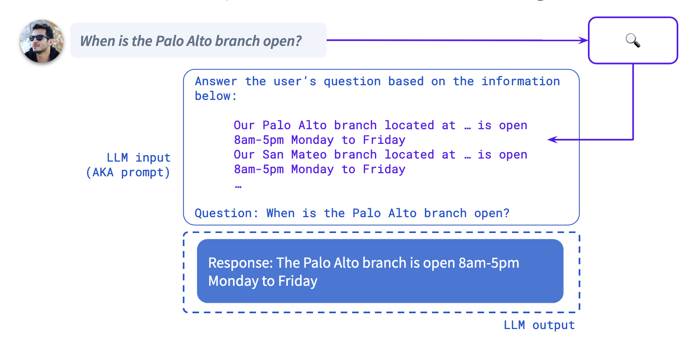

# 使用文本文档进行聊天

检索增强生成是一种使用文档中包含的信息快速构建对话机器人的流行方法。

其主要目的是回答“面向知识的用户查询”，这些查询指的是用户提出的问题或请求，这些查询专门寻求事实信息、专业知识或特定领域的知识。

本指南介绍了使用[企业搜索策略](../concepts/policies/enterprise-search-policy.md)设置和构建带有 Rasa 的 RAG 对话机器人的过程。

RAG 背后的想法是一个两步过程：

- 使用用户所说的内容查询信息检索系统并获取相关文档。
- 将检索到的文档包含在 LLM 提示中，要求 LLM 根据提供的信息回答用户的问题。

<figure markdown>
  
</figure>

以下是实现我们目标需要完成的 3 个主要步骤

## 创建一个名为 `docs` 的文件夹 {#create-a-folder-called-docs}

以文本格式收集你的知识库和语料库并将其转储到 `docs` 文件夹中。这将代表 LLM 用来获取上下文以生成响应的信息来源。

```txt title="docs/sampleDocument.txt"
we have five type of cards:  debit card, credit card, gift card, loyalty card and smart card.

The price of debit card is between 5 euros and 10 depends on the options you want to have.
Debit cards are directly linked to the user's bank account, allowing them to make purchases with funds available in the account.

If the borrowed amount is not paid in full by the due date, credit card users may incur interest charges on the remaining balance.
Responsible use of credit cards, such as timely payments, contributes to building a positive credit history, which can impact credit scores.

Gift cards come with a predetermined monetary value, allowing recipients to make purchases up to that amount.
Recipients have the flexibility to choose the items they want within the card's value, making them a popular choice for gifts.

Loyalty cards are designed to reward customers for their repeat business. Customers typically earn points or receive discounts based on their purchases.
Loyalty cards are often part of broader membership programs that may include additional benefits, such as early access to sales, special events, or exclusive products.

Smart cards are equipped with an embedded microprocessor or chip, differentiating them from traditional magnetic stripe cards.
The embedded chip in smart cards enhances security by storing and processing data internally. This makes them less susceptible to unauthorized access or duplication
```

## 覆盖 `pattern_search` {#override-the-pattern_search}

模式 `pattern_search` 定义了响应面向知识的用户查询的对话机器人行为。

在 `flows.yml` 中，添加流 `pattern_search` 以触发默认动作 `action_trigger_search`。动作 `action_trigger_search` 将执行查询并调用 LLM 来回答用户的问题。

```yaml title="flows.yml"
flows:
  pattern_search:
    description: handle a knowledge-based question or request
    name: pattern search
    steps:
      - action: action_trigger_search
```

## 将企业搜索策略添加到配置中 {#add-the-enterprise-search-policy-to-your-config}

默认情况下，企业搜索策略使用 OpenAI 嵌入来嵌入文档，并使用 GPT 3.5 来响应用户查询。你可以配置该策略以与其他嵌入模型和 LLM 配合使用。在[此处](../concepts/components/llm-configuration.md)阅读更多信息。

以下是默认设置：

=== "Rasa Pro >= 3.10.x"

    ```yaml title="config.yml"
    policies:
      - name: EnterpriseSearchPolicy
        llm:
          provider: "openai"
          model: "gpt-3.5-turbo"
        embeddings:
          provider: "openai"
          model: "text-embedding-ada-002"
        vector_store:
          type: "faiss"
          source: "./docs"
    ```

=== "Rasa Pro >= 3.8.x"

    ```yaml title="config.yml"
    policies:
    - name: EnterpriseSearchPolicy
      llm:
        model_name: "gpt-3.5-turbo"
        embeddings:
        model_name: "text-embedding-ada-002"
        vector_store:
        type: "faiss"
        source: "./docs"
    ```

=== "Rasa Pro <= 3.7.x"

    ```yaml title="config.yml"
    policies:
    - name: rasa_plus.ml.EnterpriseSearchPolicy
      llm:
        model_name: "gpt-3.5-turbo"
        embeddings:
        model_name: "text-embedding-ada-002"
        vector_store: 
        type: "faiss" 
        source: "./docs"
    ```

## 结果 {#outcome}

下面是一个对话示例，展示了我们如何利用上述步骤来应用企业搜索。

<figure style="max-width: 400px;" markdown>
  
</figure>

## 高级配置 {#advanced-configuration}

之前概述的设置旨在初步探索使用 Rasa 的 RAG 方法。企业搜索策略目前支持 Milvus 和 Qdrant，它们提供从自托管 docker 到云部署的多种部署选项。

在[此处](../concepts/policies/enterprise-search-policy.md#vector-store)阅读更多信息。

例如，如果你想使用 Milvus 向量存储和 huggingface 中的嵌入，则必须修改 `config.yml` 和 `endpoints.yml` 文件。

要配置 `EnterpriseSearchPolicy` 以使用这些组件，请根据你使用的 Rasa Pro 版本将以下行添加到 `config.yml` 中：

=== "Rasa Pro >= 3.10.x"

    ```yaml title="config.yml"
    - name: EnterpriseSearchPolicy
      vector_store:
        type: "milvus"
      embeddings:
        provider: "huggingface_local"
        model: "BAAI/bge-small-en-v1.5"
    ```

=== "Rasa Pro >= 3.8.x"

    ```yaml title="config.yml"
    - name: EnterpriseSearchPolicy
      vector_store:
        type: "milvus"
      embeddings:
        type: "huggingface"
        model_name: "BAAI/bge-small-en-v1.5"
    ```

=== "Rasa Pro <=3.7.x"

    ```yaml title="config.yml"
    - name: rasa_plus.ml.EnterpriseSearchPolicy
      vector_store: 
        type: "milvus"
      embeddings:
        type: "huggingface"
        model_name: "BAAI/bge-small-en-v1.5" 
    ```

并将以下内容添加到 `endpoints.yml` 中：

```yaml title="endpoints.yml"
vector_store:
  type: milvus
  host: localhost
  port: 19530
  collection: rasa
```
