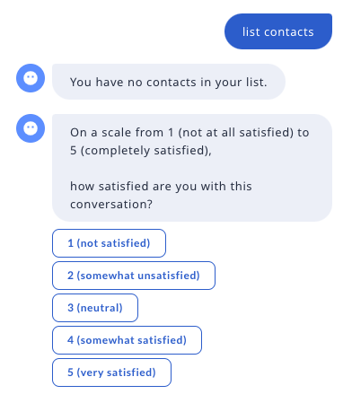

# 用户满意度调查

本指南向你展示如何创建调查流来收集用户对其对话体验的反馈。你可以通过在流末尾使用 [`link`](../concepts/flows.md#link) 步骤（而不是 `END` 步骤）来实现此目的。

!!! note "注意"

    此解决方案依赖于 Rasa Pro v3.9 及更高版本中的功能。

## 添加调查流 {#adding-the-survey-flow}

首先，创建一个调查流，其中的[流守卫](../concepts/starting-flows.md#flow-guards)始终为 `false`。这确保我们的流只能从另一个活动流中启动。

```yaml title="feedback.yml"
flows:
  collect_feedback:
    description: Collect user satisfaction feedback
    if: False
    steps:
      - collect: user_satisfaction
```

将相应的[槽](../concepts/domain.md#slots)和[话语](../concepts/responses.md)添加到[领域](../concepts/domain.md)中：

```yaml title="domain.yml"
slots:
  user_satisfaction:
    type: float

responses:
  utter_ask_user_satisfaction:
    - text: |
        On a scale from 1 (not at all satisfied) to 5 (completely satisfied),
        how satisfied are you with this conversation?
      buttons:
        - payload: "/SetSlots(user_satisfaction=1)"
          title: "1 (not satisfied)"
        - payload: "/SetSlots(user_satisfaction=2)"
          title: "2 (somewhat unsatisfied)"
        - payload: "/SetSlots(user_satisfaction=3)"
          title: "3 (neutral)"
        - payload: "/SetSlots(user_satisfaction=4)"
          title: "4 (somewhat satisfied)"
        - payload: "/SetSlots(user_satisfaction=5)"
          title: "5 (very satisfied)"
```

最后，添加 `link` 步骤以启动调查流。在此示例中，我们从 [CALM 模板对话机器人](../command-line-interface.md#rasa-init)开始，并将链接添加到联系人流列表中：

```yaml title="list_contacts.yml"
flows:
  list_contacts:
    name: list your contacts
    description: show your contact list
    steps:
      - action: list_contacts
        next:
          - if: "slots.contacts_list"
            then:
              - action: utter_list_contacts
              - link: collect_feedback
          - else:
              - action: utter_no_contacts
              - link: collect_feedback
```

训练对话机器人并使用 `rasa inspect` 启动它。向机器人发送消息 `"list my contacts"` 以触发响应。

<figure style="max-width: 400px;" markdown>
  
</figure>
