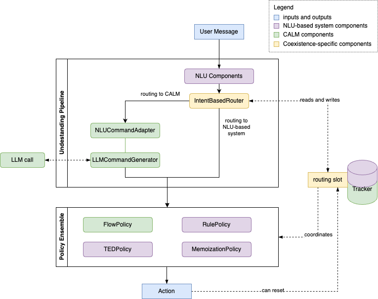

# 共存如何运作

要从基于 NLU 的对话机器人迁移到 CALM，可以使用共存功能。本页详细介绍了该功能的工作原理。

## 关键术语 {#key-terms}

- **系统**：每当我们使用“两个系统”或“任一系统”等词语时，我们指的是 CALM 或基于 NLU 的系统。
- **粘性**：粘性意味着一旦路由器做出路由决策，它就会一直存在，直到重置为止，这通常发生在流、故事或规则的末尾。这可以防止 CALM 在故事或规则中中途接管，或基于 NLU 的系统在流中中途接管。这种中断可能会带来问题，因为两个系统处理不同的技能，从一个系统切换到另一个系统需要清理，以便能够无错误地完成技能。非​​粘性路由仅用于单轮交互，例如闲聊。
- [**技能中断**](../../nlu-based-assistants/glossary.md#skill-interruption)。
- [**主题领域**](../../nlu-based-assistants/glossary.md#topic-area)。

## 概述 {#overview}

下图描述了共存的工作原理。

[CALM](../../nlu-based-assistants/glossary.md#calm-conversational-ai-with-language-models) 与[基于 NLU 的系统](../../nlu-based-assistants/glossary.md#nlu-based-systems)的共存取决于路由机制，该机制根据消息的内容将消息路由到任一系统。路由发生在[路由器组件](../../concepts/components/coexistence-routers.md)中。目前提供两种不同的路由器组件，在上图中使用 [`IntentBasedRouter`](../../concepts/components/coexistence-routers.md#intentbasedrouter)。

如果路由会话尚未激活，例如专用路由槽 [`route_session_to_calm`](../../building-assistants/coexistence.md#adding-the-routing-slot-to-your-domain) 尚未设置，则路由器将参与并根据路由机制的结果路由消息。一旦路由器决定将消息路由到任一系统，路由槽将被设置并且路由会话将处于活动状态。路由通常是粘性的。这意味着后续消息将被路由到同一系统而无需再次使用路由器。例如，如果路由槽已设置，则路由器组件不会参与，并且消息将根据路由槽中设置的值进行路由。

一旦消息被路由到任一系统，系统就会按照通常的方式处理该消息。用命令或意图和实体标注的消息被传递给策略。在这里，路由槽与 CALM 的对话堆栈一起协调策略。一般来说，当一个系统被激活时另一个系统的策略将不会运行以节省计算。

为了让用户能够在一个会话中实现多项[技能](../../nlu-based-assistants/glossary.md#skill)，CALM 和基于 NLU 的系统必须在它们完成并准备交还控制权时发出信号。技能分为两个系统，例如支付贷款和查看一些投资新闻，因此重置路由非常重要。CALM 和基于 NLU 的系统策略可以发出信号，表明它们已完成系统中所有已启动的技能，并通过调用新的默认动作 [`action_reset_routing`](../../concepts/default-actions.md#action_reset_routing) 重置路由。路由器将在下一个传入用户消息时再次启用。

## 意图触发器 {#intent-triggers}

可以使用斜线语法在 Rasa 中触发意图，如 `/initialise_conversation` 所示。这些意图触发器不由 NLU 管道处理，因此路由器永远不会看到它们。同时，可能存在需要将会话分配给 CALM 或基于 NLU 的系统启动技能。为了在使用共存功能时支持意图触发器，我们设计了以下启发式方法：

- 如果到基于 NLU 的系统或 CALM 的路由处于活动状态，则路由不会更改。
- 如果没有活动路由：
    -  如果给定意图，任何流的 NLU 触发器都被激活，我们将路由到 CALM（请参阅 [NLU 触发器文档](../starting-flows.md#nlu-trigger)）。
    - 否则，我们将路由到基于 NLU 的系统。

这样，可以设计将启动特定基于 NLU 的系统或 CALM 技能的意图触发器。

!!! info "入门"

    [共存](../../building-assistants/coexistence.md)功能可帮助你从基于 NLU 的对话机器人迁移到[带语言模型的对话式 AI（CALM）](../../calm.md)方法，从 `3.8.0` 版开始可用。要开始使用共存功能，请按照[用户指南](../../building-assistants/coexistence.md)中的步骤操作。
