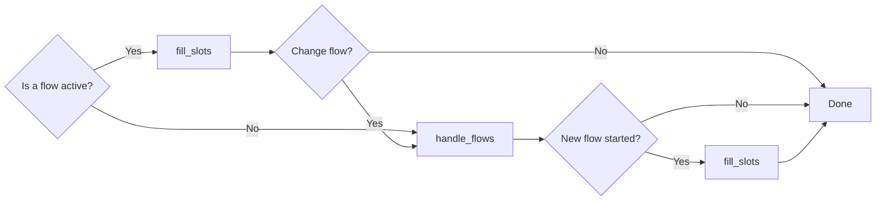

# LLM 命令生成器

`LLMCommandGenerators` 利用上下文学习来输出表示用户希望如何进行对话的命令列表。

## 工作原理 {#how-an-llm-based-command-generator-work}

基于 LLM 的命令生成器的工作是提取有关迄今为止的对话的信息。它输出一系列 [`commands`](../dialogue-understanding.md#command-reference)，这些命令表示用户希望如何进行对话。

例如，如果你定义了一个名为 `transfer_money` 的流，并且用户通过说“I need to transfer some money”来开始对话，则正确的命令输出将是 `StartFlow("transfer_money")`。

如果你向用户询问是/否问题（使用 `collect` 步骤）并且他们说“yes”，则正确的命令输出是 `SetSlot(slot_name, True)`。

如果用户回答了问题，但也请求了一些新内容，例如“yes. Oh what's my balance?”，则命令输出可能是 `[SetSlot(slot_name, True), StartFlow("check_balance")]`。

通过生成一系列命令，对话理解比基于分类的 NLU 系统更能表示用户想要什么。

基于 LLM 的命令生成器还使用[流检索](llm-command-generators.md#retrieving-relevant-flows)子模块来确保输入上下文大小不会随着对话机器人的大小线性增加。

## 类型 {#types-of-llm-based-command-generators}

Rasa 目前有两个基于 LLM 的命令生成器：`SingleStepLLMCommandGenerator` 和 `MultiStepLLMCommandGenerator`。

!!! warning "弃用警告"

    之前的 `LLMCommandGenerator` 在版本 3.9.0 中已重命名为 `SingleStepLLMCommandGenerator`，同时保留其功能。Rasa 4.0.0 将不再支持以前的名称 `LLMCommandGenerator`。请修改对话机器人的配置以改用 `SingleStepLLMCommandGenerator`。

要在对话机器人中使用两个 `CommandGenerator` 之一，请在 `config.yml` 文件中将 `SingleStepLLMCommandGenerator` 或 `MultiStepLLMCommandGenerator` 添加到 NLU 管道。在[此处](overview.md)阅读有关 `config.yml` 文件的更多信息，并在[此处](llm-configuration.md)了解如何配置 LLM 模型

=== "SingleStepLLMCommandGenerator"

    ```yaml title="config.yml"
    pipeline:
    # - ...
    - name: SingleStepLLMCommandGenerator
    # - ...
    ```

=== "MultiStepLLMCommandGenerator"

    ```yaml title="config.yml"
    pipeline:
    # - ...
    - name: MultiStepLLMCommandGenerator
    # - ...
    ```

`SingleStepLLMCommandGenerator` 和 `MultiStepLLMCommandGenerator` 需要访问 LLM API。你可以使用任何支持 `/chat` API 的 OpenAI 模型，例如 `"gpt-3.5-turbo"` 或 `"gpt-4"`。我们正在努力扩大受支持的模型和模型提供者列表。

!!! info "信息"

    `SingleStepLLMCommandGenerator` 可以很好地与强大的模型（例如 `gpt-4`）配合使用，而 `MultiStepLLMCommandGenerator` 则设计用于与更便宜、更小的模型（例如 `gpt-3.5-turbo`）配合使用。有关推荐模型的更多信息，请点击[此处](llm-configuration.md)。

### SingleStepLLMCommandGenerator {#singlestepllmcommandgenerator}

为了在上下文中解释用户的消息，`SingleStepLLMCommandGenerator` 的当前实现使用上下文学习、有关对话当前状态的信息以及对话机器人中定义的流。每个流的描述和槽定义都包含在提示中作为相关信息。但是，为了扩展到更多流，基于 LLM 的命令生成器仅包含与对话当前状态相关的流，请参阅[流检索](llm-command-generators.md#retrieving-relevant-flows)。

#### 提示模板 {#prompt-template}

默认提示模板用作动态框架，使 `SingleStepLLMCommandGenerator` 能够呈现提示。模板由 **静态组件** 以及呈现提示时填充的 **动态组件** 组成：

- 对话的当前状态：模板的这一部分捕获正在进行的对话。
- 定义的流和槽：模板的这一部分为对话提供背景和结构。它概述了总体主题，指导模型对对话目的的理解。
- 活动的流和槽：对话中需要模型注意的活动元素。

#### 自定义 {#customization}

你可以根据需要自定义 `SingleStepLLMCommandGenerator`。 两个 `LLMCommandGenerator` 可用的常规自定义选项列在[常规自定义](#general-customization)部分中。

#### 自定义提示模板 {#customizing-the-prompt-template}

如果你无法通过编辑流和槽描述来使某些功能正常工作（请参阅[自定义提示](#customizing-the-prompt)部分），你可以更深入地自定义用于驱动 `SingleStepLLMCommandGenerator` 的提示模板。 为此，请将你自己的提示编写为 jinja2 模板并将其作为文件提供给组件：

```yaml title="config.yml" hl_lines="3"
pipeline:
  - name: SingleStepLLMCommandGenerator
    prompt_template: prompts/command-generator.jinja2
```

!!! warning "弃用警告"

    之前的 `LLMCommandGenerator` 的 `prompt` 配置在 `3.9.0` 版本中被 `SingleStepLLMCommandGenerator` 的 `prompt_template` 取代。`prompt` 配置变量现已弃用，并将在 `4.0.0` 版本中被删除。

提示模板还允许使用变量来整合动态信息。你可以在此处访问可用变量的完整列表，以便在自定义提示模板中使用。

| 变量                       | 类型                   | 描述                                                         |
| :------------------------- | :--------------------- | :----------------------------------------------------------- |
| `available_flows`          | `List[Dict[str, Any]]` | 对话机器人中可用的所有流的列表。                             |
| `current_conversation`     | `str`                  | 当前对话的可读表示。示例：`USER: hello\nAI: hi\nUSER: I need to send money` |
| `current_flow`             | `str`                  | 当前活动流的 ID。示例：`transfer_money`                      |
| `current_slot`             | `str`                  | 当前询问的槽的名称。示例：`transfer_money_recipient`         |
| `current_slot_description` | `str`                  | 当前要求的收集步骤的描述。示例：`the name of the person`     |
| `flow_slots`               | `List[Dict[str, Any]]` | 当前活动流中的槽列表。                                       |
| `user_message`             | `str`                  | 用户发送的最新消息。示例：`I want to transfer money`         |

迭代 `flow_slots` 变量有助于创建列出当前活动流的所有槽的提示，

```jinja

- name: {{ slot.name }}, value: {{ slot.value }}, type: {{ slot.type }}, description: {{ slot.description}}, allowed values: {{ slot.allowed_values }}

```

| 变量                  | 类型        | 描述                                                    |
| :-------------------- | :---------- | :------------------------------------------------------ |
| `slot.name`           | `str`       | 槽的名称。示例：`transfer_money_has_sufficient_funds`   |
| `slot.description`    | `str`       | 槽的描述。示例：`Checks if there is sufficient balance` |
| `slot.value`          | `str`       | 槽的值。示例：`True`                                    |
| `slot.type`           | `str`       | 槽的类型。示例：`bool`                                  |
| `slot.allowed_values` | `List[str]` | 槽允许值的列表。示例：`[True, False]`                   |

迭代 `available_flows` 变量有助于创建列出所有流的提示，

```jinja

{{ flow.name }}: {{ flow.description }}
    
    slot: {{ slot.name }} ({{ slot.description }}), allowed values: {{ slot.allowed_values }}
    

```

| 变量               | 类型                   | 描述                                               |
| :----------------- | :--------------------- | :------------------------------------------------- |
| `flow.name`        | `str`                  | 流的名称。示例：`transfer_money`                   |
| `flow.description` | `str`                  | 流的描述。示例：`This flow lets users send money.` |
| `flow.slots`       | `List[Dict[str, Any]]` | 来自流的槽列表。                                   |


### MultiStepLLMCommandGenerator {#multistepllmcommandgenerator}

`MultiStepLLMCommandGenerator` 还使用上下文学习来解释用户在上下文中的消息，但将任务分解为几个步骤，以简化 LLM 的工作。该组件旨在使更便宜、更小的 LLM（例如 `gpt-3.5-turbo`）作为更昂贵但更强大的模型（例如 `gpt-4`）的可行替代方案。

步骤如下：

- 处理流（开始、结束等）
- 填写槽

因此，`MultiStepLLMCommandGenerator` 有两个提示，而不是只有一个提示来处理所有事情：

- `handle_flows`
- `fill_slots`

下图显示了在以下情况下使用哪个提示：



如果当前没有活动流，则使用 `handle_flows` 提示来启动或澄清流。如果启动了流，则接下来执行 `fill_slots` 提示来填充新启动流的任何槽。

如果当前有活动流，则调用 `fill_slots` 提示来填充当前活动流的任何新槽。如果用户消息（也）指示应启动新流或应取消活动流等，则触发 `ChangeFlow` 命令。这会导致调用 `handle_flows` 提示来启动、取消或澄清流。如果该提示导致启动流，则再次执行 `fill_slots` 提示来填充该新流的任何槽。

#### 提示模板 {#prompt-templates}

默认提示模板充当动态框架，使 `MultiStepLLMCommandGenerator` 能够呈现提示。模板由 **静态组件** 以及在呈现提示时填充的 **动态组件** 组成。

=== "handle_flows"

    - **对话的当前状态**：模板的这一部分记录正在进行的对话。
    - **已定义流**：模板的这一部分提供对话的背景和结构。它概述了总体主题，指导模型理解对话的目的。
    - **活动流**：显示当前活动流的名称（如果有）。在条件语句中使用，以自定义有关流状态的消息。

=== "fill_slots"

    - **对话的当前状态**：模板的这一部分捕获正在进行的对话。
    - **定义的流和槽**：模板的这一部分提供对话的背景和结构。它概述了总体主题，指导模型理解对话的目的。
    - **活动流和槽**：对话中需要模型注意的活动元素。
    - **为业务流提取槽**：模板的这一部分侧重于识别和填充对话中的必要槽。

#### 自定义 {#customization-1}

你可以根据需要自定义 `MultiStepLLMCommandGenerator`。 两个 `LLMCommandGenerator` 可用的常规自定义选项列在[常规自定义](#general-customization)部分中。

#### 自定义提示模板 {#customizing-the-prompt-template-1}

如果你无法通过编辑流和槽描述来使某些功能正常工作（请参阅[自定义提示](#customizing-the-prompt)部分），你可以更深入地自定义用于驱动 `MultiStepLLMCommandGenerator` 的提示模板。 为此，请将你自己的提示编写为 jinja2 模板并将其作为文件提供给组件：

```yaml title="config.yml" hl_lines="3"
pipeline:
  - name: MultiStepLLMCommandGenerator
    prompt_templates:
      handle_flows:
        file_path: prompts/handle_flows_template.jinja2
      fill_slots:
        file_path: prompts/fill_slots_template.jinja2
```

你可以使用上面的示例配置自定义两个提示，也可以选择仅自定义特定提示。

提示模板还允许使用变量来整合动态信息。

##### handle_flows {#handle_flows}

以下是自定义 `handle_flows` 提示模板中可用的变量的完整列表：

| 变量                   | 类型                   | 描述                                                         |
| :--------------------- | :--------------------- | :----------------------------------------------------------- |
| `available_flows`      | `List[Dict[str, Any]]` | 对话机器人中可用的所有流的列表。                             |
| `current_conversation` | `str`                  | 当前对话的可读表示。示例：`USER: hello\nAI: hi\nUSER: I need to send money` |
| `current_flow`         | `str`                  | 当前活动流的ID。示例：`transfer_money`                       |
| `last_user_message`    | `str`                  | 用户发送的最新消息。示例：`I want to transfer money`         |

迭代 `available_flows` 变量有助于创建列出所有流的提示，

```jinja

- {{ flow.name }}: {{ flow.description }}

```

| 变量               | 类型  | 描述                                               |
| :----------------- | :---- | :------------------------------------------------- |
| `flow.name`        | `str` | 流的名称。示例：`transfer_money`                   |
| `flow.description` | `str` | 流的描述。示例：`This flow lets users send money.` |

默认情况下，可以在此步骤中预测以下命令：`StartFlow`、`Clarify`、`CancelFlow`、`CannotHandle`。

##### fill_slots {#fill_slots}

以下是自定义 `fill_slots` 提示模板中可用的变量的完整列表：

| 变量                          | 类型                   | 描述                                                         |
| :---------------------------- | :--------------------- | :----------------------------------------------------------- |
| `available_flows`             | `List[Dict[str, Any]]` | 对话机器人中可用的所有流的列表。                             |
| `current_conversation`        | `str`                  | 当前对话的可读表示。示例：`USER: hello\nAI: hi\nUSER: I need to send money` |
| `current_flow`                | `str`                  | 当前活动流的ID。示例：`transfer_money`                       |
| `current_slot`                | `str`                  | 当前询问的槽的名称。示例：`transfer_money_recipient`         |
| `current_slot_description`    | `str`                  | 当前要求的收集步骤的描述。示例：`the name of the person`     |
| `current_slot_type`           | `str`                  | 当前槽的类型。示例：`the name of the person`                 |
| `current_slot_allowed_values` | `str`                  | 活动流中当前请求的槽的允许值或选项。示例：大小： `[Small, Medium, Large]` |
| `flow_slots`                  | `List[Dict[str, Any]]` | 当前活动流中的槽列表。                                       |
| `last_user_message`           | `str`                  | 用户发送的最新消息。示例：`I want to transfer money`         |
| `top_flow_is_pattern`         | `bool`                 | 指示当前活动流是否是一种模式。                               |
| `top_user_flow`               | `Flow`                 | 内部对话堆栈中的顶部用户流对象。                             |
| `top_user_flow_slots`         | `List[Dict[str, Any]]` | 与顶部用户流相关的槽。                                       |
| `flow_active`                 | `bool`                 | 指示流当前是否处于活动状态。                                 |

迭代 `flow_slots` 或 `top_user_flow_slots` 变量有助于创建一个提示，列出当前活动流（可以是模式）或顶部用户流的所有槽，

```jinja

- name: {{ slot.name }}, value: {{ slot.value }}, type: {{ slot.type }}, description: {{ slot.description}}, allowed values: {{ slot.allowed_values }}

```

| 变量                  | 类型        | 描述                                                    |
| :-------------------- | :---------- | :------------------------------------------------------ |
| `slot.name`           | `str`       | 槽的名称。示例：`transfer_money_has_sufficient_funds`   |
| `slot.description`    | `str`       | 槽的描述。示例：`Checks if there is sufficient balance` |
| `slot.value`          | `str`       | 槽的值。示例：`True`                                    |
| `slot.type`           | `str`       | 槽的类型。示例：`bool`                                  |
| `slot.allowed_values` | `List[str]` | 槽允许值的列表。示例： `[True, False]`                  |

迭代 `available_flows` 变量有助于创建列出所有流的提示，

```jinja

- {{ flow.name }}: {{ flow.description }}

```

| 变量               | 类型  | 描述                                               |
| :----------------- | :---- | :------------------------------------------------- |
| `flow.name`        | `str` | 流的名称。示例：`transfer_money`                   |
| `flow.description` | `str` | 流的描述。示例：`This flow lets users send money.` |

默认情况下，此步骤中只能预测 `SetSlot` 命令。

##### 提示微调 {#prompt-tuning}

除了在[自定义提示](#customizing-the-prompt)部分中提出的提示自定义之外，`MultiStepLLMCommandGenerator` 可能受益于一些额外的提示调微调。

##### 小样本学习 {#few-shot-learning}

小样本学习是一种机器学习方法，其中 AI 模型通过对极少量的标注样本进行训练来学习做出准确的预测。我们的内部实验表明，将一些用户消息到命令对的示例添加到提示模板 `handle_flows` 有助于提高 LLM 的性能，尤其是对于 `Clarify` 命令。

为此，请整理一小段特定于对话机器人领域的用户消息：动作列表示例对。接下来，你可以在第 22 行之后将它们添加到提示模板 `handle_flows` 中。以下是一个例子：

```txt
===
Here are some examples of user messages -> action list:
1. "book" -> Clarify(book_hotel, book_restaurant, book_flight)
2. "I want to book a hotel in Paris." -> StartFlow(book_hotel)
3. "Can you help me with my booking?" -> Clarify(book_hotel, book_restaurant, book_flight)
4. "Nevermind, stop it." -> CancelFlow()
```

##### 提示语言 {#language-of-the-prompt}

在我们的内部实验中，我们发现较小的 LLM 受益于使用单一语言的完整提示。因此，如果对话机器人是为了理解和响应使用英语以外的语言的用户而构建的，并且流描述以及收集步骤描述都使用相同的语言，那么 LLM 可能也会受益于将提示模板翻译成该语言。例如，假设用户用德语与对话机器人交谈，并且流描述和收集步骤描述也是德语。为了简化 LLM 的工作，将完整的提示模板也翻译成德语可能会有所帮助。

你可以使用强大的 LLM（例如 `gpt-4`）进行翻译。但是，我们建议在自动翻译后手动检查提示模板。

##### 格式 {#formatting}

在两个提示模板 `handle_flows` 和 `fill_slots` 中，我们都会迭代程和/或槽。根据你为这些编写的描述，更新提示模板中的 for 循环可能是有意义的。

例如，如果你的槽描述相当长并且包含项目符号列表，则最终提示中的槽列表可能如下所示：

```txt
The current user message started the process "transfer_money".
Here are its slots:
- recipient (text): - name of the person to send money to
- should be a proper name
- amount (float): - the amount of money to send
- do not extract currency values
- amount should be a float
```

如你所见，很难区分描述和实际槽。

为了帮助 LLM 清楚地区分槽和描述，我们建议更新 jinja2 提示模板中的 for 循环，如下所示：

```jinja

{{loop.index}}. {{ slot.name }} ({{slot.type}}): {{ slot.description}} (allowed values: {{ slot.allowed_values }})

```

结果如下：

```txt
The current user message started the process "transfer_money".
Here are its slots:
1. recipient (text): - name of the person to send money to
- should be a proper name
2. amount (float): - the amount of money to send
- do not extract currency values
- amount should be a float
```

##### 当前限制 {#current-limitations}

`MultiStepLLMCommandGenerator` 将能够生成以下命令：

- 在 `handle_flows` 步骤中：`StartFlow`、`Clarify`、`CancelFlow`、`CannotHandle`。
- 在 `fill_slots` 步骤中：`SetSlot`。当用户消息的范围超出启动、取消或澄清流时，将从 `handle_flows` 提示中触发 `CannotHandle` 命令。该命令将触发无法处理模式，以表明无法按预期处理用户消息。

## 检索相关流 {#retrieving-relevant-flows}

随着对话机器人技能的不断提高，功能流的数量可能会扩展到数百个。但是，由于 LLM 上下文窗口的限制，将所有这些流同时呈现给 LLM 是不切实际的。为了确保效率，只会考虑与给定对话相关的部分流。我们实施了一种流检索机制，以识别和过滤命令生成器最相关的流。这种有针对性的选择有助于在 LLM 上下文窗口的限制范围内制作有效的提示。

!!! info "LLM 上下文窗口限制"

    基于 LLM 的命令生成器在底层模型的预定义上下文窗口范围内运行，这限制了它一次可以处理的文本量。此窗口包含模型可以“查看”并用于决策（提示）和响应生成（输出）的所有文本。

!!! warning "警告"

    流检索机制仅过滤相关流，而关于如何进行的推理和决策（假设已识别为相关的流）则取决于命令生成器。

检索相关流的能力附带有训练组件。在训练期间，所有定义的流（[流守卫](../starting-flows.md#flow-guards)可能评估为 `true`）都会转换为包含[流描述](../flows.md#description)和（可选）槽描述以及允许的槽值的文档。然后使用嵌入模型将这些文档转换为向量并存储在向量存储中。

与对话机器人交谈时（即在推理期间），当前对话上下文会转换为向量并与向量存储中的流进行比较。此比较会识别与当前对话上下文最相似的流，并将它们包含在 `SingleStepLLMCommandGenerator` 和 `MultiStepLLMCommandGenerator` 的提示中。

但是，会应用其他规则来选择或丢弃某些流：

- 任何[流守卫](../starting-flows.md#flow-guards)评估为 `False` 的流都会被排除。
- 任何标记为 [`always_include_in_prompt` 属性](../flows.md#always-include-in-prompt)设置为 `true` 的流都会始终包含在内，前提是流保护（如果已定义）评估为 `true`。
- 始终包含在当前对话上下文中处于活动状态的所有流。

默认情况下启用此功能，即仅检索相关流并将其包含在提示中。在[此处](#customizing-flow-retrieval)阅读有关配置选项的更多信息。

流检索的性能取决于流描述的质量。良好的描述可以改善涵盖类似主题的流之间的区分，同时也可以提高预期用户动作与流之间的一致性。有关如何编写良好描述的提示，可以查看我们的[指南](#customizing-the-prompt)。

## 常规自定义 {#general-customization}

以下自定义适用于 `SingleStepLLMCommandGenerator` 和 `MultiStepLLMCommandGenerator`。

### LLM 配置 {#llm-configuration}

要指定用于 `SingleStepLLMCommandGenerator` 或 `MultiStepLLMCommandGenerator` 的 OpenAI 模型，请在 `config.yml` 文件中设置 `llm.model` 属性：

```yaml title="config.yml"
pipeline:
# - ...
  - name: SingleStepLLMCommandGenerator
    llm:
      provider: "openai"
      model: "gpt-4"
      timeout: 7
      temperature: 0.0
# - ...
```

对于 `SingleStepLLMCommandGenerator`，`model` 默认为 `gpt-4`。对于 `MultiStepLLMCommandGenerator`，`model` 默认为 `gpt-3.5-turbo`。`model` 应设置为 [OpenAI](https://platform.openai.com/docs/guides/text-generation/completions-api) 的聊天模型。

同样，你可以为 LLM 指定 `timeout` 和 `temperature` 参数。`timeout` 默认为 `7` 秒，`temperature` 默认为 `0.0`。

如果你想使用 Azure OpenAI 服务，请按照 [Azure OpenAI 服务](llm-configuration.md#azure-openai-service)部分所述配置必要的参数。

!!! info "使用其他 LLM"

    默认情况下，OpenAI 用作底层 LLM 提供者。

    你可以在 `config.yml` 文件中配置要使用的 LLM 提供者。要使用其他提供程序（如 `cohere`），请执行以下操作：

    ```yaml title="config.yml"
    pipeline:
    # - ...
      - name: SingleStepLLMCommandGenerator
        llm:
          provider: "cohere"
          model: ...
    # - ...
    ```

    有关更多信息，请参阅 [LLM 设置页面上的 llms 和嵌入](llm-configuration.md)。

### 自定义提示 {#customizing-the-prompt}

由于 `LLMCommandGenerators` 使用上下文学习，因此调整或提高性能的主要方法之一是自定义提示。

在大多数情况下，你可以通过自定义流中的描述字段来实现所需的目的。每个流都有自己的描述字段。流中的每个步骤也可以有一个描述字段。如果你注意到流在不应该触发时被触发，或者未正确提取槽，则在描述中添加更多详细信息通常会解决问题。

例如，如果你有一个 `transfer_money` 流，其中包含槽 `amount` 的 `collect` 步骤，则可以添加描述以更可靠地提取值：

```yaml title="flows.yml" hl_lines="9"
flows:
  transfer_money:
    description: |
      This flow lets users send money to friends
      and family, in US Dollars.
    steps:
      - collect: recipient
      - collect: amount
        description: the amount of money to send. extract only the numerical value, ignoring the currency.
```

使用以下指南来编写信息丰富且上下文丰富的流描述。

1. **提供信息密集的描述**：确保流描述准确且信息丰富，直接概述流的目的和范围。力求在简洁性和信息密度之间取得平衡，使用命令式语言并避免不必要的词语以防止产生歧义。目标是尽可能清楚地传达基本信息。
2. **使用清晰和标准的语言**：避免使用不寻常的措辞或词语选择。坚持使用清晰、普遍理解的语言。
3. **明确定义上下文**：明确定义流上下文以增强模型的态势感知。仅用于[检索相关流](#retrieving-relevant-flows)的嵌入模型缺乏态势感知。它无法弄清楚上下文或读懂流中直接描述的内容之外的字里行间的内容。
4. **澄清隐性知识**：澄清描述中的任何专业知识（例如，如果提到品牌名称：品牌领域是什么；如果提到产品名称：产品是什么）。仅用于[检索相关流](#retrieving-relevant-flows)的嵌入模型不太可能产生有关品牌及其产品的良好嵌入。
5. **（可选）添加示例用户话语**：虽然严格来说不是必需的，但添加示例用户话语可以为流描述添加更多上下文。这还可以确保嵌入与用户输入紧密匹配。这应该更多地被视为一种纠正，而不是一种修复。如果用户话语提高了性能，则表明它们提供了可以直接纳入流描述的新信息。

### 自定义流检索 {#customizing-flow-retrieval}

默认情况下，在推理时仅检索相关流以包含在提示中的能力处于激活状态。要配置它，你可以修改 `flow_retrieval` 属性下的设置。默认配置使用 [OpenAI](https://platform.openai.com/docs/guides/embeddings/embedding-models) 的 `text-embedding-ada-002` 嵌入模型：

```yaml title="config.yml"
pipeline:
  - name: SingleStepLLMCommandGenerator
    ...
    flow_retrieval:
      embeddings:
        type: openai
        model: text-embedding-ada-002
      ...
  ...
```

你可以调整嵌入提供者和模型。有关支持的嵌入以及如何配置这些嵌入的更多信息，请参见[此处](llm-configuration.md)。

此外，还可以配置：

- `turns_to_embed`：要转换为向量并与向量存储中的流进行比较的对话轮次数。将值设置为 `1` 表示仅使用最新的对话轮次。增加轮次数会扩大对话上下文窗口。
- `should_embed_slots`：是否在训练期间将槽描述与流描述一起嵌入（`True` 或 `False`）。
- `num_flows`：要从向量存储中检索的最大流数。

以下是具有默认值的配置：

```yaml title="config.yml"
pipeline:
  - name: SingleStepLLMCommandGenerator
    ...
    flow_retrieval:
      turns_to_embed: 1
      should_embed_slots: true
      num_flows: 20
    ...
```

!!! info "检索的流数"

    `num_flows` 指定的流数并不直接对应于提示中包含的实际流数。包含的流总数还取决于标记为 `always_include_in_prompt` 的流和之前处于活动状态的流。有关更多信息，请查看[检索相关流](#retrieving-relevant-flows)部分。

还可以通过将 `flow_retrieval.active` 字段设置为 `false` 来禁用流检索：

```yaml title="config.yml"
pipeline:
  - name: SingleStepLLMCommandGenerator
    ...
    flow_retrieval:
      active: false
    ...
```

!!! warning "警告"

    禁用仅检索与当前对话上下文相关的流的功能将限制命令生成器管理大量流的能力。由于命令生成器的提示大小有限，超过此限制将导致其无法创建有效命令，从而使对话机器人无法对用户请求提供有意义的响应。此外，提示中的大量 token 可能会导致成本和延迟增加，从而进一步影响系统的响应能力。

### 自定义用户输入的最大长度 {#customizing-the-maximum-length-of-user-input}

要限制用户消息的长度，请设置 `user_input.max_characters`（默认值为 `420` 个字符）。

```yaml title="config.yml" hl_lines="4"
pipeline:
  - name: SingleStepLLMCommandGenerator
    user_input:
      max_characters: 420
```

### 微调 LLM 以生成命令 {#fine-tuning-an-llm-for-command-generation}

微调是一个过程，其中预先训练的语言模型在特定数据集上进一步训练，以提高其在特定任务或领域的性能。这使模型能够适应初始预训练阶段使用的一般训练数据未涵盖的特定需求和细微差别。

使用[微调配方](../../operating/fine-tuning-recipe.md)，你可以针对使用数据的特定命令生成任务微调基础语言模型。

#### 为什么要进行微调？ {#why-fine-tuning}

将微调纳入 CALM 的主要动机是解决关键问题，例如高延迟、低可靠性以及对 GPT-4 等专有 LLM 的依赖：

1. **改进的延迟和性能**：通过在本地或受控云环境中微调和部署更小、更高效的 LLM，可以显着减少推理时间，从而提高速度和响应能力。
2. **增强的可靠性**：通过自行部署经过微调的 LLM，可以确保更好地控制模型的操作和性能，从而即使在高峰使用时间也能提高可靠性。
3. **成本效益**：内部微调小型 LLM 是一种经济高效的替代方案，不会影响性能，从而在成本和准确性之间实现更好的平衡。
4. **战略优势**：采用微调配方使能够完全自定义和控制语言模型，从而增强安全性和合规性。

请参阅[微调配方工作原理的概念细节](../../operating/fine-tuning-recipe.md)，以了解幕后情况，熟悉细节后，请参阅[用户指南](../../building-assistants/fine-tuning-recipe.md)，该指南将指导你完成配方在实践中的每个步骤。
