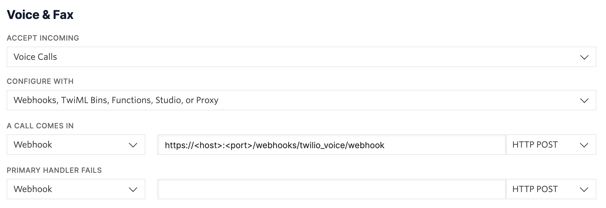

# Twilio Voice

你可以使用 Twilio 语音连接器接听拨打到你的 Twilio 电话号码或 Twilio SIP 域的电话。

## 在 Twilio 上运行 {#running-on-twilio}

### 连接到 Twilio 电话号码 {#connect-to-a-twilio-phone-number}

要将 Twilio 的呼叫转接到你的 Rasa 对话机器人，需要更新你的电话号码的 webhook。转到你的 Twilio 帐户的 [Phone Numbers](https://www.twilio.com/console/phone-numbers/incoming) 部分，然后选择要连接到 Rasa 的电话号码。在屏幕上找到 `Voice & Fax` 部分。在 `A CALL COMES IN` 下，为你的 Rasa 对话机器人添加 webhook URL（例如 `https://<host>:<port>/webhooks/twilio_voice/webhook`），将主机和端口替换为适合你部署的值。单击页面底部的 `Save`。

<figure markdown>
  
  <figcaption>设置 Twilio Webhook</figcaption>
</figure>

### 连接到 Twilio SIP 域 {#connect-to-a-twilio-sip-domain}

你还可以将 Twilio 语音频道连接到 Twilio SIP 域。可以按照 [Twilio 发送 SIP](https://www.twilio.com/docs/voice/api/sending-sip) 指南将 SIP 请求转发到你的 Twilio SIP 域。配置 SIP 域后，你必须将来电转发到 Rasa。在 Twilio 控制台中，转到 [SIP 域](https://console.twilio.com/develop/voice/manage/sip-domains?frameUrl=/console/voice/sip/endpoints)部分。选择你想要使用的 SIP 域。找到 `Call Control Configuration` 部分并为你的 Rasa 机器人添加 webhook URL（例如 `https://<host>:<port>/webhooks/twilio_voice/webhook`），将主机和端口替换为适合你部署的值。单击页面底部的 `Save`。

<figure markdown>
  
  <figcaption>设置 Twilio SIP 域 Webhook</figcaption>
</figure>

### 在 Rasa 中配置频道 {#configure-channel-in-rasa}

在你的 `credentials.yml` 文件中，确保已添加 `twilio_voice` 频道。在 `credentials.yml` 中，你可以设置多个参数来控制对话机器人的行为。下面是一个包含每个参数定义的示例。与 Twilio 文本频道不同，无需为语音频道添加 Twilio 凭据。请注意，更改 `enhanced` 和 `assistant_voice` 的值可能会导致 Twilio 产生额外费用。查看以下文档以了解有关这些设置的详细信息。

```yaml title="credentials.yml"
twilio_voice:
  initial_prompt: "hello"
  assistant_voice: "woman"
  reprompt_fallback_phrase: "I didn't get that could you repeat?"
  speech_timeout: "5"
  speech_model: "default"
  enhanced: "false"
```

## 参数定义 {#parameter-definitions}

### 初始提示 {#initial-prompt}

当 Twilio 接到新来电并将其转发给 Rasa 时，Twilio 不会提供用户消息。在这种情况下，Rasa 将表现得好像用户发送了消息“Hello”。你可以在 `credentials.yml` 文件中通过将 `initial_prompt` 参数设置为所需输入来配置此行为。`initial_prompt` 值将发送到 Rasa，并将响应告诉用户以开始语音对话。通过语音频道问候用户的方式可能与文本频道不同。你应该检查你的回复，并在必要时考虑创建[特定于频道的变体](../concepts/responses.md#channel-specific-response-variations)。

### 对话机器人语音 {#assistant-voice}

你可以通过指定对话机器人应使用的语音类型来为对话机器人增添个性。在 `credentials.yml` 文件中，你可以为 `assistant_voice` 添加一个选项来指定对话机器人的语音类型。有关支持的语音列表，你可以查看 [Twilio 文档](https://www.twilio.com/docs/voice/twiml/say#voice)。默认情况下，将使用 Twilio 的女性声音。请注意，使用任何 Polly 语音都需要支付额外费用。Twilio 文档中有关于 [Polly 定价](https://www.twilio.com/docs/voice/twiml/say/text-speech#pricing)的详细信息。

### 重新提示后备短语 {#reprompt-fallback-phrase}

与文本频道不同，文本频道中用户可以查看对话中的先前消息并花时间回复，而语音频道中对话暂停时用户可能会感到困惑。当在对话中检测到长时间停顿时，Rasa 将重复机器人的最后一句话，以重新提示用户做出响应。如果无法识别先前的机器人话语，则会发送 `reprompt_fallback_phrase` 中定义的消息。默认情况下，此设置为“I'm sorry I didn't get that could you rephrase”。

### 语音超时 {#speech-timeout}

Twilio 将从呼叫者那里收集语音的时间。此参数必须设置为数字或 `"auto"`。如果提供了数字，对话机器人将在指定的时间内收集语音。如果将 `speech_timeout` 设置为 `"auto"`，则 Twilio 将收集语音，直到检测到暂停。此参数的默认设置为 `"auto"`。你可以在 [Twilio 文档](https://www.twilio.com/docs/voice/twiml/gather#speechtimeout)中找到有关 `speech_timeout` 的更多详细信息。请注意，`speech_timeout="auto"` 仅与 `speech_model='numbers_and_commands'` 兼容。如果与 `speech_timeout` 一起使用不兼容的 `speech_model`，则会引发错误。

### 语音模型 {#speech-model}

调整 `speech_model` 参数可以帮助 Twilio 提高语音转文本转换的准确性。有效值为 `default`、`numbers_and_commands` 和 `phone_call`。默认设置为 `default`。你可以在 [Twilio 文档](https://www.twilio.com/docs/voice/twiml/gather#speechmodel)中找到有关 `speech_model` 的更多详细信息。

### 增强 {#enhanced}

将 `enhanced` 设置为 `true` 将允许你使用 Twilio 的高级语音模型来提高转录结果的准确性。请注意，将此参数设置为 `true` 将导致更高的 Twilio 转录成本。仅当也将 `speech_model` 参数设置为 `phone_call` 时，此参数才受支持。默认情况下，增强设置为 `false`。你可以在 [Twilio 文档](https://www.twilio.com/docs/voice/twiml/gather#enhanced)中找到有关增强语音模型选项的更多信息。

## 自定义语音响应 {#custom-voice-responses}

强烈建议你为所有包含图像、表情符号和/或缩写的响应提供语音[频道特定的响应](../concepts/responses.md#channel-specific-response-variations)。图像和表情符号等视觉媒体无法很好地翻译成语音应用程序。为这些响应提供语音替代方案可让你根据语音频道定制用户体验。如果检测到响应包含图像或表情符号，则会发出警告。图像或表情符号将从响应中删除，并且只有任何附带的文本才会包含在返回给用户的响应中。

除了检查包含图像和表情符号的响应外，你还应该检查所有其他响应是否适用于语音频道。像“e.g.”这样的简写缩写无法很好地翻译。语音响应应使用任何缩写的全写版本。文本和语音频道与用户的交互可能有所不同。检查语音频道范围内的所有响应并提供语音特定的响应可以改善用户体验。
