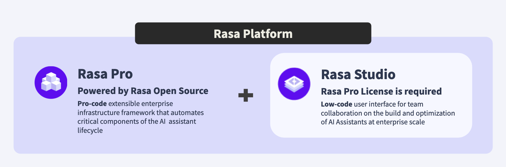

# Rasa Pro 简介

!!! info "开发者版本"

    使用免费的 Rasa Pro 开发者版开始使用 [CALM](calm.md) 构建对话机器人。

    [在这里获取](https://rasa.com/docs/rasa-pro/developer-edition){ .md-button .md-button--primary }

Rasa Pro 是一款扩展了开源 Rasa 的开放核心产品。开源 Rasa 的下载量超过 5000 万次，是用于构建聊天和基于语音的 AI 对话机器人的最流行的开源框架。

Rasa Pro 通过 [CALM](calm.md) 扩展了开源 Rasa，CALM 是一种开发对话机器人的生成式 AI 原生方法，结合了企业级分析、安全性和可观察性功能。运行 Rasa Pro 需要许可证，但所有 Rasa Pro 代码对最终用户都是可见的，并且可以根据需要进行自定义。你可以在[此处](developer-edition.md)获得用于开发人员版本的免费许可证。

我们还有一个 [YouTube 视频播放列表](https://www.youtube.com/playlist?list=PL75e0qA87dlHPWoD4c-NrYszndgq-NFz3)，可帮助你开始使用 Rasa 和 CALM。

Rasa Pro 是企业解决方案 Rasa Platform 中的专业代码组件，用于大规模实现弹性和值得信赖的 AI 对话机器人。Rasa Studio 通过低代码用户界面补充了 Rasa Pro，使你团队中的任何人都可以创建和改进对话机器人。

你可以在 [Rasa 产品发布和维护政策](https://rasa.com/rasa-product-release-and-maintenance-policy/)中了解我们的发布和维护政策。

<figure markdown>
  
</figure>

## Rasa Pro 功能 {#rasa-pro-feature}

以下标有 <button data-md-color-primary="amber">CALM</button> 标签的功能与 CALM 完全兼容。

### 带语言模型的对话式 AI {#conversational-ai-with-language-models-calm}

CALM 是一种 LLM 原生方法，用于构建可靠的对话式 AI。

点击[此处](calm.md)了解更多信息。

### 使用对话式数据管道进行分析 {#analytics-with-conversational-data-pipeline}

<button data-md-color-primary="amber">CALM</button>

在第三方工具中可视化 Rasa 指标以衡量对话机器人的性能。

点击[此处](production/lock-stores.md#concurrentredislockstore)了解更多信息。

### 并发锁存储 {#concurrent-lock-store}

<button data-md-color-primary="amber">CALM</button>

扩展部署并可靠地处理多个 Rasa 实例中的大量流量，确保不会丢失任何消息。

点击[此处](concepts/policies/enterprise-search-policy.md)了解更多信息。

### 端到端测试 {#end-to-end-testing}

<button data-md-color-primary="amber">CALM</button>

使用端到端测试解决方案测试对话机器人，该解决方案旨在满足企业级集成和验收测试标准。

点击[此处](production/testing-your-assistant.md#end-to-end-testing)了解更多信息。

### 企业搜索 {#enterprise-search}

<button data-md-color-primary="amber">CALM</button>

将外部知识集成到对话机器人中，而无需创建意图。

点击[此处](concepts/policies/enterprise-search-policy.md)了解更多信息。

### IVR 语音连接器 {#ivr-voice-connector}

<button data-md-color-primary="amber">CALM</button>

通过 OOTB 语音连接器与一流的 IVR 系统集成。

点击[此处](connectors/audiocodes-voiceai-connect.md)了解更多信息。

### 可观察性（追踪）  {#observability-tracing}

<button data-md-color-primary="amber">CALM</button>

更快地解决性能问题并识别消息处理和模型训练中的瓶颈。

点击[此处](operating/tracing.md)了解更多信息。

### PII 处理 {#pii-handling}

通过 Kafka 事件代理流式传输的日志和事件中的 PII（个人身份信息）匿名化。

点击[此处](security/pii-management.md)了解更多信息

### 实时标记 {#real-time-markers}

标记对话中的兴趣点，以支持实时针对性地分析用户旅程。

点击[此处](operating/analytics/realtime-markers.md)了解更多信息

### 机密管理 {#secrets-management}

<button data-md-color-primary="amber">CALM</button>

通过无缝的 Vault 集成增强安全性，为 Rasa 数据库启用动态凭证轮换，而不会中断系统。

点击[此处](production/secrets-managers.md)了解更多信息。

### 安全扫描以保护漏洞 {#security-scanning-for-vulnerability-protection}

<button data-md-color-primary="amber">CALM</button>

在 docker 映像上应用每日更新和主动安全补丁，以确保依赖项始终是最新的。

### 空间（Alpha 版） {#spaces-alpha-release}

模块化对话机器人，以便更好地扩展和团队协作。

点击[此处](operating/spaces.md)了解更多信息
