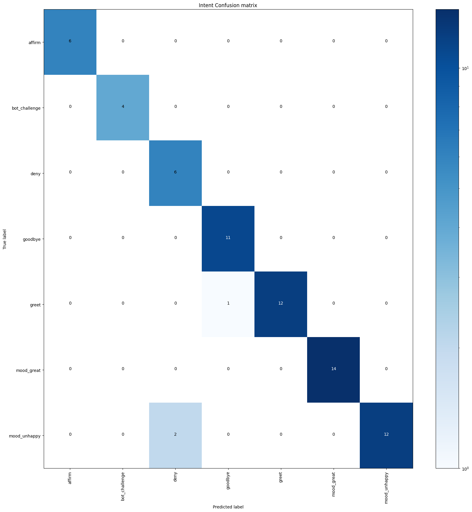
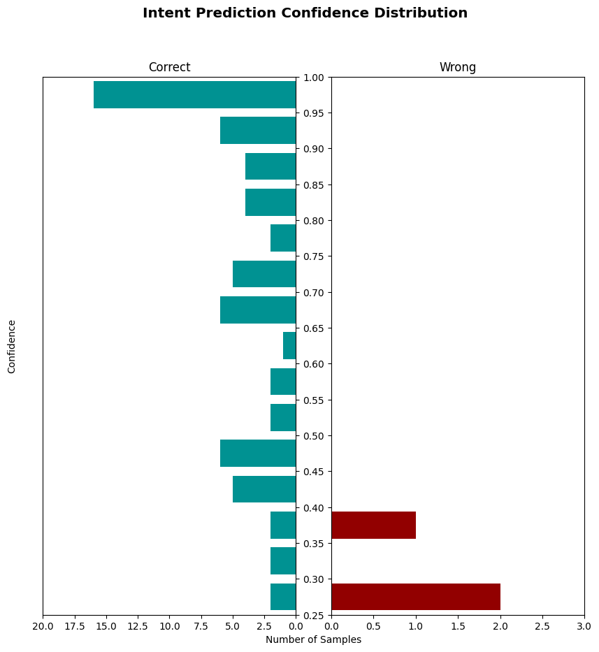

# 测试对话机器人

开源 Rasa 允许你通过运行测试故事来端到端地验证和测试对话。此外，你还可以分别测试对话管理和消息处理（NLU）。

## 验证数据和故事 {#validating-data-and-stories}

数据验证校验领域、NLU 数据和故事数据中不会出现错误或重大不一致。要验证你的数据，可以让 CI 运行如下命令：

```shell
rasa data validate
```

如果你将 `max_history` 值传递给 `config.yml` 文件中的一个或多个策略，请提供这些值中的最小值作为：

```shell
rasa data validate --max-history <max_history>
```

如果数据验证出现错误，训练模型可能失败或产生不好的效果。因此在训练模型之前运行此检查总是好的。通过包含 `--fail-on-warnings` 标志，此步骤会因更多小问题的警告而失败。

!!! info "注意"

    运行 `rasa data validate` 不会测试你的[规则](rules.md)是否与故事一致。但是，在训练期间，`RulePolicy` 会检查规则和故事之间的冲突。任何此类冲突都会中止训练。

要阅读有关验证器和所有可用选项的更多信息，请参见 [`rasa data validate` 的文档](../command-line-interface.md#rasa-data-validate)。

## 编写测试故事 {#writing-test-stories}

在测试故事上测试训练好的模型是确保对话机器人能在某些情况下正常运行的最佳方式。以修改的故事格式编写测试故事允许你提供整个对话并测试，给定某些用户输入，你的模型将以预期的方式运行。当你开始从用户对话中引入更复杂的故事时，这一点尤其重要。

测试故事类似训练数据中的故事，但也会包含用户信息。

如下为一些示例：

=== "基础"

    ```yaml title='tests/test_stories.yml' hl_lines="5 9 13"
    stories:
    - story: A basic story test
    steps:
    - user: |
        hello
      intent: greet
    - action: utter_ask_howcanhelp
    - user: |
        show me [chinese]{"entity": "cuisine"} restaurants
      intent: inform
    - action: utter_ask_location
    - user: |
        in [Paris]{"entity": "location"}
      intent: inform
    - action: utter_ask_price
    ```

=== "按钮载荷"

    ```yaml title='tests/test_stories.yml' hl_lines="8 11"
    stories:
    - story: A test where a user clicks on a button with payload
    steps:
    - user: |
        hello
      intent: greet
    - action: utter_ask_howcanhelp
    - user: /inform{{"cuisine":"chinese"}}
      intent: inform
    - action: utter_ask_location
    - user: /inform{{"location":"Paris"}}
      intent: inform
    - action: utter_ask_price
    ```

=== "自定义动作"

    ```yaml title="tests/test_stories.yml" hl_lines="5 12"
        stories:
    - story: A test where a custom action returns events
    steps:
    - user: |
        hey
      intent: greet
    - action: my_custom_action
    - slot_was_set:
        - my_slot: "value added by custom action"
    - action: utter_ask_age
    - user: |
        thanks
      intent: thankyou
    - action: utter_no_worries
    ```

=== "表单预期路径"

    ```yaml title="tests/test_stories.yml" hl_lines="5 9 14 20"
    stories:
    - story: A test story with a form
    steps:
    - user: |
        hi
      intent: greet
    - action: utter_greet
    - user: |
        im looking for a restaurant
      intent: request_restaurant
    - action: restaurant_form
    - active_loop: restaurant_form
    - user: |
        [afghan](cuisine) food
      intent: inform
    - action: restaurant_form
    - active_loop: null
    - action: utter_slots_values
    - user: |
        thanks
      intent: thankyou
    - action: utter_no_worries
    ```

=== "表单非预期路径"

    ```yaml title="tests/test_stories.yml" hl_lines="5 9 14 21"
    stories:
    - story: A test story with unexpected input during a form
    steps:
    - user: |
        hi
      intent: greet
    - action: utter_greet
    - user: |
        im looking for a restaurant
      ntent: request_restaurant
    - action: restaurant_form
    - active_loop: restaurant_form
    - user: |
        How's the weather?
      intent: chitchat
    - action: utter_chitchat
    - action: restaurant_form
    - active_loop: null
    - action: utter_slots_values
    - user: |
        thanks
      intent: thankyou
    - action: utter_no_worries
    ```

默认情况下，该命令将对名称以 `test_` 开头的任何文件的故事运行测试。你还可以使用 `--stories` 参数提供特定的测试故事文件或目录。你可以通过运行如下命令来测试对话机器人：

```shell
rasa test
```

对话测试仅确保包含的用例测试的准确性，因此你应该持续增加测试故事集来改进对话机器人。一个好的经验法则是，你的目标应该是让你的测试故事能代表真实对话的分布。

有关更多配置选项，请参见 [`rasa test` 的 CLI 文档](../command-line-interface.md#rasa-test)。

!!! warning "测试自定义动作"

    [自定义动作](../concepts/custom-actions.md)并不作为测试故事的一部分执行。如果你的自定义动作将任意事件附加到对话中，这必须反应在你的测试故事中（例如，通过将 `slot_was_set` 事件添加到你的测试故事）。

    要测试自定义动作的代码，你应该为他们编写单元测试并将这些测试包含在 [CI/CD 流水线](../production/setting-up-ci-cd.md)中。

## 评估 NLU 模型 {#evaluating-an-nlu-model}

除了测试故事，你还可以单独测试自然语言理解（NLU）模型。在现实中部署对话机器人后，它将处理未在训练数据中看到的消息。为了模拟这一点，应该始终留出一部分数据进行测试。你可以：

1. 通过混洗和拆分 NLU 数据构建[保留的测试集](testing-your-assistant.md#using-a-held-out-test-set)
2. 使用[交叉验证](testing-your-assistant.md#using-cross-validation)，这会自动创建多个训练/测试拆分

### 使用保留的测试集 {#using-a-held-out-test-set}

如果你使用训练-测试集方法，最好在每次评估模型时使用 `rasa data split` 对数据进行[混洗和拆分](../command-line-interface.md#rasa-data-split)，而不是使用容易过时的静态 NLU 测试集。

你可以使用如下方法将 NLU 数据拆分为训练集和测试集：

```shell
rasa data split nlu
```

接下来，你可以使用如下方法查看经过训练的 NLU 模型在生成的测试集中的预测能力：

```shell hl_lines="2"
rasa test nlu
    --nlu train_test_split/test_data.yml
```

### 使用交叉验证 {#using-cross-validation}

如果你对 NLU 训练数据进行了重大更改（例如，将一个意图拆分为两个意图或添加大量训练样本），则应该使用交叉验证运行完整的 NLU 评估。交叉验证会自动创建多个训练/测试拆分，并对每个训练/测试拆分的评估结果进行平均。这意味着在交叉验证期间评估所有数据，使得交叉验证成为自动测试 NLU 模型最彻底的方法。

要在交叉验证模式下运行 NLU 测试，请运行：

```shell hl_lines="3"
rasa test nlu
    --nlu data/nlu
    --cross-validation
```

你可以使用 `-f/--folds` 标识指定测试/训练拆分的数量：

```shell hl_lines="4"
rasa test nlu
    --nlu data/nlu
    --cross-validation
    --folds 5
```

请注意，在交叉验证期间，NLU 模型将针对每折数据进行训练，因此使用过多数据和较多折进行交叉验证可能会很耗时。在小型数据集上，较多折可能会导致每个测试拆分中每个意图的样本太少。

另一方面，如果指定的折数太少，数据将被分割成更大的块，并且每个折的训练数据将成比例地减少。

针对数据集大小选择可以平衡两个考虑因素的折的数量。

!!! tip "超参数调整"

    要进一步改进模型，请查看有关[超参数调整的教程](https://blog.rasa.com/rasa-nlu-in-depth-part-3-hyperparameters/)。

### 对比 NLU 流水线 {#comparing-nlu-pipelines}

为了充分利用训练数据，应该在不同的流水线和不同数量的训练数据上训练和评估模型。

为此，可以将多个配置文件传递给 `rasa test` 命令：

```shell hl_lines="2"
rasa test nlu --nlu data/nlu.yml
   --config config_1.yml config_2.yml
```

这将执行如下几个步骤：

1. 从 `data/nlu.yml` 创建一个全局的 80% 训练和 20% 测试拆分。
2. 从全局训练拆分中排除一定比例的数据。
3. 在剩余的训练数据上训练每个配置的模型。
4. 在全局测试拆分上评估每个模型。

在步骤 2 中使用不同百分比的训练数据重复上述过程，可以让你了解在增加训练数据量时每个流水线的行为方式。由于训练不是完全确定的，因此对于指定的每个配置，整个过程都重复了 3 次。

绘制所有执行中 [f1-score](https://scikit-learn.org/stable/modules/generated/sklearn.metrics.f1_score.html) 的平均值和标准差图。f1-score 图以及所有训练/测试集、训练模型、分类和错误报告将保存到名为 `nlu_comparison_results` 的文件夹中。

检查 f1-score 图可以帮助了解 NLU 模型是否有足够的数据。如果图显示在使用所有训练数据时 f1-score 仍在提高，则它可能会随着更多数据进一步提高。但是，如果在使用所有训练数据时 f1-score 已经趋于稳定，那么添加更多数据可能也无济于事。

如果要更改运行次数或排除百分比，可以运行：

```shell hl_lines="3"
rasa test nlu --nlu data/nlu.yml
  --config config_1.yml config_2.yml
  --runs 4 --percentages 0 25 50 70 90
```

### 解释输出 {#interpreting-the-output}

#### 意图分类器 {#intent-classifiers}

`rasa test` 脚本会为意图分类模型生成报告（`intent_report.json`）、混淆矩阵（`intent_confusion_matrix.png`）和置信度直方图（`intent_histogram.png`）。

报告记录了每个意图的[准确率](https://scikit-learn.org/stable/modules/generated/sklearn.metrics.precision_score.html)、[召回率](https://scikit-learn.org/stable/modules/generated/sklearn.metrics.recall_score.html)和 [f1-score](https://scikit-learn.org/stable/modules/generated/sklearn.metrics.f1_score.html)，并提供了总体的平均值。你可以使用 `--report` 参数将这些报告保存为 JSON 文件。

混淆矩阵显示了哪些意图被错误的分类为其他意图。任何被错误分类的样本都会被记录并保存到一个名为 `errors.json` 的文件中以便调试。

<figure markdown>
  { width="600" }
  <figcaption>意图混淆矩阵</figcaption>
</figure>

直方图可视化了所有预测的置信度，正确和不正确的预测分别由蓝色和红色进行显示。提高训练数据的质量将蓝色柱向上移动，红色柱向下移动。它还应该有助于减少红色直方图本身柱的数量。

<figure markdown>
  { width="600" }
  <figcaption>意图预测置信度分布</figcaption>
</figure>

#### 响应选择器 {#response-selectors}

`rasa test` 以与评估意图分类器相同的方式评估响应选择器，生成报告（`response_selection_report.json`）、混淆矩阵（`response_selection_confusion_matrix.png`）、置信度直方图（`response_selection_histogram.png`）和错误（`response_selection_errors.json`）。如果你的流水线包含多个响应选择器，则会在单个报告中对它们进行评估。

报告记录[检索意图](glossary.md#retrieval-intent)的每个子意图的准确率、召回率和 f1-score，并提供总体的平均值。你可以使用 `--report` 参数将这些报告保存为 JSON 文件。

#### 实体提取 {#entity-extraction}

`rasa test` 报告实体提取器经过训练识别的每种实体类型的准确率、召回率和 f1-score。

`rasa test` 仅评估可训练的实体提取器，例如 `DIETClassifier` 和 `CRFEntityExtractor`。并不评估像 `DucklingHTTPExtractor` 这样的预训练提取器。

如果你的流水线中有多个实体提取器，或使用一些自定义提取器，则多个实体可能和相同词语关联。在这种情况下，你可以在测试文件中使用列表进行标注，例如：

```yaml
stories:
- story: A basic test story with mutliple entities for a single token
  steps:
    - user: |
        I like [ice cream][{\"entity\": \"food\"}, {\"entity\": \"desert\"}]
      intent: inform
    # ...
```

!!! warning "错误实体标注"

    如果任何实体被错误地标注，则评估可能会失败。一个常见的问题是实体无法在词语内部开始或结束。例如，如果有像 `[Brian](name)'s house` 这样的 `name` 实体，则仅当分词器将 `Brian's` 拆分为多个词时才有效。

#### 实体评分 {#entity-scoring}

为了评估实体提取，我们采用了一种简单的标记方法。我们并没有完全参考 [BILOU 标签](nlu-training-data.md#bilou-entity-tagging)，而是只考虑基本的每个词的实体类型标签。对于像“near Alexanderplatz”这样的位置实体，我们希望的标签为 `LOC LOC` 而不是基于 BILOU 的 `B-LOC L-LOC`。

在评估方面，我们的方法更加宽松，因为它鼓励部分提取且不惩罚实体的拆分。例如，给定上述实体“near Alexanderplatz”和提取的“Alexanderplatz”，我们的方法鼓励提取“Alexanderplatz”并惩罚遗漏的单词“near”。

然而，基于 BILOU 的方法会将其标记为完全错误，因为他希望“Alexanderplatz”被标记为实体的最后一个词（L-LOC），而不是一个单独词的实体（U-LOC）。需要注意，“near”和“Alexanderplatz”的拆分提取在我们的方法中可以获得满分，但在基于 BILOU 的方法中会获得零分。

以下是“near Alexanderplatz tonight”这句话两种评分机制的比较：

| 提取的                                              | 简单标签（分数） | BILOU 标签（分数）     |
| :-------------------------------------------------- | :--------------- | :--------------------- |
| `[near Alexanderplatz](loc) [tonight](time)`        | loc loc time (3) | B-loc L-loc U-time (3) |
| `[near](loc) [Alexanderplatz](loc) [tonight](time)` | loc loc time (3) | U-loc U-loc U-time (1) |
| `near [Alexanderplatz](loc) [tonight](time)`        | O loc time (2)   | O U-loc U-time (1)     |
| `[near](loc) Alexanderplatz [tonight](time)`        | loc O time (2)   | U-loc O U-time (1)     |
| `[near Alexanderplatz tonight](loc)`                | loc loc loc (2)  | B-loc I-loc L-loc (1)  |

## 评估对话模型 {#evaluating-a-dialogue-model}

你可以使用测试脚本在一组测试故事上评估训练的对话模型：

```shell
rasa test core --stories test_stories.yml --out results
```

这会将所有失败的故事打印到 `results/failed_test_stories.yml` 中。如果一个动作被预测错误，则这个故事就失败了。

测试脚本还将混淆矩阵保存到名为 `results/story_confmat.pdf` 的文件中。对于领域中的每个动作，混淆矩阵显示正确预测该动作的频率以及预测错误动作的频率。

### 解释生成的警告 {#interpreting-the-generated-warnings}

测试脚本还会生成一个名为 `results/stories_with_warnings.yml` 的警告文件。该文件包含在任何对话轮次中都预测了 [`action_unlikely_intent`](default-actions.md#action_unlikely_intent) 但原始故事中的所有动作都被正确预测的所有测试故事。但是，如果一个测试故事最初就包含一个 `action_unlikely_intent`，例如为了[确保一个规则在一个 `action_unlikely_intent` 之后触发对话路径](default-actions.md#customization-1)，但策略集未能做到，那么相应的故事也将作为一个失败的故事出现在 `results/failed_test_stories.yml` 中。

这些故事按 `action_unlikely_intent` 预测的严重程度进行排序。严重程度由 [`UnexpecTEDIntentPolicy`](policies.md#unexpected-intent-policy) 在预测时计算。值越大越严重，越不可能为意图，因此审查特定的对话路径变得更加关键。

请注意，`action_unlikely_intent` 是由 `UnexpecTEDIntentPolicy` 预测的，它在后台采用基于机器学习的模型，因此也可能导致错误警告。如果这些故事中的对话路径已经存在于训练故事中，你可以选择忽略此类警告。

### 比较策略配置 {#comparing-policy-configurations}

要为对话模型选择配置，或为特定策略选择超参数，你需要衡量对话模型对未见过的对话的泛化能力。尤其是在项目开始时，当你没有很多真实的对话来训练对话机器人时，你可能并不想排除一些用作测试集。

开源 Rasa 有一些脚本可以帮助你选择和微调你的策略配置。一旦你对其满意，你就可以在完整的数据集上训练得到最终配置。

为此，你首先必须针对不同配置训练模型。创建两个（或更多）配置文件，包括你要比较的策略，然后将它们提供给训练脚本来训练模型：

```shell
rasa train core -c config_1.yml config_2.yml \
  --out comparison_models --runs 3 --percentages 0 5 25 50 70 95
```

与[评估 NLU 模型](testing-your-assistant.md#comparing-nlu-pipelines)的方式类似，上述命令在多种配置和不同数量的训练数据上训练模型。对于提供的每个配置文件，开源 Rasa 将训练对话模型，其中 0%、5%、25%、50%、70% 和 95% 的训练故事将从训练数据中排除。重复此操作 3 次以确保结果一致。

脚本结束后，你可以将多个模型传递给测试脚本来比较刚才训练的模型：

```shell
rasa test core -m comparison_models --stories stories_folder
  --out comparison_results --evaluate-model-directory
```

这将评估 `stories_folder` 中故事的每个模型（可以是训练集或测试集），并绘制一些图表来展示哪个策略执行的最好。由于之前的训练命令排除了一些训练数据来训练每个模型，因此上面的测试命令可以测量你的模型对保留故事的预测能力，要比较单个策略，请创建每个仅包含一个策略的配置文件。

!!! info "注意"

    训练过程可能需要很长时间，因此我们建议让它在后台某个不会被中断的地方运行。

### 测试动作代码 {#testing-action-code}

用于测试动作的代码的方法取决于它是如何实现的。例如，如果你连接到外部 API，你应该编写集成测试以确保这些 API 按预期响应输入。如论你如何测试动作代码，都应该将这些测试包含在 CI 流水线中，以便在每次更改时运行。

如果有任何疑问和问题，请在[论坛的测试部分](https://forum.rasa.com/tags/testing)与我们分享。

### 端到端测试 {#end-to-end-testing}

<button data-md-color-primary="amber">仅 Rasa Pro</button>
