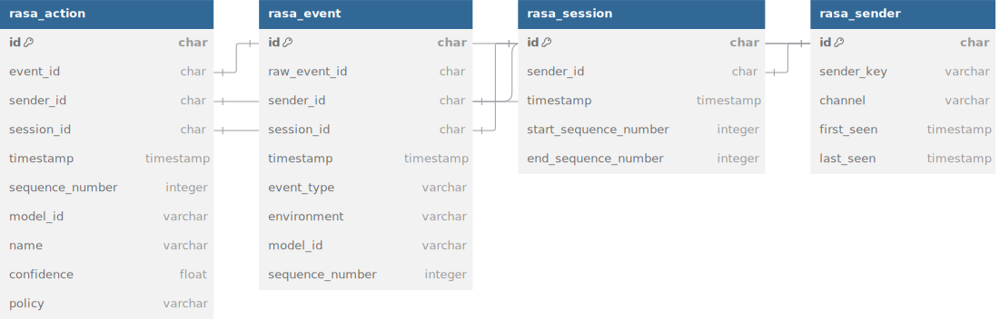

# 数据结构参考

分析管道创建的数据结构概述。可用于构建分析仪表板的所有表和属性的描述。

数据结构由 Analytics 管道创建，并被视为公共 API。API 的版本控制遵循 [Rasa 产品发布和维护政策](https://rasa.com/rasa-product-release-and-maintenance-policy/)。所有[内部表](#internal-tables)都应视为私有，可能会随时更改，恕不另行通知。

## 数据库表概述 {#database-table-overview}

<figure markdown>
  
</figure>

## 常用术语 {#common-terms}

- 发送者是通过频道与对话机器人交谈的用户。如果用户使用多个频道，则可能有多个发送者，例如通过网站和集成到移动应用程序中的频道与对话机器人通信。
- 会话是发送者和对话机器人之间的对话。当发送者向对话机器人发送消息时，会话开始，当会话超时或明确结束时，会话结束。如果会话因较长时间不活动而中断，则新活动将触发创建新会话（[可通过会话超时配置](../../concepts/domain.md#session-configuration)）。
- 轮次总是从发送者的消息开始，并在发送者的下一条消息之前结束。轮次也可以以会话超时或明确结束而结束。轮次通常包含至少一个对话机器人响应。
- 对话堆栈框架表示 CALM 对话机器人在某个时间点的状态。堆栈框架包含对话机器人的活动流和步骤。堆栈框架是在对话机器人通过流前进时创建的，并随着发送给对话机器人的每个事件而更新。堆栈帧存储在 [`rasa_dialogue_stack_frame`](#rasa_dialogue_stack_frame) 表中。

## 表 {#tables}

### rasa_sender {#rasa_sender}

发送者是通过 Rasa 频道与对话机器人交互的用户。如果对话机器人支持多个频道，则用户可能有多个发送者。例如，用户可能有一个 Facebook 频道的发送者和一个 Slack 频道的发送者。

<figure markdown>
  
</figure>

#### `id` 发送者标识符 {#id-sender-identifier}

发送者的唯一标识符由 Analytics 生成。发送者会获得不同的已生成 ID。该 `id` 与 Rasa 频道使用的 `sender_id` 不同，Rasa 中的 `sender_id` 是 Analytics 中的 `sender_key`。

- 类型：`varchar(36)`
- 示例：`a78783c4-bef7-4e55-9ec7-5afb4420f19a`

#### `sender_key` Rasa 频道发送者标识符 {#sender_key-rasa-channel-sender-identifier}

Rasa 频道用于识别此发送者的唯一标识符。`sender_key` 特定于 Rasa 中的频道实现，格式取决于频道。

- 类型：`varchar(255)`
- 示例：`fb26ba0a9d8b4bd99e2b8716acb19e4b`

#### `channel` Rasa 频道名称 {#channel-rasa-channel-name}

用于此发送者的频道的名称。频道名称在相应 Rasa 频道的实现中定义。

- 类型：`varchar(255)`
- 示例：`socket.io`

#### `first_seen` 与此发送者的最早联系 {#first_seen-first-contact-with-this-sender}

与此发送者的最早联系的日期和时间。对应于为此发送者创建的第一个会话的最早事件的时间。

- 类型：`DateTime`
- 示例：`2022-06-28 02:15:49.326936`

#### `last_seen` 与此发送者的最后联系 {#last_seen-latest-contact-with-this-sender}

与此发送者的最后联系的日期和时间。对应于为此发送者创建的最新会话的最后事件的时间。

- 类型：`DateTime`
- 示例：`2022-10-28 02:15:49.326936`

### rasa_session {#rasa_session}

`rasa_session` 表包含用户与对话机器人开始的所有对话会话的信息。每个新用户以及返回对话机器人的用户都会创建新会话。触发新会话开始的条件可以在 [Rasa 领域](../../concepts/domain.md#session-configuration)中配置。

<figure markdown>
  
</figure>

#### `id` 会话标识符 {#id-session-identifier}

会话的唯一标识符。每个会话都会分配一个不同的生成 ID。

- 类型：`varchar(36)`
- 示例：`63b150a6-21a3-4e6c-bb24-5ab6ddc30cf1`

#### `sender_id` 启动会话的发送者 {#sender_id-sender-who-started-the-session}

启动会话的发送者的唯一标识符。它是 [`rasa_sender.id`](#rasa_sender) 列的外键。

- 类型：`varchar(36)`
- 示例：`9e4ebded-f232-4cc5-af78-d98daa0c1a53`

#### `timestamp` 创建日期时间 {#timestamp-creation-date-time}

会话创建的时间戳。时间戳为 UTC。

- 类型：`DateTime`
- 示例：`2022-06-28 02:15:49.326936`

#### `start_sequence_number` 会话开始 {#start_sequence_number-start-of-the-session}

此会话中第一个事件的序列号。所有事件都属于一个会话。起始序列号始终小于或等于 `end_sequence_number`。起始和结束序列号之间的差值不等于此会话中的事件数，因为序列号在多个对话中递增。

- 类型：`Integer`
- 示例：`78`

#### `end_sequence_number` 会话结束 {#end_sequence_number-end-of-the-session}

会话中最后一个事件的序列号。

- 类型：`Integer`
- 示例：`91`

### rasa_turn {#rasa_turn}

`rasa_turn` 表包含有关所有对话轮次的信息。轮次是用户和对话机器人之间的一次互动。轮次始终以用户消息开始。它以下一个用户消息之前的最后一个事件或会话结束而结束。轮次通常是一条用户消息，后面跟着一个或多个对话机器人响应。用户消息和轮次结束之间的所有事件都属于同一轮次。

<figure markdown>
  
</figure>

#### `id` 会话标识符 {#id-session-identifier-1}

轮次的唯一标识符。每个轮次都会分配一个不同的生成 ID。

- 类型：`varchar(36)`
- 示例：`ffa5d0cd-f5a6-45a4-9506-ba7ffd76edf1`

#### `sender_id` 发起轮次的发送者 {#sender_id-sender-who-started-the-turn}

发起轮次的发送者的唯一标识符。它是 [`rasa_sender.id`](#rasa_sender) 列的外键。

- 类型：`varchar(36)`
- 示例：`9e4ebded-f232-4cc5-af78-d98daa0c1a53`

#### `session_id` 会话标识符 {#session_id-session-identifier}

此轮次所属会话的唯一标识符。它是 [`rasa_session.id`](#rasa_session) 列的外键。

- 类型：`varchar(36)`
- 示例：`63b150a6-21a3-4e6c-bb24-5ab6ddc30cf1`

#### `start_sequence_number` 轮次开始 {#start_sequence_number-start-of-the-turn}

此轮次中第一个事件的序列号。所有事件都属于一个会话。起始序列号始终小于或等于 `end_sequence_number`。起始和结束序列号之间的差值不等于此会话中的事件数，因为序列号在多个对话中递增。

- 类型：`Integer`
- 示例：`79`

#### `end_sequence_number` 轮次结束 {#end_sequence_number-end-of-the-turn}

此轮次中最后一个事件的序列号。

- 类型：`Integer`
- 示例：`82`

### rasa_dialogue_stack_frame {#rasa_dialogue_stack_frame}

`rasa_dialogue_stack_frame` 表包含有关最顶层对话堆栈帧的活动流标识符和流步骤 ID 的信息。CALM 对话机器人在流和跨流前进时，会向对话堆栈添加和删除堆栈帧。当收到新的 `DialogueStackUpdated` 事件时，该表将使用新的堆栈帧信息进行更新。

堆栈帧记录的结束序列号将使用对话机器人在发出 `DialogueStackUpdated` 事件后发送的每个 [rasa 事件](#rasa_event)的序列号属性进行更新。这表明在此堆栈更新事件之后发生的事件与已保存的堆栈帧记录相关联。当收到下一个 `DialogueStackUpdated` 事件时，结束序列号不再更新。

<figure markdown>
  
</figure>

#### `id` 堆栈框架标识符 {#id-stack-frame-identifier}

堆栈框架的唯一标识符。每个堆栈框架记录都会分配一个不同的生成 ID。

#### `sender_id` 启动堆栈框架的发送者 {#sender_id-sender-who-started-the-stack-frame}

启动堆栈框架的发送者的唯一标识符。它是 [`rasa_sender.id`](#rasa_sender) 列的外键。

- 类型：`varchar(36)`
- 示例：`9e4ebded-f232-4cc5-af78-d98daa0c1a53`

#### `session_id` 会话标识符 {#session_id-session-identifier-1}

此堆栈框架所属会话的唯一标识符。它是 [`rasa_session.id`](#rasa_session) 列的外键。

- 类型：`varchar(36)`
- 示例：`63b150a6-21a3-4e6c-bb24-5ab6ddc30cf1`

#### `active_flow_identifier` 活动流标识符 {#active_flow_identifier-active-flow-identifier}

堆栈框架中活动流的标识符。流标识符是流 yaml 文件中的流 ID。当对话机器人不在流中时，活动流标识符为 `null`。

- 类型：`varchar(255)`
- 示例：`book_restaurant`

#### `flow_step_id` 步骤标识符 {#flow_step_id-step-identifier}

堆栈框架中当前步骤的标识符。步骤标识符是 flows yaml 文件中的步骤 ID。当对话机器人不在流中时，当前步骤为 `null`。

- 类型：`varchar(255)`
- 示例：`2_ask_amount`

#### `inserted_at` 创建时间戳 {#inserted_at-creation-timestamp}

堆栈框架创建的时间戳。时间戳为 UTC。时间戳对应于堆栈框架中的第一个事件时间戳。

- 类型：`DateTime`
- 示例：`2022-06-28 02:15:49.326936`

#### `start_sequence_number` 堆栈框架的开始 {#start_sequence_number-start-of-the-stack-frame}

此堆栈框架中第一个事件的序列号。所有事件都属于一个会话。起始序列号始终小于或等于 `end_sequence_number`。起始序列号和结束序列号之间的差值不等于此会话中的事件数，因为序列号在多个对话中递增。

- 类型：`Integer`
- 示例：`79`

#### `end_sequence_number` 堆栈帧结束 {#end_sequence_number-end-of-the-stack-frame}

此堆栈帧中最后一个事件的序列号。

- 类型：`Integer`
- 示例：`82`

### rasa_flow_status {#rasa_flow_status}

`rasa_flow_status` 表包含有关任何给定会话中的活动流、流状态和流步骤 ID 的信息。

<figure markdown>
  
</figure>

#### `id` 流状态标识符 {#id-flow-status-identifier}

流状态记录的唯一标识符。每个流状态记录都会分配一个不同的生成 ID。

#### `sender_id` 启动流状态的发送者 {#sender_id-sender-who-started-the-flow-status}

启动流事件的发送者的唯一标识符。它是 [`rasa_sender.id`](#rasa_sender) 列的外键。

- 类型：`varchar(36)`
- 示例：`9e4ebded-f232-4cc5-af78-d98daa0c1a53`

#### `session_id` 会话标识符 {#session_id-session-identifier-2}

此堆栈框架所属会话的唯一标识符。它是 [`rasa_session.id`](#rasa_session) 列的外键。

- 类型：`varchar(36)`
- 示例：`63b150a6-21a3-4e6c-bb24-5ab6ddc30cf1`

#### `flow_identifier` 流标识符 {#flow_identifier-flow-identifier}

堆栈框架中活动流的标识符。流标识符是流 yaml 文件中的流 ID。

- 类型：`varchar(255)`
- 示例：`book_restaurant`

#### `flow_status` 流标状态 {#flow_status-flow-status}

流的状态。流状态可以是以下之一：

- `started`：流已启动，对话机器人在流中。
- `completed`：流已完成，对话机器人不在流中。
- `interrupted`：流已中断，对话机器人不在流中。
- `resumed`：流已恢复，对话机器人在流中。
- `canceled`：流已中止，对话机器人不在流中。

- 类型：`varchar(255)`
- 示例：`started`

#### `step_id` 步骤标识符 {#step_id-step-identifier}

堆栈框架中当前步骤的标识符。步骤标识符是流 yaml 文件中的步骤 ID。

- 类型：`varchar(255)`
- 示例：`0_ask_amount`

#### `inserted_at` 创建时间戳 {#inserted_at-creation-timestamp-1}

流状态创建的时间戳。时间戳采用 UTC 格式。

- 类型：`DateTime`
- 示例：`2022-06-28 02:15:49.326936`

### rasa_event {#rasa_event}

`rasa_event` 表包含对话机器人创建的所有事件。每个用户消息、机器人响应和执行的动作以及对话会话的大量内部更改都会创建事件。[所有 Rasa 事件的概述](../../action-server/events.md)。

<figure markdown>
  
</figure>

#### `id` 事件标识符 {#id-event-identifier}

事件的唯一标识符。每个事件都会分配不同的生成 ID。

- 类型：`varchar(36)`
- 示例：`f5adcd16-b18d-4c5c-95f0-1747b20cb0e6`

#### `sender_id` 事件所属对话的发送者 {#sender_id-sender-whose-conversation-the-event-belongs-to}

此事件所属对话的发送者的唯一标识符。它是 [`rasa_sender.id`](#rasa_sender) 列的外键。

- 类型：`varchar(36)`
- 示例：`9e4ebded-f232-4cc5-af78-d98daa0c1a53`

#### `session_id` 会话标识符 {#session_id-session-identifier-3}

此事件所属会话的唯一标识符。它是 [`rasa_session.id`](#rasa_session) 列的外键。

- 类型：`varchar(36)`
- 示例：`63b150a6-21a3-4e6c-bb24-5ab6ddc30cf1`

#### `timestamp` 创建时间戳 {#timestamp-creation-date-time-1}

事件创建的时间戳。时间戳为 UTC。

- 类型：`DateTime`
- 示例：`2022-06-28 02:15:49.326936`

#### `event_type` 事件类型 {#event_type-kind-of-event}

事件的类型。事件类型为字符串，可以是以下之一：

- `user`：用户向对话机器人发送了消息。
- `bot`：对话机器人向用户发送了消息。
- `action`：对话机器人执行了动作。
- `session_started`：已启动新会话。
- `action_execution_rejected`：动作执行失败。
- `active_loop`：对话机器人当前处于循环中。
- `slot`：已设置插槽。
- `followup`：触发了后续动作。
- `loop_interrupted`：循环被中断。
- `pause`：会话暂停，例如，因为会话被移交给人工代理。
- `restart`：会话重新启动。这将触发启动新会话。对话机器人的状态将被重置。
- `rewind`：对话机器人倒回到之前的状态。
- `user_featurization`：对话机器人将用户输入特征化。

事件类型定义如何解释事件以及事件如何影响对话。例如，用户事件类型将被解释为用户消息，而对话机器人事件类型将被解释为对话机器人响应。

- 类型：`varchar(255)`
- 示例：`action`

#### `model_id` 模型标识符 {#model_id-model-identifier}

创建此事件时作为对话机器人的一部分运行的 Rasa 模型的标识符。

- 类型：`varchar(255)`
- 示例：`75a985b7b86d442ca013d61ea4781b22`

#### `environment` 对话机器人环境名称 {#environment-name-of-the-assistant-environment}

创建此事件的对话机器人的环境名称。环境是在对话机器人启动期间设置的字符串，

- 类型：`varchar(255)`
- 示例：`production`

#### `sequence_number` 事件开始 {#sequence_number-start-of-the-event}

事件的序列号。会话的事件始终具有递增的序列号。对于一个接一个的事件，序列号不能保证是连续的。但序列号可用于对会话的事件进行排序。

- 类型：`Integer`
- 示例：`78`

### rasa_bot_message {#rasa_bot_message}

对话机器人向用户发送的消息将在 `rasa_bot_message` 表中跟踪。该表包含有关已发送消息的信息。

<figure markdown>
  
</figure>

#### `id` 机器人消息标识符 {#id-bot-message-identifier}

机器人消息的唯一标识符由 Analytics 生成。

- 类型：`varchar(36)`
- 示例：`2f2e5384-1bfa-4b53-90a7-c75e5f20b117`

#### `event_id` 此消息事件的 ID {#event_id-id-of-the-event-of-this-message}

创建此机器人消息的事件的唯一标识符。它是 [`rasa_event.id`](#rasa_event) 列的外键。

- 类型：`varchar(36)`
- 示例：`f5adcd16-b18d-4c5c-95f0-1747b20cb0e6`

#### `sender_id` 消息所属对话的发送者 {#sender_id-sender-whose-conversation-the-message-belongs-to}

此消息所属对话的发送者的唯一标识符。它是 [`rasa_sender.id`](#rasa_sender) 列的外键。

- 类型：`varchar(36)`
- 示例：`9e4ebded-f232-4cc5-af78-d98daa0c1a53`

#### `session_id` 会话标识符 {#session_id-session-identifier-4}

此消息所属会话的唯一标识符。它是 [`rasa_session.id`](#rasa_session) 列的外键。

- 类型：`varchar(36)`
- 示例：`63b150a6-21a3-4e6c-bb24-5ab6ddc30cf1`

#### `timestamp` 创建日期时间 {#timestamp-creation-date-time-2}

消息创建的时间戳。时间戳为 UTC。

- 类型：`DateTime`
- 示例：`2022-06-28 02:15:49.326936`

#### `template_name` 用于生成消息的模板的名称 {#template_name-name-of-the-template-used-to-generate-the-message}

Rasa 用于生成机器人消息的模板的名称。如果消息不是从模板生成的，而是自定义动作生成的，则可能为空。

- 类型：`varchar(255)`
- 示例：`utter_greet`

#### `text` 消息内容 {#text-message-content}

机器人消息的文本。

- 类型：`varchar(65535)`
- 示例：`Ok, what can I help you with?`

#### `model_id` 模型标识符 {#model_id-model-identifier-1}

创建此消息时作为对话机器人的一部分运行的 Rasa 模型的标识符。

- 类型：`varchar(255)`
- 示例：`75a985b7b86d442ca013d61ea4781b22`

#### `sequence_number` 事件开始 {#sequence_number-start-of-the-event-1}

消息的序列号。会话的事件始终具有递增的序列号。此消息的序列号与基础事件的序列号相同。

- 类型：`Integer`
- 示例：`78`

### rasa_user_message {#rasa_user_message}

用户向对话机器人发送的消息将在 `rasa_user_message` 表中跟踪。该表包含有关已发送消息的信息。

<figure markdown>
  
</figure>

#### `id` 用户消息标识符 {#id-user-message-identifier}

用户消息的唯一标识符由 Analytics 生成。

- 类型：`varchar(36)`
- 示例：`49fdd79e-976b-47c2-ab27-a4c3d743a1c9`

#### `event_id` 此消息事件的 ID {#event_id-id-of-the-event-of-this-message-1}

创建此用户消息的事件的唯一标识符。它是 [`rasa_event.id`](#rasa_event) 列的外键。

- 类型：`varchar(36)`
- 示例：`f5adcd16-b18d-4c5c-95f0-1747b20cb0e6`

#### `sender_id` 消息所属对话的发送者 {#sender_id-sender-whose-conversation-the-message-belongs-to-1}

此消息所属对话的发送者的唯一标识符。它是 [`rasa_sender.id`](#rasa_sender) 列的外键。

- 类型：`varchar(36)`
- 示例：`9e4ebded-f232-4cc5-af78-d98daa0c1a53`

#### `session_id` 会话标识符 {#session_id-session-identifier-5}

此消息所属会话的唯一标识符。它是 [`rasa_session.id`](#rasa_session) 列的外键。

- 类型：`varchar(36)`
- 示例：`63b150a6-21a3-4e6c-bb24-5ab6ddc30cf1`

#### `intent` 文本的分类 {#intent-classification-of-the-text}

Rasa 将文本分类为的意图的名称。用于训练模型的域中的意图之一。

- 类型：`varchar(255)`
- 示例：`book_flight`

#### `retrieval_intent` 文本的分类 {#retrieval_intent-classification-of-the-text}

Rasa 将文本分类为的检索意图的名称。仅在配置了检索意图时填充。

- 类型：`varchar(255)`
- 示例：`book_flight/faq`

#### `confidence` 模型对分类的预测确定性 {#confidence-certainty-the-model-predicted-for-classifications}

ML 模型意图预测的置信度。置信度是介于 0 和 1 之间的值。值越高，模型对意图的确定性就越高。

- 类型：`Float`
- 示例：`0.8798527419567108`

#### `text` 消息内容 {#text-message-content-1}

用户消息的文本。

- 类型：`varchar(65535)`
- 示例：`I want to book a flight.`

#### `timestamp` 创建日期时间 {#timestamp-creation-date-time-3}

消息创建的时间戳。时间戳是 UTC。

- 类型：`DateTime`
- 示例：`2022-06-28 02:15:49.326936`

#### `model_id` 模型标识符 {#model_id-model-identifier-2}

创建此消息时作为对话机器人的一部分运行的 Rasa 模型的标识符。

- 类型：`varchar(255)`
- 示例：`75a985b7b86d442ca013d61ea4781b22`

#### `sequence_number` 事件的开始 {#sequence_number-start-of-the-event-2}

消息的序列号。会话的事件始终具有递增的序列号。此消息的序列号与基础事件的序列号相同。

- 类型：`Integer`
- 示例：`78`

#### `message_id` 消息文本的唯一 ID {#message_id-unique-id-for-the-message-text}

标识消息文本的唯一 ID。

- 类型：`varchar(255)`
- 示例：`7cdb5700ac9c493aa46987b77d91c363`

### rasa_llm_command {#rasa_llm_command}

[`LLMCommandGenerator`](../../concepts/dialogue-understanding.md#commandgenerator) 发送的命令将在 `rasa_llm_command` 表中跟踪。该表包含响应每条用户消息而发出的命令的信息。

<figure markdown>
  
</figure>

#### `id` llm 命令标识符 {#id-llm-command-identifier}

LLM 命令的唯一标识符由 Analytics 生成。

- 类型：`varchar(36)`
- 示例：`49fdd79e-976b-47c2-ab27-a4c3d743a1c9`

#### `sender_id` 命令所属对话的发送者 {#sender_id-sender-whose-conversation-the-command-belongs-to}

此命令所属对话的发送者的唯一标识符。它是 [`rasa_sender.id`](#rasa_sender) 列的外键。

- 类型：`varchar(36)`
- 示例：`9e4ebded-f232-4cc5-af78-d98daa0c1a53`

#### `session_id` 会话标识符 {#session_id-session-identifier-6}

此命令所属会话的唯一标识符。它是 [`rasa_session.id`](#rasa_session) 列的外键。

- 类型：`varchar(36)`
- 示例：`63b150a6-21a3-4e6c-bb24-5ab6ddc30cf1`

#### `user_message_id` 用户消息文本的唯一 ID {#user_message_id-unique-id-for-the-user-message-text}

标识消息文本的唯一 ID。表示 [`rasa_user_message.message_id`](#rasa_user_message) 列的外键。

- 类型：`varchar(255)`
- 示例：`7cdb5700ac9c493aa46987b77d91c363`

#### `command` 命令名称 {#command-command-name}

发出的[命令](../../concepts/dialogue-understanding.md#command-reference)的名称。

- 类型：`varchar(255)`
- 示例：`set slot`

#### `inserted_at` 创建日期时间 {#inserted_at-creation-timestamp-2}

收到用户消息的时间戳。时间戳为 UTC。

- 类型：`DateTime`
- 示例：`2022-06-28 02:15:49.326936`

#### `flow_identifier` 流标识符 {#flow_identifier-flow-identifier-1}

堆栈框架中活动流的标识符。流标识符是流 yaml 文件中的流 ID。这仅适用于 `start flow` 命令。

- 类型：`varchar(255)`
- 示例：`book_restaurant`

#### `set_slot_name` 插槽名称 {#set_slot_name-slot-name}

设置的插槽的名称。这仅适用于 `set slot` 命令。

- 类型：`varchar(255)`
- 示例：`restaurant_name`

#### `clarification_options` 流标识符列表 {#clarification_options-list-of-flow-identifiers}

用户可以从中选择的流标识符列表。这仅适用于澄清命令。

- 类型：`varchar(65535)`
- 示例：`'["add_contact", "remove_contact"]'`

### rasa_action {#rasa_action}

对话机器人执行的动作。机器人执行的所有动作均在 `rasa_action` 表中跟踪。该表包含有关执行的动作及其预测的信息。

<figure markdown>
  
</figure>

#### `id` 动作标识符 {#id-action-identifier}

动作执行的唯一标识符由 Analytics 生成。

- 类型：`varchar(36)`
- 示例：`bd074dc7-e745-4db6-86d0-75b0af7bc067`

#### `event_id` 此动作执行事件的 ID {#event_id-id-of-the-event-of-this-action-execution}

创建此动作执行的事件的唯一标识符。它是 [`rasa_event.id`](#rasa_event) 列的外键。

- 类型：`varchar(36)`
- 示例：`f5adcd16-b18d-4c5c-95f0-1747b20cb0e6`

#### `sender_id` 触发此动作执行的对话的发送者 {#sender_id-sender-whose-conversation-triggered-this-action-execution}

触发此动作执行的对话的发送者的唯一标识符。它是 [`rasa_sender.id`](#rasa_sender) 列的外键。

- 类型：`varchar(36)`
- 示例：`9e4ebded-f232-4cc5-af78-d98daa0c1a53`

#### `session_id` 会话标识符 {#session_id-session-identifier-7}

此动作执行所属会话的唯一标识符。它是 [`rasa_session.id`](#rasa_session) 列的外键。

- 类型：`varchar(36)`
- 示例：`63b150a6-21a3-4e6c-bb24-5ab6ddc30cf1`

#### `name` 执行动作的名称 {#name-name-of-the-executed-action}

Rasa 已预测并执行的动作的名称。用于训练模型的域中的动作之一。

- 类型：`varchar(255)`
- 示例：`action_book_flight`

#### `confidence` ML 模型预测动作的确定性 {#confidence-ml-models-certainty-of-the-predicted-action}

ML 模型动作预测的置信度。置信度是 0 到 1 之间的值。值越高，模型越确定该动作是正确的。

- 类型：`Float`
- 示例：`0.9398527419567108`

#### `policy` 预测动作的策略的名称 {#policy-name-of-the-policy-that-predicted-the-action}

预测此动作的策略的名称。该策略是 Rasa 对话机器人中做出预测的组件。该策略可以是规则策略、记忆策略或 ML 策略。

- 类型：`varchar(255)`
- 示例：`policy_2_TEDPolicy`

#### `timestamp` 创建日期时间 {#timestamp-creation-date-time-4}

执行动作的时间戳。时间戳为 UTC。

- 类型：`DateTime`
- 示例：`2022-06-28 02:15:49.326936`

#### `model_id` 模型标识符 {#model_id-model-identifier-3}

执行此动作时作为对话机器人的一部分运行的 Rasa 模型的标识符。

- 类型：`varchar(255)`
- 示例：`75a985b7b86d442ca013d61ea4781b22`

#### `sequence_number` 事件开始 {#sequence_number-start-of-the-event-3}

执行动作的序列号。会话的事件始终具有递增的序列号。此执行动作的序列号与底层事件的序列号相同。

- 类型：`Integer`
- 示例：`78`

### rasa_slot {#rasa_slot}

已为会话设置的槽。所有对槽值的更改均在 `rasa_slot` 表中进行跟踪。该表包含有关槽值更改的信息。

<figure markdown>
  
</figure>

#### `id` 槽位更改标识符 {#id-slot-change-identifier}

此槽位值更改的唯一标识符由 Analytics 生成。

- 类型：`varchar(36)`
- 示例：`a793d284-b5b9-4cef-be8a-bc0f58c70c28`

#### `event_id` 触发此槽位更改的事件的 ID {#event_id-id-of-the-event-that-triggered-this-slot-change}

触发槽位值更改的事件的唯一标识符。它是 [`rasa_event.id`](#rasa_event) 列的外键。

- 类型：`varchar(36)`
- 示例：`f5adcd16-b18d-4c5c-95f0-1747b20cb0e6`

#### `sender_id` 触发此槽位更改的对话发送者 {#sender_id-sender-whose-conversation-triggered-this-slot-change}

触发此槽位更改的对话发送者的唯一标识符。它是 [`rasa_sender.id`](#rasa_sender) 列的外键。

- 类型：`varchar(36)`
- 示例：`9e4ebded-f232-4cc5-af78-d98daa0c1a53`

#### `session_id` 会话标识符 {#session_id-session-identifier-8}

此槽更改所属会话的唯一标识符。它是 [`rasa_session.id`](#rasa_session) 列的外键。

- 类型：`varchar(36)`
- 示例：`63b150a6-21a3-4e6c-bb24-5ab6ddc30cf1`

#### `slot_path` 槽的路径 {#slot_path-path-of-the-slot}

已更改槽的路径。该路径通过槽的名称、发送者和会话来标识槽。路径是一个字符串，类似于 `<sender_id>/<session_id>/<slot_name>`。

- 类型：`varchar(255)`
- 示例：`9e4ebded-f232-4cc5-af78-d98daa0c1a53/63b150a6-21a3-4e6c-bb24-5ab6ddc30cf1/email`

#### `name` 槽的名称 {#name-name-of-the-slot}

已更改槽的名称。槽的名称与域中的槽的名称相同。

- 类型：`varchar(255)`
- 示例：`email`

#### `value` 新槽值 {#value-new-slot-value}

会话槽的新值。该值是转储的 JSON 对象。

- 类型：`varchar(65535)`
- 示例：`john@example.com`

#### `timestamp` 创建日期时间 {#timestamp-creation-date-time-5}

槽值更改时的时间戳。时间戳为 UTC。

- 类型：`DateTime`
- 示例：`2022-06-28 02:15:49.326936`

#### `sequence_number` 事件开始时间 {#sequence_number-start-of-the-event-4}

槽位变化的序列号。会话的事件始终具有递增的序列号。槽位变化的序列号与底层事件的序列号相同。

- 类型：`Integer`
- 示例：`78`

### rasa_session_slot_state {#rasa_session_slot_state}

会话结束时槽的状态。槽的状态是会话结束时槽的值。槽的状态存储在 `rasa_session_slot_state` 表中。

<figure markdown>
  
</figure>

#### `id` 槽的路径 {#id-path-of-the-slot}

槽的路径。路径通过槽的名称、发送者和会话来标识槽。路径是一个字符串，类似于 `<sender_id>/<session_id>/<slot_name>`。

- 类型：`varchar(255)`
- 示例：`9e4ebded-f232-4cc5-af78-d98daa0c1a53/63b150a6-21a3-4e6c-bb24-5ab6ddc30cf1/email`

#### `sender_id` 此槽所属对话的发送者 {#sender_id-sender-whose-conversation-this-slot-is-part-of}

此槽所属对话的发送者的唯一标识符。它是 [`rasa_sender.id`](#rasa_sender) 列的外键。

- 类型：`varchar(36)`
- 示例：`9e4ebded-f232-4cc5-af78-d98daa0c1a53`

#### `session_id` 会话标识符 {#session_id-session-identifier-9}

此槽所属会话的唯一标识符。它是 [`rasa_session.id`](#rasa_session) 列的外键。

- 类型：`varchar(36)`
- 示例：`63b150a6-21a3-4e6c-bb24-5ab6ddc30cf1`

#### `name` 槽的名称 {#name-name-of-the-slot-1}

槽的名称。槽的名称与域中的槽的名称相同。

- 类型：`varchar(255)`
- 示例：`email`

#### `value` 会话中槽的最后一个值 {#value-last-value-of-the-slot-in-the-session}

会话结束时槽的值。该值是一个转储的 JSON 对象。如果在会话期间多次更改槽，则该值设置为最后一次更改。

- 类型：`varchar(65535)`
- 示例：`john@example.com`

#### `timestamp` 创建日期时间 {#timestamp-creation-date-time-6}

此会话中槽位的最后更新时间。时间戳为 UTC。

- 类型：`DateTime`
- 示例：`2022-06-21 02:15:49.326936`

### rasa_pattern {#rasa_pattern}

模式是从 Rasa 收到的标记定义。此表称为 rasa_pattern，以将其与存储在 rasa_marker 表中的提取标记区分开来。它存储标记的配置（可以将其视为对话事件的模式）及其元数据。

<figure markdown>
  
</figure>

#### `id` 模式标识符 {#id-pattern-identifier}

Rasa 模式的唯一标识符由 Analytics 生成。

- 类型：`varchar(36)`
- 示例：`bd074dc7-e745-4db6-86d0-75b0af7bc067`

#### `name` 模式名称 {#name-pattern-name}

模式名称

- 类型：`varchar()`
- 示例：`registration success`

#### `description` 模式描述 {#description-pattern-description}

模式描述

- 类型：`varchar()`
- 示例：`This marker identifies successful account registration in the chat`

#### `config` 模式配置{#config-pattern-configuration}

模式配置字典存储为转义字符串

- 类型：`varchar()`
- 示例：`"{'or': [{'intent': 'mood_unhappy'},{'intent': 'mood_great'}]}"`

#### `is_active` 软删除标识 {#is_active-soft-delete-flag}

实时分析期间仅处理 `is_active==True` 的模式

- 类型：`boolean`

#### `created_at` 创建日期时间 {#created_at-creation-date-time}

此模式的创建时间。时间戳为 UTC。

- 类型：`DateTime`
- 示例：`2022-06-21 02:15:49.326936`

#### `updated_at` 更新日期时间 {#updated_at-update-date-time}

此会话中模式的最后更新时间。时间戳为 UTC。

- 类型：`DateTime`
- 示例：`2022-06-21 02:15:49.326936`

### rasa_marker {#rasa_marker}

从对话中提取的标记。此表中的每一行都对应一个标记，以及模式、发送者、会话和提取标记的最后一个事件的详细信息。

<figure markdown>
  
</figure>

#### `id` 标记标识符 {#id-marker-identifier}

提取的 Rasa 标记的唯一标识符由 Analytics 生成。

- 类型：`varchar(36)`
- 示例：`bd074dc7-e745-4db6-86d0-75b0af7bc067`

#### `pattern_id` 在此标记中应用的模式 {#pattern_id-pattern-which-was-applied-in-this-marker}

在此标记中应用的模式的唯一标识符。它是 [`rasa_pattern.id`](#rasa_pattern) 列的外键

- 类型：`varchar(36)`
- 示例：`9e4ebded-f232-4cc5-af78-d98daa0c1a53`

#### `sender_id` 发送者标识符 {#sender_id-sender-identifier}

此标记所属对话的发送者的唯一标识符。它是 [`rasa_sender.id`](#rasa_sender) 列的外键。

- 类型：`varchar(36)`
- 示例：`9e4ebded-f232-4cc5-af78-d98daa0c1a53`

#### `session_id` 会话标识符 {#session_id-session-identifier-10}

此标记所属会话的唯一标识符。它是 [`rasa_session.id`](#rasa_session) 列的外键。

- 类型：`varchar(36)`
- 示例：`63b150a6-21a3-4e6c-bb24-5ab6ddc30cf1`

#### `event_id` 事件标识符 {#event_id-event-identifier}

此标记所应用的事件代理中事件的唯一标识符。请注意，一个标记可以应用于多个事件，这是序列中最后一个事件的 ID。

- 类型：`varchar(36)`
- 示例：`63b150a6-21a3-4e6c-bb24-5ab6ddc30cf1`

#### `num_preceding_user_turns` 正在进行的用户轮次数 {#num_preceding_user_turns-number-of-proeeding-user-turns}

一个整数，表示标记应用事件之前的用户轮次数。

- 类型：`Integer`
- 示例：`4`

#### `created_at` 创建日期时间 {#created_at-creation-date-time-1}

此标记的创建时间。时间戳为 UTC。

- 类型：`DateTime`
- 示例：`2022-06-21 02:15:49.326936`

## 内部表 {#internal-tables}

内部表用于存储有关对话机器人和发送给对话机器人的事件的信息。它们不用于直接查询，但对于 Analytics 的运行必不可少。它们是 Analytics 服务内部使用的私有 API，可能会在未经通知的情况下发生变化。

内部表：

- `_rasa_raw_event`
- `alembic_version`
