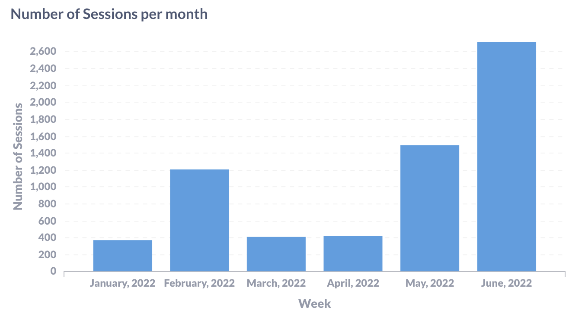
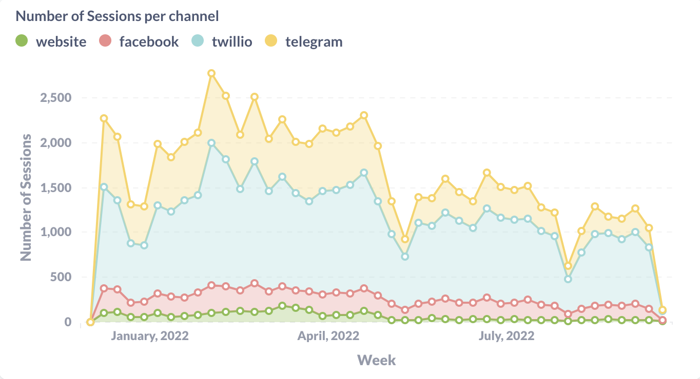
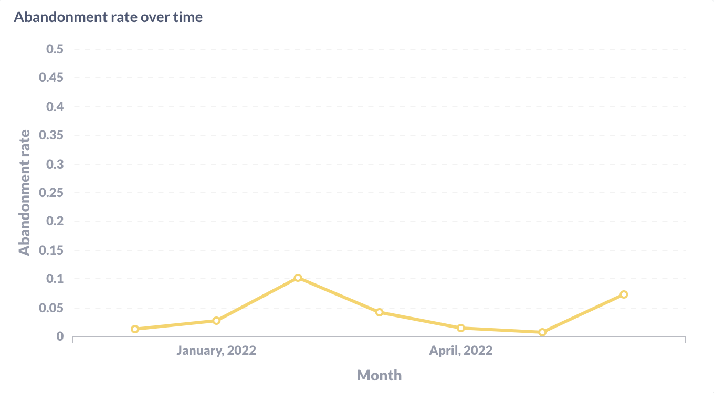
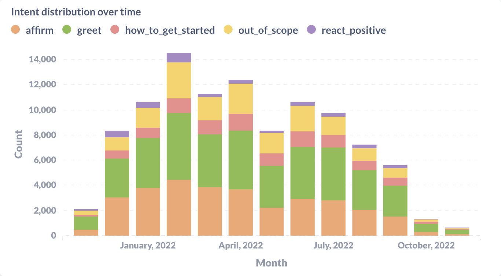
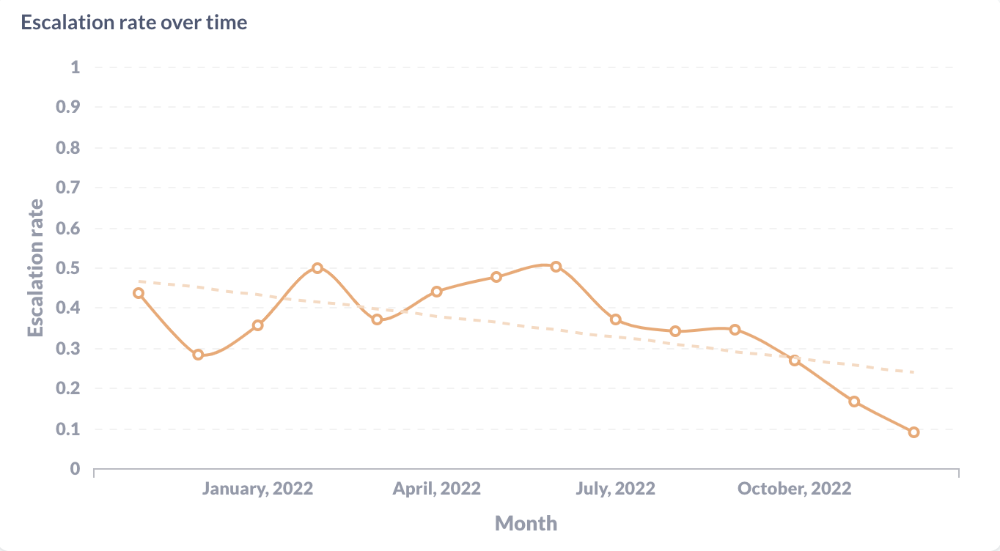

# 示例查询

本部分可帮助你开始分析对话机器人的对话。示例使用 SQL 查询和 Metabase 中的示例可视化。

有关更多指标和对话类别，请参阅[指标类型](getting-started-with-analytics.md#types-of-metrics)。

## 通用查询 {#universal-queries}

### 每月会话数 {#number-of-sessions-per-month}

对话机器人的常见高级使用指标是每月会话数。以下是 SQL 查询的形式：

```sql
SELECT
  date_trunc('month', "public"."rasa_session"."timestamp") AS "first_seen",
  count(*) AS "count"
FROM "public"."rasa_session"
GROUP BY 1
ORDER BY 1 ASC
```

<figure markdown>
  
  <figcaption>在 Metabase 中可视化每月会话数</figcaption>
</figure>

### 每个频道的会话数 {#number-of-sessions-per-channel}

如果你将对话机器人连接到多个频道，查看每个频道（例如每周）的会话数可能会很有用。此指标所需的查询是：

```sql
SELECT
  "public"."rasa_sender"."channel" AS "channel",
  "public"."rasa_sender"."first_seen" AS "timestamp",
  count(distinct "public"."rasa_sender"."sender_key") AS "count"
FROM "public"."rasa_sender"
GROUP BY 1, 2
ORDER BY 1 ASC, 2 ASC
```

<figure markdown>
  
  <figcaption>在 Metabase 中可视化每个频道的会话数</figcaption>
</figure>

### 放弃率 {#abandonment-rate}

放弃率可以用许多不同的自定义方式定义，但在这里我们将其定义为在机器人发出特定消息（例如 `utter_ask_name`）后，会话在没有用户消息的情况下结束。你可以调整指标以检测在特定意图集之后没有用户消息就结束的会话。SQL 查询如下所示：

```sql
WITH "sessions" AS (
    SELECT
        DISTINCT ON ("public"."rasa_event"."session_id") "public"."rasa_event"."session_id",
        "public"."rasa_event"."timestamp" AS "timestamp",
        (
            CASE
                WHEN "public"."rasa_bot_message"."template_name" = 'utter_ask_name'
                THEN 1 ELSE 0
            END
        ) AS "is_abandonned"
    FROM "public"."rasa_event"
    INNER JOIN "public"."rasa_bot_message"
      ON "public"."rasa_event"."id" = "public"."rasa_bot_message"."event_id"
    WHERE "public"."rasa_event"."event_type" = 'bot'
    ORDER BY 1, 2 DESC
)
SELECT
  date_trunc('month', "timestamp") AS "timestamp",
  SUM("is_abandonned")::float / count(*) AS "abandonment_rate"
FROM "sessions"
GROUP BY 1
ORDER BY 1 ASC
```

<figure markdown>
  
  <figcaption>在 Metabase 中可视化放弃率</figcaption>
</figure>

## 基于 NLU 的对话机器人 {#nlu-based-assistants}

### 前 N 个意图 {#top-n-intents}

为了改进对话机器人，你可以研究用户表达的各种意图。以下查询选择了前 5 个意图，可以帮助你对该主题有一个良好的认识：

```sql
SELECT
  "public"."rasa_user_message"."intent" AS "intent",
  count(*) AS "count"
FROM "public"."rasa_user_message"
GROUP BY 1
ORDER BY 2 DESC, 1 ASC
LIMIT 5
```

<figure markdown>
  
  <figcaption>在 Metabase 中可视化前 5 个意图</figcaption>
</figure>

此外，你还可以查看一段时间内的意图分布：

```sql
SELECT
  "public"."rasa_user_message"."intent" AS "intent",
  date_trunc('month', "public"."rasa_user_message"."timestamp") AS "timestamp",
  count(*) AS "count" FROM "public"."rasa_user_message"
GROUP BY 1, 2
ORDER BY 1 ASC, 2 ASC
```

<figure markdown>
  
  <figcaption>在 Metabase 中可视化随时间变化的意图分布</figcaption>
</figure>

### 升级率 {#escalation-rate-1}

升级率或人工交接率是衡量对话机器人传递给人工代理的对话数量的指标。此指标可以帮助你更好地了解对话期间发生的情况。假设你有一个名为 `handoff_to_support` 的意图。你可以使用此基于 NLU 的对话机器人示例查询获取随时间推移的升级率：

```sql
WITH "sessions" AS (
    SELECT
        "public"."rasa_user_message"."session_id" AS "session_id",
        date_trunc('month', "public"."rasa_user_message"."timestamp") AS "timestamp",
        (
          CASE "public"."rasa_user_message"."intent"
            WHEN 'handoff_to_support'
            THEN 1 ELSE 0
          END
        ) AS "has_handoff_to_support"
    FROM "public"."rasa_user_message"
),
"sessions_with_handoff" AS (
    SELECT
      "session_id",
      "timestamp",
      SUM("has_handoff_to_support") AS "has_handoff_to_support"
    FROM "sessions"
    GROUP BY 1, 2
)
SELECT
  "timestamp",
  SUM("has_handoff_to_support") / count(*) AS "escalation_rate"
FROM "sessions_with_handoff"
GROUP BY 1 ASC
ORDER BY 1 ASC
```

<figure markdown>
  
  <figcaption>在 Metabase 中可视化升级率</figcaption>
</figure>

## 基于 CALM 的对话机器人 {#calm-based-assistants}

### 给定时间段内的前 N ​​个流 {#top-n-flows-in-a-given-time-period}

以下查询选择给定时间段内的前 5 个流（例如过去 7 天）：

```sql
SELECT rasa_flow_status.flow_identifier, COUNT(DISTINCT rasa_flow_status.session_id) AS "count"
FROM rasa_flow_status
# we only want the top 5 user defined flows, not the built-in flow usage
WHERE rasa_flow_status.flow_identifier NOT LIKE 'pattern_%' AND rasa_flow_status.inserted_at >= NOW() AT TIME ZONE 'UTC' - INTERVAL '7 days'
GROUP BY 1
ORDER BY 2 DESC, 1 ASC
LIMIT 5;
```

### 升级率 {#escalation-rate-2}

要计算基于 CALM 的对话机器人的升级率，可以使用以下查询：

```sql
WITH "sessions" AS (
    SELECT
        rasa_llm_command.session_id AS "session_id",
        date_trunc('month', rasa_llm_command.inserted_at) AS "timestamp",
        (
          CASE rasa_llm_command.command
            WHEN 'human handoff'
            THEN 1 ELSE 0
          END
        ) AS "has_handoff_to_support"
    FROM rasa_llm_command
),
"sessions_with_handoff" AS (
    SELECT
      "session_id",
      "timestamp",
      SUM("has_handoff_to_support") AS "has_handoff_to_support"
    FROM "sessions"
    GROUP BY 1, 2
)
SELECT
  "timestamp",
  100.0 * SUM("has_handoff_to_support") / count(*) AS "escalation_rate"
FROM "sessions_with_handoff"
GROUP BY 1
ORDER BY 1 ASC;
```

### 解决率 {#resolution-rate}

解决率是衡量对话机器人无需人工干预即可解决的对话数量的指标。此指标可以帮助你更好地了解对话过程中发生的情况。要了解哪些对话已解决，你可以在 `rasa_flow_status` 表中确定哪些流已完成。你可以使用此基于 CALM 的对话机器人示例查询获得特定流的解决率：

```sql
WITH "completed_sessions" AS (
    SELECT COUNT(DISTINCT rasa_flow_status.session_id) as "completed_count"
    FROM rasa_flow_status
    WHERE rasa_flow_status.flow_identifier = 'transfer_money' AND rasa_flow_status.flow_status = 'completed'
)


SELECT 100 * (SELECT "completed_sessions". "completed_count" FROM "completed_sessions") / NULLIF(COUNT(DISTINCT rasa_flow_status.SESSION_ID), 0) as "resolution_rate_percentage"
FROM rasa_flow_status
WHERE rasa_flow_status.flow_identifier = 'transfer_money' AND rasa_flow_status.flow_status = 'started';
```

### 特定流的中断率 {#drop-off-rate-for-a-specific-flow}

中断率是衡量未完成流的对话数量的指标。该指标是[解决率](#resolution-rate)的倒数（例如 100% - 解决率）。

你可以进一步深入查找特定流的中断率：

```sql
WITH "interrupted_sessions" AS (
    SELECT COUNT(DISTINCT rasa_flow_status.session_id) as "interrupted_count"
    FROM rasa_flow_status
    WHERE rasa_flow_status.flow_identifier = 'setup_recurrent_payment' AND rasa_flow_status.flow_status = 'interrupted'
)


SELECT 100 * (SELECT "interrupted_sessions". "interrupted_count" FROM "interrupted_sessions") / NULLIF(COUNT(DISTINCT rasa_flow_status.SESSION_ID), 0) as "resumption_rate_percentage"
FROM rasa_flow_status
WHERE rasa_flow_status.flow_identifier = 'setup_recurrent_payment' AND rasa_flow_status.flow_status = 'started';
```

此外，你还可以计算已恢复的中断流的百分比：

```sql
WITH "resumed_sessions" AS (
    SELECT COUNT(DISTINCT rasa_flow_status.session_id) as "resumed_count"
    FROM rasa_flow_status
    WHERE rasa_flow_status.flow_identifier = 'book_restaurant' AND rasa_flow_status.flow_status = 'resumed'
)


SELECT 100 * (SELECT "resumed_sessions". "resumed_count" FROM "resumed_sessions") / NULLIF(COUNT(DISTINCT rasa_flow_status.SESSION_ID), 0) as "resumption_rate_percentage"
FROM rasa_flow_status
WHERE rasa_flow_status.flow_identifier = 'book_restaurant' AND rasa_flow_status.flow_status = 'interrupted';
```

### 漏斗指标 {#funnel-metrics}

漏斗指标是了解用户如何与对话机器人互动的好方法。你可以使用漏斗指标来了解有多少用户正在完成流的每个步骤，或者有多少用户正在通过链接流。

#### 流中每个步骤的唯一会话数 {#count-of-unique-sessions-for-each-step-in-a-flow}

以下查询选择流中每个步骤的唯一会话数：

```sql
SELECT DISTINCT t1.flow_step_id, COUNT(DISTINCT t1.session_id) AS "session_count"
FROM rasa_dialogue_stack_frame t1
JOIN rasa_flow_status t2 ON t1.session_id = t2.session_id
WHERE t1.active_flow_identifier = 'setup_recurrent_payment' AND t2.flow_status NOT IN ('cancelled', 'completed')
GROUP BY 1
ORDER BY 1;
```

我们删除了已取消或已完成的流，以便更好地了解流失人数。

#### 每个链接流的唯一会话数 {#count-of-unique-sessions-for-each-linked-flow}

以下查询选择由流 `replace_card` 链接到流 `replace_eligible_card` 形成的链中每个链接流的唯一会话数：

```sql
SELECT
    COUNT(DISTINCT CASE WHEN active_flow_identifier='replace_card' THEN session_id ELSE null END) as "replace_card_starts",
    COUNT(DISTINCT CASE WHEN active_flow_identifier='replace_eligible_card' THEN session_id ELSE null END) as "replace_eligible_card_starts"
FROM rasa_dialogue_stack_frame;
```
