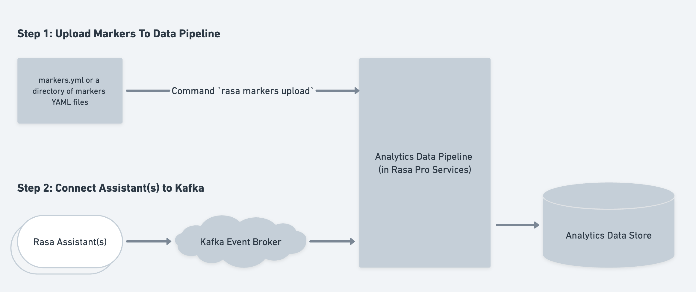

# 实时标记分析

!!! info "3.6 版本新特性"

    实时处理来自 Rasa 对话机器人的标记，以追踪解决方案和放弃率等指标，向对话添加元标记，或过滤对话以进行对话驱动开发

!!! warning "功能尚未兼容 CALM"

    此功能目前与 [CALM](../../calm.md) 不兼容。我们正在努力确保未来的集成和兼容性。

在 Rasa Pro 中，[标记](../../production/markers.md)是一项强大的功能，可让你追踪和提取自定义对话事件。借助 Analytics Data Pipeline，你现在可以实时处理这些标记，从而获得有价值的见解并提高 Rasa 对话机器人的性能。在本指南中，我们将探讨如何利用标记的实时分析来追踪对话中的解决方案和放弃率。

<figure markdown>
  
</figure>

## 定义标记 {#defining-markers}

有关定义[标记](../../production/markers.md#defining-markers)的详细信息，请参阅 Rasa 文档的标记部分。

## 启用实时处理 {#enable-real-time-processing}

要启用 Rasa 项目中标记的实时分析，你需要使用 `rasa markers upload` 命令将标记上传到 Analytics Data Pipeline。此命令根据领域文件验证标记 YAML，以确保文件中引用的所有槽、意图和动作也存在于领域中，并将标记配置 YAML 上传到 Analytics Data Pipeline（它们在数据库中持久保存）并退出。要开始使用，请确保你安装了最新版本的 Rasa。然后，打开命令行界面并导航到你的 Rasa 项目目录。运行以下命令：

```shell
rasa markers upload --config=<path-to-config-file> -d=<path-to-domain-file> -rasa-pro-services-url=<url>
```

默认情况下，此命令会根据机器人的 `domain.yml` 文件验证标记配置文件。要指定不同的领域文件，请使用可选的 `-d` 参数。

每当标记配置文件发生更改时，都应运行此命令。更改可能包括添加新标记、更改现有标记或删除现有标记。

!!! note "注意"

    此命令将标记配置上传到数据管道。管道假定配置文件是真实来源，并且仅处理其中定义的标记。如果你从此文件中删除标记并运行此命令，则该标记的处理将停止。

### 配置 CLI 命令 {#configuring-the-cli-command}

访问我们的 [CLI 页面](../../command-line-interface.md#rasa-markers-upload)，了解有关可用命令行参数的更多信息。

## 如何处理标记？ {#how-are-markers-processed}

标记 YAML 文件描述了标记提取的事件模式。上传 YAML 文件后，用于标记提取的模式将存储在 `rasa_patterns` 表中。当 Kafka Consumer 开始从 Rasa 对话机器人接收事件时，它会开始分析这些事件中的标记。管道处理来自 Kafka Event Broker 的所有事件，并识别对话中与标记匹配的兴趣点。提取的标记然后存储在 `rasa_marker` 表中。

管道中标记的评估类似于 `rasa evaluate markers` 命令，该命令可用于处理来自追踪器存储中对话的标记。在[此处](../../production/markers.md#extracting-markers)阅读更多信息。

提取的标记在处理后会立即添加到数据库中的 `rasa_markers` 表中。该表中的每一行都包含模式、会话、发送者和提取标记时的最后一个事件的外键标识符，以及 `num_preceding_user_turns`，后者用于追踪标记应用事件之前的轮次数。查看[数据结构参考](data-structure-reference.md#rasa_marker)页面以了解相关表的数据库架构。
