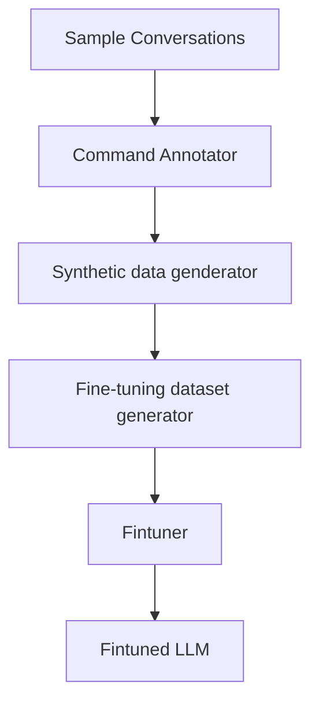
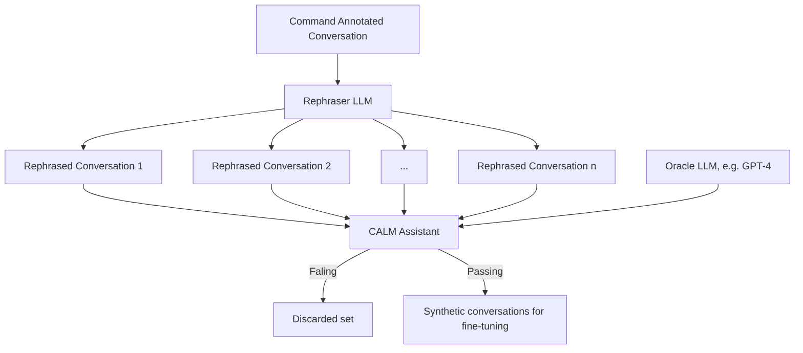
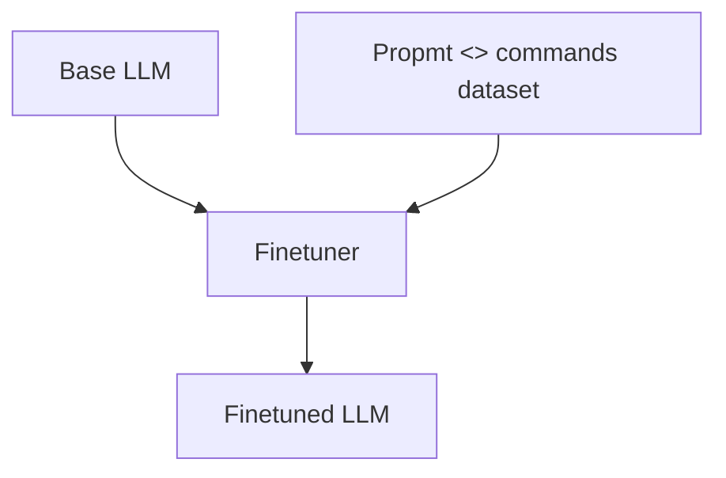

# 命令生成器的微调配方

!!! info "3.10 版本新特性"

    微调配方可帮助你微调小型语言模型（例如 Llama-3.1 8B），以完成[命令生成](../concepts/dialogue-understanding.md)任务并将其与 CALM 对话机器人集成。此功能从版本 `3.10.0` 开始作为测试版功能提供。如果你已经熟悉配方的概念，请转到[用户指南](../building-assistants/fine-tuning-recipe.md)，按照尝试配方所需的确切步骤进行操作。

CALM 与 LLM 无关，这意味着当你开始构建 CALM 对话机器人时，可以通过 OpenAI / Azure OpenAI 平台使用现成的强大 LLM，如 GPT-4。这是启动 CALM 对话机器人的好方法。

但是，随着对话机器人扩展到更多用例和更高流量，对话机器人可能会遇到以下问题：

1. 对话机器人的响应时间可能很长，破坏与对话机器人交谈的最终用户的用户体验。
2. 依赖第三方 LLM 提供商可能意味着必须遵守他们施加的速率限制，导致某些用户消息无法收到回复。
3. 其中一些强大的 LLM 在规模上可能非常昂贵。

微调配方可帮助你微调小型语言模型（例如 Llama-3.1 8B），以完成[命令生成](../concepts/dialogue-understanding.md)任务并将其与你的 CALM 对话机器人集成。这样做可以帮助大大缓解响应时间和 LLM 可用性问题，并降低对话机器人的运行时成本。

本页提供了配方内部工作原理的概念性理解。可以参考[用户指南](../building-assistants/fine-tuning-recipe.md)，按照所需的确切步骤尝试配方。

## 概念概述 {#conceptual-overview}



该配方半自动化以下步骤以生成经过微调的 LLM：

1. 为每个可用的示例对话的每个用户步骤[标注命令](#command-annotation)。
2. 使用 LLM [生成合成数据](#synthetic-data-generation)，通过重新表述每个用户步骤来创建新的对话。
3. 通过汇总所有生成的对话中每个用户步骤的提示和命令来[构建微调数据集](#fine-tuning-dataset-generator)。
4. 在微调数据集上[微调 LLM](#model-fine-tuning)。

我们将在以下部分更详细地解释每个步骤。

### 准备 {#preparation}

该功能假设用户已经拥有一个使用 `SingleStepLLMCommandGenerator` 作为[命令生成器](../concepts/components/llm-command-generators.md)构建的 CALM 对话机器人，使用强大的 LLM（例如 `gpt-4`）和为同一对话机器人编写的 [E2E 测试](../production/testing-your-assistant.md#how-to-write-test-cases)。

为了有效地微调你的模型，确保你的系统全面覆盖 E2E 测试至关重要。这些测试提供了微调所需的数据。如果你的 E2E 测试没有充分覆盖对话机器人的功能，则由于缺乏相关的训练示例，微调后的模型可能会表现不佳。

为了解决这个问题，你可以使用 [E2E 测试诊断工具](../production/testing-your-assistant.md#e2e-test-coverage-report)，它是 Rasa CLI 的一部分。此工具可帮助你评估你的 E2E 测试是否充分覆盖了系统的功能。它还确定了在进行微调之前可能需要更新现有测试或应该创建新测试的区域。

#### 评估微调的测试覆盖率 {#assessing-test-coverage-for-fine-tuning}

在查看覆盖率报告的结果时，有三个关键领域需要关注，以确保你的数据适合微调：

1. [所有命令](../concepts/dialogue-understanding.md)的表示：确保对话机器人可能生成的所有命令都出现在你的测试中。如果某些命令未被覆盖，模型可能难以正确生成它们，因为在训练期间从未“见过”这些场景。这可以通过检查[命令覆盖直方图](../production/testing-your-assistant.md#command-coverage)来评估。
2. 所需技能的展示：确保你希望对话机器人展示的技能在测试中得到很好的体现。这可确保模型从各种示例和场景中学习，从而提高其稳健性和可靠性。这可以通过检查[流覆盖率报告](../production/testing-your-assistant.md#flow-coverage)来评估。

通过仔细分析和扩展你的测试覆盖率，你可以更好地为微调模型做好准备，从而提高性能并打造更可靠的对话机器人。

### 命令标注 {#command-annotation}

!!! info "重要"

    如果对话机器人上的 E2E 测试失败，该测试将被命令标注模块忽略，随后配方的所有其他步骤也会忽略它。因此，请确保对话机器人能够成功通过输入的 E2E 测试。我们还建议使用 [E2E 覆盖率分析工具](../production/testing-your-assistant.md#e2e-test-coverage-report)来了解通过测试对对话机器人流的覆盖率。

作为配方的第一步，命令标注器模块通过 CALM 对话机器人运行 E2E 测试，并提取 `SingleStepLLMCommandGenerator` 在每个用户步骤中预测的命令。该模块作为 [`rasa llm finetune prepare-data` CLI 命令](../command-line-interface.md#rasa-llm-finetune-prepare-data)的一部分运行，每个 E2E 测试都使用 LLM 在每个用户步骤中应预测的命令进行扩充。此步骤的输出将每个 E2E 测试转换为最终如下所示的对话：

```yaml hl_lines="5-6 9-10 13-15 18-19"
conversations:
- original_test_case: ../e2e_tests/user_books_car_and_hotel.yml::car booking combined with hotel
  steps:
  - user: I'd like to book a car
    llm_commands:
    - StartFlow(search_rental_car)
  - bot: in which city?
  - user: to Basel
    llm_commands:
    - SetSlot(trip_destination, Basel)
  - bot: When would you like to pick up the car?
  - user: from may 14th to the 17th
    llm_commands:
    - SetSlot(car_rental_start_date, may 14th)
    - SetSlot(car_rental_end_date, may 17th)
  - utter: utter_ask_car_rental_selection
  - user: I'll take the luxury one! looks nice
    llm_commands:
    - SetSlot(car_rental_selection, Avis - Luxury)
```

只有 `SingleStepLLMCommandGenerator` 处理的用户步骤才会用命令进行标注，并最终进入最终的训练数据集进行微调。例如，如果你使用发出设置槽命令的按钮绕过 `SingleStepLLMCommandGenerator`，则用户步骤将不会被标注。

### 合成数据生成 {#synthetic-data-generation}



在每个对话的用户步骤都用命令标注之后，合成数据生成模块会为每个标注的用户步骤创建 n 个重述，并验证重述的用户步骤是否产生与相应对话中的原始用户步骤相同的命令集。只有通过此验证的重述用户步骤才会用于微调数据集。

注意：来自按钮的用户话语（例如用户单击按钮而不是键入响应）不会被合成数据生成器重述和跳过。

假设我们每个用户步骤生成 3 个重述，对话及其失败和通过的重述用户步骤如下所示：

```yaml hl_lines="7-10 15-19 25-28 33-36"
conversations:
- original_test_case: ../e2e_tests/user_books_car_and_hotel.yml::car booking combined with hotel
  steps:
  - user: I'd like to book a car
    llm_commands:
    - StartFlow(search_rental_car)
    passing_rephrasings:
    - I need to reserve a car.
    - Could I arrange for a car rental?
    - I'm interested in hiring a car.
  - bot: in which city?
  - user: to Basel
    llm_commands:
    - SetSlot(trip_destination, Basel)
    passing_rephrasings:
    - The destination is Basel.
    - I'd like to go to Basel.
    failed_rephrasings:
    - I'll need the car in Basel.
  - bot: When would you like to pick up the car?
  - user: from may 14th to the 17th
    llm_commands:
    - SetSlot(car_rental_start_date, may 14th)
    - SetSlot(car_rental_end_date, may 17th)
    passing_rephrasings:
    - I need the car from May 14th to May 17th.
    - The rental period will be May 14th to 17th.
    - I'll require the vehicle from the 14th to the 17th of May.
  - utter: utter_ask_car_rental_selection
  - user: I'll take the luxury one! looks nice
    llm_commands:
    - SetSlot(car_rental_selection, Avis - Luxury)
    passing_rephrasings:
    - I'd like to go with the luxury option; it looks appealing.
    - I'll choose the luxury model; it seems nice.
    - I'm opting for the luxury car; it looks great.
```

#### Rephraser LLM {#rephraser-llm}

`Rephraser LLM` 默认使用 `gpt-4o-mini` 创建 10 个用户步骤重述。Rephraser 使用以下提示来创建重述：

```jinja
Objective:
Create multiple rephrasings of user messages tailored to the "{{ test_case_name }}" conversation scenario.

===
Conversation overview:
{{ transcript or "Not provided." }}

===
Task:
Produce {{ number_of_rephrasings }} rephrasings for each user message that are diverse yet contextually appropriate.
Preserve the intent and content, but vary the structure, formality, and detail.
Only rephrase messages prefixed with "{{ user_prefix }}:".

Guidelines:
- Use a variety of expressions from brief and casual to elaborate and formal.
- Vary sentence structures, vocabularies, and expressions creatively.
- Keep the core message intact with concise and simple modifications.

Format:
- Each original user message should be prefixed with "USER: ".
- Enumerate the rephrasing.
- Separate each user message set with a line break.

===
Example output for 3 rephrasings of 2 user messages:
"""
USER: Show invoices
1. I want to see my bills.
2. I mean bills
3. Yes, I want to see the invoices.

USER: I'd like to book a car
1. I need to reserve a car.
2. Could I arrange for a car rental?
3. I'm interested in hiring a car.
"""

===
Expected output:
{{ number_of_rephrasings }} rephrasings for the following {{ number_of_user_messages }} user messages in the expected
format:

- {{ message }}

```

如果你想要修改提示或为 Rephraser LLM 使用不同的 LLM，可以通过 CLI 命令 [`rasa llm finetune prepare-data`](../command-line-interface.md#rasa-llm-finetune-prepare-data) 上的参数 `--rephrase-config <path-to-config-file>` 指定自定义配置。默认配置如下所示：

```yaml
prompt_template: default_rephrase_prompt_template.jina2
llm:
  model: gpt-4o-mini
  provider: openai
```

你可以通过在 CLI 命令 [`rasa llm finetune prepare-data`](../command-line-interface.md#rasa-llm-finetune-prepare-data) 上添加标志 `--num-rephrases <number>` 来指定每个用户步骤的重述次数。如果将 `num-rephrases` 设置为 `0`，则将跳过合成数据生成器。由于合成数据生成器为数据集增加了语言多样性，因此建议至少使用几个重述。我们的内部实验表明，向数据集添加重述可以提高微调模型的性能。

#### 重述用户步骤的验证 {#validation-of-rephrased-user-steps}

为了验证重述用户步骤，我们采用原始用户步骤的提示并对其进行更新，即我们用重述的提示替换原始用户话语。然后，提示将发送到用于注释对话的同一 LLM。如果解析和处理后的 LLM 响应与原始用户步骤的响应相匹配，则重新表述的用户话语通过测试并添加到合成对话数据集中进行微调。

### 微调数据集生成器 {#fine-tuning-dataset-generator}

微调数据集生成器获取所有示例对话中每个用户步骤的通过重新表述，并从中创建新对话。然后，将新对话中的每个用户步骤转换为数据点以进行微调。每个数据点都包含提示，其中包括对话历史记录和当前用户消息（原始或重新表述），以及提示应生成的命令。之后，数据点被拆分为训练和验证数据集，然后可用于微调基础 LLM。

每个数据点都添加到最终的 `.jsonl` 文件（train / val）中，如下所示：

```json
{
    "prompt": "Your task is to analyze the current conversation context and generate a list of actions to start new business processes that we call flows, to extract slots, or respond to small talk and knowledge requests.\n\nThese are the flows that can be started, with their description and slots:\n\nlist_bookings: list flight bookings - booked flights\n    \nsearch_rental_car: search for rental cars\n    slot: trip_destination\n    slot: car_rental_start_date\n    slot: car_rental_end_date\n    slot: car_rental_search_results_readable\n    slot: car_rental_selection (Car rental option which the user has selected. Must be an exact element of the slot car_rental_search_results_readable. If the user wants an option that isn't listed, do not fill the slot with that value.)\n    \nwelcome: greet the user and ask how you can help\n    \nlist_skills: tell the user what i can do\n    \ngoodbye: say goodbye to user\n    \nsearch_hotel: search for hotels\n    slot: trip_destination\n    slot: hotel_price_range\n    slot: hotel_start_date (check in date for the hotel. Do not fill this slot unless user explicitly specifies it in the conversation.)\n    slot: hotel_end_date (check out date for the hotel. Do not fill this slot unless user explicitly specifies it in the conversation.)\n    slot: hotel_search_results_readable\n    slot: hotel_name (Name of the hotel which the user has selected. Must be an exact element of the slot \"hotel_search_results_readable\". If the user wants an option that isn't listed, do not fill the slot with that value.)\n    \nbook_excursion: search and book an excursion\n    slot: trip_destination\n    slot: excursion_name (use the official name as stated by the assistant)\n    \nchange_flight: change an existing booking to a new flight\n    slot: flight_search_start_date (start date for flight search. Refer to the current time available and always output this in the ISO format.)\n    slot: flight_search_end_date (end date for flight search. Refer to the current time available and always output this in the ISO format.)\n    slot: selected_flight_id (the selected id number from the search results presented to the user.)\n    \nout_of_scope: trigger this if the user asks for something we don't have a flow for or an existing command does not apply for it. Conversation repair flow for off-topic interactions that won't disrupt the main conversation. should not respond to greetings or anything else for which there is a flow defined or an existing command is apt for it.\n    \n\n===\nHere is what happened previously in the conversation:\n\nUSER: I'd like to book a car\n\n===\n\nYou are currently not in any flow and so there are no active slots.\nThis means you can only set a slot if you first start a flow that requires that slot.\n\nIf you start a flow, first start the flow and then optionally fill that flow's slots with information the user provided in their message.\n\nThe user just said \"\"\"I'd like to book a car\"\"\".\n\n===\nBased on this information generate a list of actions you want to take. Your job is to start flows and to fill slots where appropriate. Any logic of what happens afterwards is handled by the flow engine. These are your available actions:\n* Slot setting, described by \"SetSlot(slot_name, slot_value)\". An example would be \"SetSlot(recipient, Freddy)\"\n* Starting another flow, described by \"StartFlow(flow_name)\". An example would be \"StartFlow(transfer_money)\"\n* Cancelling the current flow, described by \"CancelFlow()\"\n* Clarifying which flow should be started. An example would be Clarify(list_contacts, add_contact, remove_contact) if the user just wrote \"contacts\" and there are multiple potential candidates. It also works with a single flow name to confirm you understood correctly, as in Clarify(transfer_money).\n* Intercepting and handle user messages with the intent to bypass the current step in the flow, described by \"SkipQuestion()\". Examples of user skip phrases are: \"Go to the next question\", \"Ask me something else\".\n* Responding to knowledge-oriented user messages, described by \"SearchAndReply()\"\n* Responding to a casual, non-task-oriented user message, described by \"ChitChat()\".\n* Handing off to a human, in case the user seems frustrated or explicitly asks to speak to one, described by \"HumanHandoff()\".\n\n===\nWrite out the actions you want to take, one per line, in the order they should take place.\nDo not fill slots with abstract values or placeholders.\nOnly use information provided by the user.\nOnly start a flow if it's completely clear what the user wants. Imagine you were a person reading this message. If it's not 100% clear, clarify the next step.\nDon't be overly confident. Take a conservative approach and clarify before proceeding.\nIf the user asks for two things which seem contradictory, clarify before starting a flow.\nIf it's not clear whether the user wants to skip the step or to cancel the flow, cancel the flow.\nStrictly adhere to the provided action types listed above.\nFocus on the last message and take it one step at a time.\nUse the previous conversation steps only to aid understanding.\n\nCurrent time is \"2024-04-27 18:13:47.329404 +0000\" and it is a Saturday today!\n\nYour action list:",
    "completion": "StartFlow(search_rental_car)"
}
```

#### 构建新对话 {#creating-new-conversations}

让我们看一个例子来了解如何构建新对话。以这个原始对话为例：

```txt
- user: I'd like to book a car
- bot: in which city?
- user: to Basel
- bot: When would you like to pick up the car?
- user: from may 14th to the 17th
- utter: utter_ask_car_rental_selection
- user: I'll take the luxury one! looks nice
```

并针对每个用户步骤进行以下重新表述：

| 原始用户信息                         | 重述 1                                                     | 重述 2                                       | 重述 3                                                     |
| :----------------------------------- | :--------------------------------------------------------- | :------------------------------------------- | :--------------------------------------------------------- |
| I'd like to book a car               | I need to reserve a car.                                   | Could I arrange for a car rental?            | I'm interested in hiring a car.                            |
| to Basel                             | The destination is Basel.                                  | I'd like to go to Basel.                     |                                                            |
| from may 14th to the 17th            | The rental period will be May 14th to 17th.                | I need the car from May 14th to May 17th.    | I'll require the vehicle from the 14th to the 17th of May. |
| I'll take the luxury one! looks nice | I'd like to go with the luxury option; it looks appealing. | I'll choose the luxury model; it seems nice. | I'm opting for the luxury car; it looks great.             |

要构建新对话，我们将相同索引位置的传递重述组合起来以构建新对话。如果特定索引处的特定用户步骤不存在传递重述，我们将重置该用户步骤的索引并再次使用该用户步骤的第一个传递重述。

因此，最终的对话将如下所示：

```txt
# conversation 1 (original conversation)
- user: I'd like to book a car
- bot: in which city?
- user: to Basel
- bot: When would you like to pick up the car?
- user: from may 14th to the 17th
- utter: utter_ask_car_rental_selection
- user: I'll take the luxury one! looks nice

# conversation 2
- user: I need to reserve a car.
- bot: in which city?
- user: The destination is Basel.
- bot: When would you like to pick up the car?
- user: The rental period will be May 14th to 17th.
- utter: utter_ask_car_rental_selection
- user: I'd like to go with the luxury option; it looks appealing.

# conversation 3
- user: Could I arrange for a car rental?
- bot: in which city?
- user: I'd like to go to Basel.
- bot: When would you like to pick up the car?
- user: I need the car from May 14th to May 17th.
- utter: utter_ask_car_rental_selection
- user: I'll choose the luxury model; it seems nice.

# conversation 4
- user: I'm interested in hiring a car.
- bot: in which city?
- user: The destination is Basel.
- bot: When would you like to pick up the car?
- user: I'll require the vehicle from the 14th to the 17th of May.
- utter: utter_ask_car_rental_selection
- user: I'm opting for the luxury car; it looks great.
```

#### 将数据拆分为训练和验证 {#split-data-into-training-and-validation}

默认情况下，我们取 80% 的微调数据作为训练数据集。其余数据点进入验证集。在此过程中，我们确保微调数据集中存在的所有命令至少会在训练数据集中出现一次。这可确保微调模型在训练期间看到所有可用命令。你可以通过在 CLI 命令 [`rasa llm finetune prepare-data`](../command-line-interface.md#rasa-llm-finetune-prepare-data) 上设置标志 `--train-frac <float-number>` 来更新进入训练数据集的数据部分。

当你[微调基础模型](../operating/fine-tuning-recipe.md#model-fine-tuning)时，基础模型期望数据采用特定格式。默认情况下，训练和验证数据集采用[指令数据格式](https://huggingface.co/docs/trl/en/sft_trainer#dataset-format-support)。如果你想使用[对话数据格式](https://huggingface.co/docs/trl/en/sft_trainer#dataset-format-support)，请在 CLI 命令 [`rasa llm finetune prepare-data`](../command-line-interface.md#rasa-llm-finetune-prepare-data) 上设置标志 `--output-format dialogueal`。

### 模型微调 {#model-fine-tuning}



准备好数据集后，下一个合乎逻辑的步骤是对一个足够小的开源 LLM 进行实际微调，以帮助它在命令生成任务中表现出色。具体来说，[使用 LoRA 进行参数高效微调](https://huggingface.co/blog/peft)，输入是上一步中为每个数据点准备的提示，输出是 LLM 要预测的命令集。

Rasa 提供了这个示例 [Python Notebook](https://nbviewer.org/github/RasaHQ/notebooks/blob/main/cmd_gen_finetuning.ipynb) 作为微调的参考。它已经在 GCP Vertex AI 和 AWS Sagemaker 上进行了测试，可以轻松适应其他云平台。默认情况下：

1. 使用 [Unsloth](https://docs.unsloth.ai/) 库，因为它对内存和速度进行了大量优化。
2. 从 [huggingface hub](https://huggingface.co/models) 下载基础模型。建议使用 [Llama-3.1 8b Instruct](https://huggingface.co/meta-llama/Meta-Llama-3.1-8B-Instruct) 模型。
3. 使用 [BitsandBytes](https://huggingface.co/docs/transformers/main/en/quantization/bitsandbytes) 库以 8 位加载基础模型，以实现高效的内存使用。
4. 提供在我们的内部实验中运行良好的默认超参数。
5. 运行微调并将损失可视化为监控训练和验证集的指标。在使用默认超参数在 NVIDIA A100 上测试此步骤时，使用包含约 500 个示例的训练数据集执行微调大约需要 12 分钟。因此，此步骤相对便宜且运行速度快。
6. 允许在云端保存模型。
