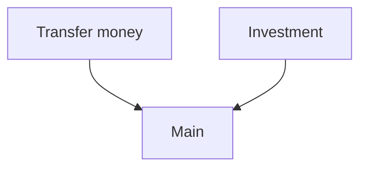

# 空间

空间是一种模块化对话机器人的方法，可以增强子部分之间的隔离性，并提高仅在特定上下文中相关的意图和实体的分类性能。

!!! warning "3.6.0a1 版本新特性"

    这是 Alpha 版本。此 Alpha 版本将使我们能够收集用户的反馈并将其集成到未来的版本中。我们鼓励你尝试一下！此 Alpha 版本的功能将来可能会发生变化。如果你有反馈（正面或负面），请通过你的支持联系人与我们分享。

!!! warning "功能尚未兼容 CALM"

    此功能目前与 [CALM](../calm.md) 不兼容。我们正在努力确保未来的集成和兼容性。

空间是一种模块化对话机器人的方法。随着对话机器人规模和范围的扩大，意图、实体和其他[原语](../nlu-based-assistants/glossary.md#rasa-primitive)之间发生冲突的可能性也会增加。这是因为在常规 rasa 对话机器人中，所有意图、实体和动作都随时可用，为对话机器人提供了更多选择来区分添加的内容。空间通过激活和停用 [rasa 原语](../nlu-based-assistants/glossary.md#rasa-primitive)组来提供对话机器人各部分之间的基本分离。这些组中的每一个都称为空间。当预测到某些指定的意图（称为进入意图）时，空间就会被激活。随着空间的激活，空间的所有原语都可用于与用户的后续交互。考虑空间的好方法是：

- 它们允许你指定后续原语，这些原语只有在另一个意图出现后才可访问。
- 它们就像多个子对话机器人合并为一个，可以共享原语。

## 何时使用空间 {#when-to-use-spaces}

当你在单个对话机器人中处理业务的多个领域时，空间会很有帮助。通常，这会导致大量的表单、实体和通知意图在某个时候开始重叠。填写表单和通知意图是具有上述后续结构的典型情况。另一个很好的例子是，当你希望能够根据用户所在的子领域或流为帮助或澄清请求定义不同的行为时。这在今天的技术上对于故事来说是可行的，但描述每个交互路线的完整事件范围可能会很麻烦。

## 何时不使用空间/限制 {#when-not-to-use-spaces--limitations}

由于空间将 rasa 对话机器人分成多个部分，因此它几乎与 rasa 的所有现有功能交互。我们使其与几乎所有功能兼容，但也有一些例外。这意味着，如果你创建了超出与 rasa 正常工作方式一致的组件的自定义，空间可能不适合你。

另一个重要的限制是空间目前不支持故事。我们知道这对许多现有机器人来说是一个很大的限制。但是，由于故事及其现有策略与固定事件范围 (`max_history`) 一起工作，因此它们目前与能够很好地描述封装逻辑单元的想法不兼容。

目前，唯一与空间创建的边界一起工作的实体提取器是 `CRFEntityExtracto`r 的改编版本。你可以在以下部分中找到更多相关信息。

## 示例空间对话机器人 {#an-example-spaces-bot}

我们创建了一个使用空间的对话机器人，供你查看、学习和试验。它具有金融领域的三个不同空间。[这是存储库](https://github.com/RasaHQ/financial-spaces-bot)。

## 如何使用空间 {#how-to-use-spaces}

空间由单独的域、NLU 和规则文件集定义。然后组装这些单独的集合以创建统一的对话机器人。需要使用新引入的 `spaces` 键将组装计划添加到 `config.yml` 中。其次，你需要使用一个特殊的数据导入器来读取和执行组装计划。第三，你需要向 NLU 管道添加一些特定的空间感知组件。以下是上面链接的金融空间对话机器人的 `config.yml`：

```yaml
# https://rasa.com/docs/rasa/model-configuration/
recipe: default.v1

# Configuration for Rasa NLU.
# https://rasa.com/docs/rasa/nlu/components/
language: en

spaces:
  - name: main
    domain: main/domain.yml
    nlu: main/nlu/training_data.yml
    nlu_test: main/nlu/test_data.yml
    rules: main/rules.yml
  - name: transfer_money
    domain: transfer_money/domain.yml
    nlu: transfer_money/nlu/training_data.yml
    nlu_test: transfer_money/nlu/test_data.yml
    rules: transfer_money/rules.yml
    entry_intents:
      - transfer_money
  - name: investment
    domain: investment/domain.yml
    nlu: investment/nlu/training_data.yml
    nlu_test: investment/nlu/test_data.yml
    rules: investment/rules.yml
    entry_intents:
      - buy_stock
  - name: pay_cc
    domain: pay_cc/domain.yml
    nlu: pay_cc/nlu/training_data.yml
    nlu_test: pay_cc/nlu/test_data.yml
    rules: pay_cc/rules.yml
    entry_intents:
      - pay_cc

importers:
  - name: "rasa_plus.spaces.space_data_importer.SpaceDataImporter"
    temporary_working_directory: spaces

pipeline:
  - name: WhitespaceTokenizer
  - name: RegexFeaturizer
  - name: LexicalSyntacticFeaturizer
  - name: CountVectorsFeaturizer
  - name: CountVectorsFeaturizer
    analyzer: char_wb
    min_ngram: 1
    max_ngram: 4
  - name: rasa_plus.spaces.components.spaces_crf_entity_extractor.SpacesCRFEntityExtractor
  - name: EntitySynonymMapper
  - name: DIETClassifier
    epochs: 100
    ranking_length: 0
    entity_recognition: false
    BILOU_flag: false
  - name: rasa_plus.spaces.components.filter_and_rerank.FilterAndRerank
  - name: FallbackClassifier
    threshold: 0.3
    ambiguity_threshold: 0.1

policies:
  - name: RulePolicy
```

在上面的配置文件中，你可以看到空间定义，其中包含主空间（用于共享原语的空间的指定名称）和三个子空间（用于转账、投资和信用卡支付）。主空间不是必需的，但它是空间之间共享原语的唯一方式。每个路径值可以指向单个文件或目录。

其次，你还可以看到正在使用的导入器 `rasa_plus.spaces.space_data_importer.SpaceDataImporter`。此导入器读取上述空间定义并组装对话机器人。结果可以在临时工作目录中看到。

第三，你可以看到使空间正常工作所必需的特定 NLU 组件。最重要的是 `FilterAndRerank` 组件，它通过后处理意图排名和实体提取来使空间正常工作。如果你还需要实体提取，则需要使用 `SpacesCRFEntityExtractor` 使其与空间一起工作。

最后，你可以看到我们在这里只使用 `RulePolicy`。

创建空间并对 `config.yml` 进行调整后，你可以使用 `rasa train -c config.yml` 训练新对话机器人，然后使用 `rasa shell` 启动它。

### 仅训练特定子空间 {#training-only-a-specific-subspace}

我们在 `rasa train` 命令中添加了 `--space` 参数，以便你选择仅训练一个特定子空间：

- `rasa train`：使用所有空间训练完整对话机器人。
- `rasa train --space investment`：仅训练包含投资和主空间的对话机器人。

其他命令未进行调整，因为它们使用经过训练的对话机器人作为输入。
​​
## 空间如何工作？ {#how-do-spaces-work}

在下文中，我们将了解空间内部的工作原理，以便你更好地了解正在发生的事情，以防万一。

最重要的方面之一是空间形成具有两层的层次结构。最顶层是主空间，其中包含所有空间都应该可以使用的共享原语。主空间始终处于活动状态。在子空间中定义的任何内容都只能由该空间使用，而不能由其他子空间或主空间使用。



### 组装过程中会发生什么？ {#what-happens-during-the-assembly}

组装过程中最重要的步骤是添加前缀。在此步骤中，空间领域文件中定义的每个意图、实体、槽、动作、形式、话语都以此空间的名称作为前缀（话语的中缀）。例如，`transfer_money` 领域中的意图 `ask_transfer_charge` 将变为 `transfer_money.ask_transfer_charge`，并且此意图的每个引用都将进行调整。然后，最终对话机器人将处理前缀数据。

主空间是一个例外。主空间中的任何内容及其在其他空间中使用的所有原语都不会被添加前缀。

另一个例外是规则。它们没有可以添加前缀的名称。相反，我们为每个规则添加一个条件，即它仅在其空间处于活动状态时才适用。

### 如何追踪空间激活？ {#how-is-space-activation-tracked}

当预测任何进入意图时，空间就会被激活。一个空间可以有多个进入意图。但是，在给定时间内只有一个空间可以处于活动状态。因此，当空间 A 处于活动状态并且预测到空间 B 的进入意图时，空间 A 将停用，而空间 B 从现在开始处于活动状态。

空间激活通过组装期间自动生成的槽进行追踪。

### 过滤和重新排序如何工作？ {#how-does-filter-and-rerank-work}

过滤和重新排序组件对[意图分类组件](../nlu-based-assistants/components.md#intent-classifiers)的意图排序进行后处理。它访问[追踪器](../action-server/sdk-tracker.md)并检查哪些空间处于活动状态或将被激活，以防进入意图位于顶部。

然后，它会从排名中删除任何不可能的意图。此外，它还会删除任何在空间激活状态下不可能的实体或即将被预测的进入意图。

### 实体识别如何以不同的方式工作？ {#how-does-entity-recognition-work-differently}

通常，Rasa 中的实体识别器在消息中只为每个标记返回一个标签。因此，没有排名，可以像意图一样进行后处理。我们构建了 `SpacesCRFEntityExtractor`，它创建了多个提取器。每个空间一个。现在，在后处理步骤中，我们可以过滤掉未激活的空间的提取器。

### 自定义动作 {#custom-actions}

自定义动作与以前一样。但是，追踪器、域和槽在交给你的动作之前将被剥离来自其他空间的任何信息。此外，每个事件（例如槽集）在由你的动作返回后都会被添加前缀。所有这些都确保从你的自定义动作的角度来看，你不必担心其他空间和意外泄露或更改信息。这保证了你的空间之间的隔离。请注意，子空间不会继承主空间的自定义动作。

### 响应选择 {#response-selection}

响应选择与以前一样。唯一的小区别是，在 `config.yaml` 中，你需要指定检索意图，包括它的最终前缀。如果你的检索意图是投资空间中的 `investment_faq`，那么在你的配置中，你需要将 `investment.investment_faq` 设置为检索意图。如果检索意图属于主空间，则不添加前缀。这就是为什么在这种情况下，在定义检索意图时不需要前缀。

### 查找表和同义词 {#lookup-tables-and-synonyms}

查找表和同义词适用于空间。但是，它们在空间之间并不是真正隔离的。因此可能会有一些意想不到的相互作用。对于同义词，具体来说：

- 假设两个空间定义了相同的同义词。空间 A：“IB”->“Instant banking”。空间 B：“IB”->“iron bank”。则会发出警告，一个值会覆盖另一个值。
- 如果“IB”在两个空间中都是实体，但只有一个将其定义为同义词，也会发生类似的事情。无论哪个空间处于活动状态，任何具有值“IB”的实体都将始终映射到该同义词。

对于查找表，没有已知的不利相互作用。

## 训练数据导入器 {#training-data-importers}

使用 [`--data` 命令行参数](../command-line-interface.md)，你可以指定 Rasa 应在磁盘上查找训练数据的位置。然后，Rasa 会加载任何潜在的训练文件并使用它们来训练你的对话机器人。

如果需要，你还可以自定义 Rasa 导入训练数据的方式。此操作的潜在用例可能是：

- 使用自定义解析器以其他格式加载训练数据。
- 使用不同的方法收集训练数据（例如从不同的资源加载它们）。

你可以[编写自定义导入器](#writing-a-custom-importer)并指示 Rasa 使用它，方法是将部分导入器添加到你的配置文件中并指定导入器及其完整类路径：

```yaml title="config.yml" hl_lines="2-4"
importers:
- name: "module.CustomImporter"
  parameter1: "value"
  parameter2: "value2"
- name: "RasaFileImporter"
```

`name` 键用于确定应加载哪个导入器。任何额外的参数都作为构造函数参数传递给已加载的导入器。

!!! tip "提示"

    你可以指定多个导入器。Rasa 将自动合并它们的结果。

## RasaFileImporter（默认） {#rasafileimporter-default}

默认情况下，Rasa 使用导入器 `RasaFileImporter`。如果你想单独使用它，则无需在配置文件中指定任何内容。如果你想与其他导入器一起使用，请将其添加到配置文件中：

```yaml title="config.yml" hl_lines="5"
importers:
- name: "module.CustomImporter"
  parameter1: "value"
  parameter2: "value2"
- name: "RasaFileImporter"
```

## MultiProjectImporter（实验性） {#multiprojectimporter-experimental}

!!! info "1.3 新特性"

    此功能目前处于实验阶段，将来可能会更改或删除。请在[论坛](https://forum.rasa.com/)上分享你的反馈，以帮助我们为此功能做好生产准备。

使用此导入器，你可以通过组合多个可重复使用的 Rasa 项目来训练模型。例如，你可以使用一个项目处理聊天，使用另一个项目欢迎用户。这些项目可以单独开发，然后在训练对话机器人时组合起来。

例如，请考虑以下目录结构：

```txt
.
├── config.yml
└── projects
    ├── GreetBot
    │   ├── data
    │   │   ├── nlu.yml
    │   │   └── stories.yml
    │   └── domain.yml
    └── ChitchatBot
        ├── config.yml
        ├── data
        │   ├── nlu.yml
        │   └── stories.yml
        └── domain.yml
```

在这里，上下文 AI 对话机器人导入了 `ChitchatBot` 项目，而后者又导入了 `GreetBot` 项目。项目导入在每个项目的配置文件中定义。

要指示 Rasa 使用 `MultiProjectImporter` 模块，你需要将其添加到根 `config.yml` 中的导入器列表中。

```yaml title="./config.yml"
importers:
- name: MultiProjectImporter
```

然后，在同一个文件中，通过将要导入的项目添加到导入列表来指定它们。

```yaml title="./config.yml"
imports:
- projects/ChitchatBot
```

`ChitchatBot` 的配置文件需要引用 `GreetBot`：

```yaml title="./ChitchatBot/config.yml"
imports:
- ../GreetBot
```

由于 `GreetBot` 项目未指定要导入的其他项目，因此它不需要 `config.yml`。

Rasa 使用配置文件中的相对路径来导入项目。这些路径可以位于文件系统上允许文件访问的任何位置。

在训练过程中，Rasa 将导入所有必需的训练文件，将它们组合起来，并训练统一的 AI 对话机器人。训练数据在运行时合并，因此不会创建额外的训练数据文件。

!!! warning "策略和 NLU 管道"

    Rasa 将在训练期间使用根项目目录的策略和 NLU 管道配置。导入项目的策略和 NLU 配置将被忽略。

!!! warning "注意合并"

    相同的意图、实体、槽、响应、动作和形式将被合并，例如，如果两个项目具有针对意图 `greet` 的训练数据，则它们的训练数据将被合并。

## 编写自定义导入器 {#writing-a-custom-importer}

如果你正在编写自定义导入器，则该导入器必须实现 `TrainingDataImporter` 的接口：

```python
from typing import Optional, Text, Dict, List, Union

import rasa
from rasa.shared.core.domain import Domain
from rasa.shared.nlu.interpreter import RegexInterpreter
from rasa.shared.core.training_data.structures import StoryGraph
from rasa.shared.importers.importer import TrainingDataImporter
from rasa.shared.nlu.training_data.training_data import TrainingData


class MyImporter(TrainingDataImporter):
    """Example implementation of a custom importer component."""

    def __init__(
        self,
        config_file: Optional[Text] = None,
        domain_path: Optional[Text] = None,
        training_data_paths: Optional[Union[List[Text], Text]] = None,
        **kwargs: Dict
    ):
        """Constructor of your custom file importer.
        Args:
            config_file: Path to configuration file from command line arguments.
            domain_path: Path to domain file from command line arguments.
            training_data_paths: Path to training files from command line arguments.
            **kwargs: Extra parameters passed through configuration in configuration file.
        """

        pass

    def get_domain(self) -> Domain:
        path_to_domain_file = self._custom_get_domain_file()
        return Domain.load(path_to_domain_file)

    def _custom_get_domain_file(self) -> Text:
        pass

    def get_stories(
        self,
        interpreter: "NaturalLanguageInterpreter" = RegexInterpreter(),
        exclusion_percentage: Optional[int] = None,
    ) -> StoryGraph:
        from rasa.shared.core.training_data.story_reader.yaml_story_reader import (
            YAMLStoryReader,
        )

        path_to_stories = self._custom_get_story_file()
        return YAMLStoryReader.read_from_file(path_to_stories, self.get_domain())

    def _custom_get_story_file(self) -> Text:
        pass

    def get_config(self) -> Dict:
        path_to_config = self._custom_get_config_file()
        return rasa.utils.io.read_config_file(path_to_config)

    def _custom_get_config_file(self) -> Text:
        pass

    def get_nlu_data(self, language: Optional[Text] = "en") -> TrainingData:
        from rasa.shared.nlu.training_data import loading

        path_to_nlu_file = self._custom_get_nlu_file()
        return loading.load_data(path_to_nlu_file)

    def _custom_get_nlu_file(self) -> Text:
        pass
```
