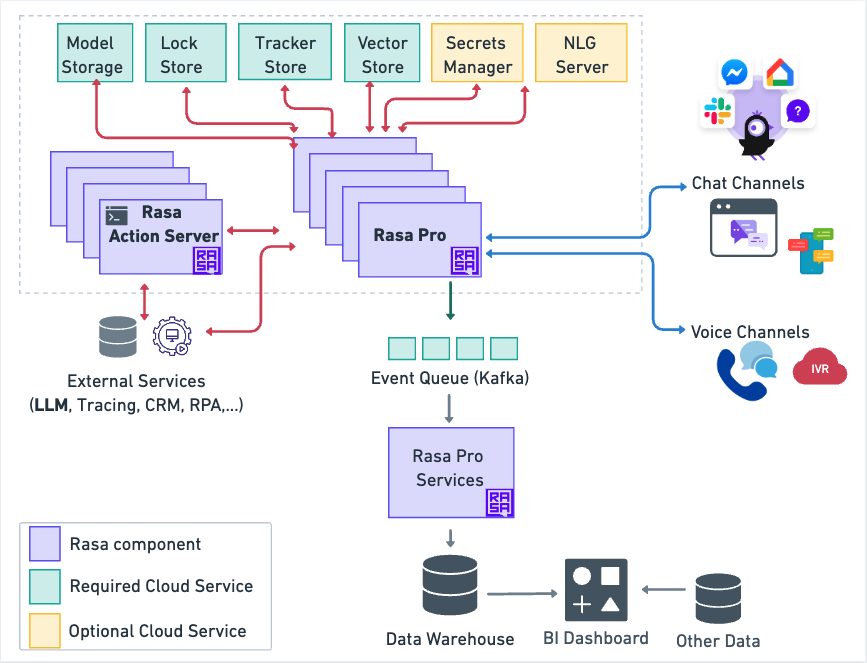

# 概述

Rasa Pro 部署由各种组件组成。一些由 Rasa 提供，另一些由你开发，其中一些是需要配置的云服务。本页提供了一个图表，说明了所有这些组件及其交互方式。

下图概述了 Rasa Pro 架构。

<figure markdown>
  
</figure>

## 动作服务器（自定义动作） {#action-server-custom-actions}

自定义动作用于实现 Rasa 对话机器人无法处理的业务逻辑。它们包括从数据库获取客户信息、查询 API 或调用外部服务等。

自定义动作可以通过 HTTP 或 gRPC 调用。Rasa 提供了 Rasa SDK，一个用于构建自定义动作的 Python SDK。更多详细信息请参阅 [rasa 动作服务器文档](../action-server.md)。

## 云服务 {#cloud-services}

部署的对话机器人依赖于你需要配置的多个先决条件云服务。

其中一些先决条件云服务是必需的（绿色），而其他则是可选的（黄色）。

强烈建议使用托管云服务，因为它们具有稳定性、性能和备份。每个云提供者都提供许多选项，下表仅列出了一些可用选项。

| 类型       | AWS                                             | Azure                         | Google                                   |
| :--------- | :---------------------------------------------- | :---------------------------- | :--------------------------------------- |
| 模型存储   | Amazon S3                                       | Azure Blob Storage            | Google Cloud Storage                     |
| 锁存储     | Amazon ElastiCache for Redis                    | Azure Cache for Redis         | Memorystore for Redis                    |
| 追踪器存储 | Amazon RDS for PostgreSQL                       | Azure Database for PostgreSQL | Google Cloud SQL for PostgreSQL          |
| 事件队列   | Amazon Managed Streaming for Apache Kafka (MSK) | Azure Kafka Service           | Confluent Cloud on Google Cloud Platform |
| 密钥管理   | HashiCorp Vault on AWS                          | HashiCorp Vault on Azure      | HashiCorp Vault with Google Cloud        |

请注意，NLG 服务器是可选的云服务，你必须自行创建和部署。

接下来，你将看到每个云服务功能的简短描述。

### [模型存储](model-storage.md) {#model-storage}

模型存储是存储经过训练的模型的云服务。初始化或重新启动时，Rasa Pro 将下载经过训练的模型并将其读入内存。

### [锁存储](lock-stores.md) {#lock-store}

当你遇到高负载场景，需要将 Rasa 服务器复制到多个实例时，需要使用锁存储。它确保即使有多个服务器，每个对话的消息也会按正确的顺序处理，不会有任何丢失或重叠。

### [追踪器存储](tracker-stores.md) {#tracker-store}

对话机器人的对话存储在追踪器存储中。

### [密钥管理](secrets-managers.md) {#secrets-manager}

HashiCorp Vault 机密管理与 Rasa 集成，以安全地存储和管理敏感凭据。

### [NLG 服务器](nlg.md) {#nlg-server}

Rasa 中的 NLG 服务器用于响应生成并将其与对话学习过程分开。使用 NLG 服务器的好处是，它允许动态生成响应，而无需重新训练对话机器人，通过将响应文本与训练数据分离来优化工作流。

### [事件队列（Kafka）](event-brokers.md) {#event-queue-kafka}

Rasa 中的 Kafka 事件代理用于将所有事件从 Rasa 服务器流式传输到 Kafka 主题，以实现强大、可扩展的消息处理和进一步处理。

!!! info "注意"

    Rasa Pro 架构部分的其余部分使用 `endpoints.yml` 文件作为参考，并解释了如何通过 CLI 命令直接从 python 包启动 Rasa Pro 网络服务器：

    ```shell
    rasa run --endpoints endpoints.yml
    ```

    在生产环境中部署时，你可以通过 Helm 将 Rasa Pro docker 镜像部署到 Kubernetes 或 Openshift 集群。可以在 Rasa Pro helm chart 的 `values.yml` 文件中设置相同的端点配置，并通过以下命令传递：

    ```shell
    helm install --values values.yml
    ```
