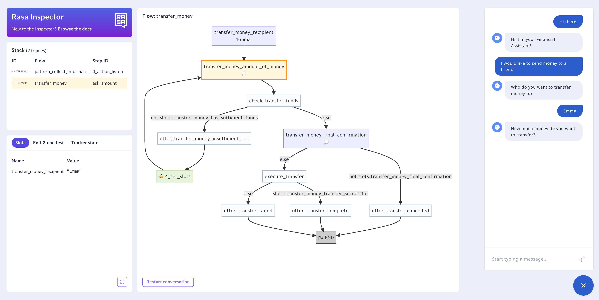

# Rasa 检查

!!! info "3.7 版本新特性"

    Rasa 检查是 Rasa 新推出的带有语言模型的对话式 AI（CALM）方法的一部分，从 `3.7.0` 版本开始可用。

Rasa 检查是一款调试工具，可让开发人员深入了解其 Rasa 对话机器人的对话机制。它允许实时原型化对话流、槽值和追踪器状态，以确保对话管理顺畅而准确。

## 入门 {#getting-started}

使用 [`rasa inspect`](../command-line-interface.md#rasa-inspect) 通过命令行启动 Rasa 检查。

## 接口描述 {#interface-description}

`rasa inspect` 命令根据上次训练的模型启动对话机器人，并在浏览器中打开一个新选项卡。

<figure markdown>
  
  <figcaption>Rasa 检查窗口</figcaption>
</figure>

具有以下四个窗口（从右到左和从上到下）：

- **聊天小部件**：你可以在其中与对话机器人进行现场测试对话。
- **流视图**：可视化当前活动的流和对话步骤。
- **堆栈视图**：自下而上列出激活的流及其最新步骤。
- **槽、端到端测试和追踪器状态视图**：其中包含聊天期间捕获的数据的详细信息。

### 聊天小部件 {#chat-widget}

与对话机器人开始自由形式的聊天。其余三个调试窗格将显示对话发展的内在性，并允许检查是否在正确的时刻激活了正确的流以及对话是否按计划进行。

### 流视图 {#flow-view}

在流图中可视化当前活动的流并突出显示最新步骤。通过单击堆栈表的行，你可以查看在对话的不同点激活的特定流。在窗格的底部，你可以找到一个“restart conversation”按钮，它将丢弃任何先前的信息并开始新的聊天。页面重新加载将导致相同的行为。

### 堆栈视图 {#stack-view}

堆栈部分按时间顺序提供了已激活流及其最新步骤的自下而上的概览。该表最上面的项目表示对话机器人正在尝试完成的当前活动流步骤。下面列出的流处于“暂停”状态，一旦其上方一行中的每个流都已完成，它们就会恢复。

- **ID**：每个堆栈框架的唯一标识符。
- **流**：活动流的标识符，链接到 `flows.yml` 文件。
- **步骤 ID**：当前步骤的标识符，也可以在 `flows.yml` 文件中找到。

### 槽、端到端测试和追踪器状态视图 {#slots-end-2-end-test-and-tracker-state-view}

你可以在此处查看迄今为止收集的数据的详细信息：

#### 槽 {#slots}

[槽](../concepts/domain.md#slots)是动态变量，对话机器人在整个对话过程中在其中存储和检索信息。它们在 `domain.yml` 文件中定义。

#### 端到端测试 {#end-2-end-test}

聊天小部件中进行的测试对话在此处以[端到端测试格式](testing-your-assistant.md#end-to-end-testing)表示。这有助于快速将对话转换为测试用例，当将其添加到端到端测试集时，可以增强对话机器人的稳健性。

#### 追踪器状态 {#tracker-state}

追踪器状态视图提供有关过去事件和对话当前状态的详细信息。它通过一系列记录的事件呈现对话历史记录，例如用户发送的消息以及 LLM 预测的命令、设置的槽、触发的对话修复模式和对话机器人执行的动作。
