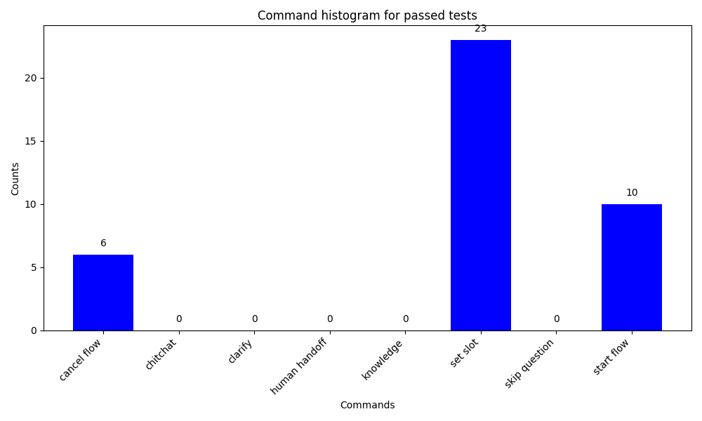

# 测试对话机器人

Rasa 允许你端到端地验证和测试对话机器人。

## 验证数据和故事 {#validating-data-and-stories}

数据验证校验领域、NLU 数据和故事数据中不会出现错误或重大不一致。要验证你的数据，可以让 CI 运行如下命令：

```shell
rasa data validate
```

如果你将 `max_history` 值传递给 `config.yml` 文件中的一个或多个策略，请提供这些值中的最小值作为：

```shell
rasa data validate --max-history <max_history>
```

如果数据验证出现错误，训练模型可能失败或产生不好的效果。因此在训练模型之前运行此检查总是好的。通过包含 `--fail-on-warnings` 标志，此步骤会因更多小问题的警告而失败。

要阅读有关验证器和所有可用选项的更多信息，请参见 [`rasa data validate` 的文档](../command-line-interface.md#rasa-data-validate)。

## 端到端测试 {#end-to-end-testing}

!!! info "3.5 版本新特性"

    你现在可以使用端到端测试来整体测试对话机器人，包括对话管理和自定义动作。

端到端 (E2E) 测试是一种增强的、全面的基于 CLI 的测试工具，它允许你测试具有不同预配置上下文的对话场景、执行[自定义动作](../action-server/actions.md)、验证[响应](../concepts/responses.md)文本或名称，并断言何时填充[槽](../concepts/domain.md#slots)。

端到端测试不仅限于测试 NLU 或对话模型，还允许你设计有效的验收或集成测试。端到端测试的主要功能是：

- 与[动作服务器](../action-server/running-action-server.md)集成：你可以在测试中执行自定义动作，前提条件是在后台启动动作服务器。
- 测试参数化（例如不同的用户配置文件或其他外部因素）：你可以定义具有不同预填充槽的多个测试装置，并在测试中重复使用它们。
- 验证响应文本或名称：你可以断言机器人响应文本（包括带有槽值和[条件响应变化](../concepts/responses.md#using-variables-in-responses)的[插值响应](../concepts/responses.md#using-variables-in-responses)）或语音名称符合预期。
- 断言机器人要么按预期设置槽值，要么不设置槽，或者该值与测试步骤中指定的值不同。

!!! danger "3.10 版本测试新特性"

    为了帮助你更快地开始端到端测试，我们引入了一个新的命令 `rasa data convert e2e`，可将现有的示例对话转换为端到端测试用例。你可以在[端到端测试转换部分](../testing/e2e-test-conversion.md)了解有关此功能的更多信息。

    生成的端到端测试用例利用断言格式，这允许你评估生成响应与其他基于 Rasa 事件的断言之间的相关性和事实准确性。你可以在[使用断言进行端到端测试](../testing/e2e-testing-assertions/assertions-introduction.md)部分了解有关此功能的更多信息。

    这些功能处于测试阶段（实验阶段），可能会在未来的 Rasa Pro 版本中发生变化。

### 测试最佳实践 {#testing-best-practices}

编写端到端测试时，重要的是不要在测试用例中使用个人身份信息 (PII) 或敏感数据。我们建议使用通用名称、位置、日期和其他占位符，以避免任何潜在的数据隐私问题。

我们还强烈建议不要使用连接到生产外部服务的生产操作服务器进行端到端测试。相反，使用全栈测试环境，其中包含动作服务器和其他外部服务的单独开发或预发布实例。或者，你也可以模拟外部服务以避免任何意外的副作用。

### 如何编写测试用例 {#how-to-write-test-cases}

要编写测试用例，你需要在项目的 `tests` 目录中创建一个 YAML 文件。文件的名称应为 `e2e_test_cases.yml`。你还可以在 `tests` 目录中创建一个子目录，并将测试用例 YAML 文件放在那里。这些文件将由 Rasa Pro 自动发现并运行，但是你需要将子目录的路径作为位置参数提供给 `rasa test e2e` 命令。

每个输入文件都必须包含 `test_cases` 键。此键的值是测试用例列表。每个测试用例都必须包含为 `test_case` 键指定的名称和为 `steps` 键指定的测试步骤列表。步骤可以是以下任一项：

- `user`：指用户的消息。
- `bot`：表示机器人生成的文本响应。
- `utter`：指领域文件中定义的机器人响应名称。
- `slot_was_set`：表示成功设置了槽，并且取决于其定义方式：
    - 如果提供了槽名称，例如 `my_slot`：检查是否设置了具有给定名称的槽。
    - 如果提供了键值对，例如 `my_slot: value`：检查是否设置了具有给定名称的槽，并设置了预期值。
- `slot_was_not_set`：指定设置槽失败，并且取决于定义：
    - 如果提供了槽名称，例如 `my_slot`：检查是否未设置具有给定名称的槽。
    - 如果提供了键值对，例如 `my_slot: value`：检查是否未设置具有给定名称的槽或其值与预期值不同。

以下示例说明了如何在测试用例中使用 `user`、`bot`、`utter` 和 `slot_was_set` 步骤：

```yaml title="tests.yml"
test_cases:
  - test_case: user books a restaurant # name of the test case must be provided and be unique
    steps:
      - user: I want to book a table for 4 at Xaigon for 8pm tonight
      - slot_was_set: # slot_was_set/slot_was_not_set can contain multiple slot names or key-value pairs
          - book_restaurant_name_of_restaurant: Xaigon
          - book_restaurant_number_of_people: "4"
          - book_restaurant_date: tonight
          - book_restaurant_time: 8pm
      - utter: utter_restaurant_available # utter is used for predefined domain utterances
      - utter: utter_ask_book_restaurant_reservation_name
      - user: Emil
      - slot_was_set:
          - book_restaurant_reservation_name: Emil
      - utter: utter_ask_book_restaurant_confirmation
      - user: yes
      - bot: Thank you for booking the table at Xaigon for 4 people at 8pm tonight. # bot is used to match textual responses
```

在 `user` 步骤之后的每个步骤中，你可以指定多个预期事件。任何发现的其他事件都将被忽略，不会导致测试失败。

#### 槽 {#slots}

槽可以指定为字符串值（表示槽名称）或槽名称和槽值对的列表。如果槽指定为键值对，则还会比较这些值。如果槽步骤仅包含槽名称，则断言槽已设置（使用 `slot_was_set` 步骤时）或未设置（使用 `slot_was_not_set` 步骤时）。

```yaml
- slot_was_set:
    - book_restaurant_name_of_restaurant: Xaigon # check that the slot is set and the value is Xaigon
    - book_restaurant_number_of_people: "4"
    - book_restaurant_time # check that the slot is set regardless the value with which it is set
- slot_was_not_set:
    - book_restaurant_reservation_name # check that the slot is not set (no SlotSet event found)
    - book_restaurant_reservation_date: "2023-11-11" # check that the slot either is not set or the value is not 2023-11-11
```

无需在 `slot_was_set` 或 `slot_was_not_set` 步骤中指定所有槽事件，你可以仅指示要检查的槽子集。你可以将 `slot_was_not_set` 视为 `slot_was_set` 的逆，当指定 `slot_was_not_set` 步骤时，它会在追踪器存储中查找 `SlotSet` 事件的缺失，但仅针对该特定 `user` 步骤，而不是全局（更多是按[测试步骤的顺序](testing-your-assistant.md#order-of-test-steps-and-events)）。

#### 预填充槽的固定物 {#fixtures-for-pre-filled-slots}

使用固定物是一项可选功能，可实现槽的预填充，确保在运行单个测试用例之前具有特定的上下文。测试用例配置顶层的 `fixtures` 键由固定物名称列表组成，每个固定物名称都必须是唯一的。这些固定物名称对应于槽键值对集。当特定测试用例需要预定义的槽值时，你可以通过将其添加到 `fixtures` 键来在测试用例定义中引用固定物名称。

请考虑以下示例，其中包括一个带有固定物的测试用例文件和两个利用这些固定物的测试用例：

```yaml title="fixture-tests.yml"
fixtures:
  - premium: # name of the fixture must be provided and be unique
      - membership_type: premium # every fixture can contain multiple slot key-value pairs
      - logged_in: True
  - standard:
      - logged_in: False
      - membership_type: standard

test_cases:
  - test_case: "test_premium_booking"
    fixtures:
      - premium # re-use the name of the fixture provided in fixtures section
    steps:
      - user: "Hi!"
      - bot: "Welcome back! How can I help you?"
      - user: "I want to book a trip."
      - utter: utter_ask_location
      - user: "I would like to travel to Lisbon."
      - slot_was_set:
          - location: "Lisbon"
      - utter: utter_ask_date
      - user: "I would like to travel on 22nd of June."
      - slot_was_set:
          - travel_date: "2023-06-22"
      - bot: "Great! I will book your trip to Lisbon on 22nd of June."
      - bot: "You saved 20% by being a premium member."

  - test_case: "test_anonymous_booking"
    fixtures:
      - standard
    steps:
      - user: "Hi!"
      - bot: "Hey! How can I help you?"
      - user: "I want to book a trip."
      - utter: utter_ask_location
      - user: "I would like to travel to Paris."
      - slot_was_set:
          - location: "Paris"
      - utter: utter_ask_date
      - user: "I would like to travel on 2nd of April."
      - slot_was_set:
          - travel_date: "2023-04-02"
      - bot: "Great! I will book your trip to Paris on 2nd of April."
      - bot: "You can also choose to save 20% by becoming a premium member."
```

这些固定物中的槽是在 `action_session_start` 动作之后和测试运行器执行第一步之前设置的。

#### 用户消息的元数据 {#metadata-on-user-messages}

!!! info "3.9 版本新特性"

    端到端测试现在支持在用户消息上添加元数据。

仅当你已将自定义连接器与对话机器人一起使用，并使用用户消息的 `metadata` 键在自定义动作中从前端传递了额外信息，并且想要根据运行时提供的元数据正确测试对话流时，此功能才有意义。有关更多信息，请参阅自定义连接器文档的[消息元数据](../connectors/custom-connectors.md#metadata-on-messages)部分。

使用元数据是一项可选功能，可以测试受外部元数据（例如 API 响应标头、中间件通信或其他上下文信息）动态影响的交互。

测试用例配置顶层的 `metadata` 键由元数据名称列表组成，每个名称都必须是唯一的。这些元数据名称对应于元数据的键值对。当测试用例中的所有用户步骤都需要预定义元数据时，你可以通过将其添加到 `metadata` 键来在测试用例定义中引用元数据名称。除此之外，你还可以在每个 `user` 步骤中使用 `metadata` 键来提供其他元数据。这将与测试用例级元数据合并，然后传递给 `UserMessage` 对象。

!!! info "注意"

    如果在合并操作期间 `user` 步骤中提供的元数据与测试用例的元数据发生冲突，则 `user` 步骤元数据优先并将覆盖测试用例提供的元数据。

请考虑以下示例，其中包括一个带有元数据的测试用例文件和两个利用这些元数据的测试用例：

```yaml title="metadata-tests.yml"
metadata:
  - user_info:
      language: English
      location: Europe
  - device_info:
      os: linux

test_cases:
  - test_case: "test_standard_booking"
    metadata: user_info
    steps:
      - user: "Hi!"
      - utter: "utter_greet"
      - user: "I would like to book a trip."
      - bot: "Where would you like to travel?"
      - user: "I want to travel to Lisbon."
        metadata: device_info
      - bot: "Your trip to Lisbon has been booked."
      - bot: "You saved 15% by booking with a standard membership."
      - bot: "Upgrade for more savings."

  - test_case: "test_mood_great"
    steps:
      - user: "Hi!"
        metadata: user_info
      - bot: "Hey! How are you?"
      - user: "I am feeling wonderful."
      - bot: "Great, carry on!"
```

在上面的示例中，`test_standard_booking` 测试用例中的所有用户步骤都只具有元数据 `user_info`，但第三个 `user` 步骤除外，该步骤除了 `user_info` 元数据外，还具有元数据 `device_info`。此外，`test_mood_great` 测试用例中只有第一个 `user` 步骤具有 `user_info` 元数据，而其他 `user` 步骤没有元数据。

#### 存根自定义动作 {#stubbing-custom-actions}

!!! danger "3.10 版本测试新特性"

    你现在可以在测试用例中存根自定义动作，以模拟自定义动作的执行，而无需实际运行动作服务器。

    此功能仅为测试版（实验性），可能会在未来的 Rasa Pro 版本中发生变化。要启用此功能，你必须在测试环境中将环境变量 `RASA_PRO_BETA_STUB_CUSTOM_ACTION` 设置为 `true`。

    我们欢迎你通过客户办公室团队对此功能提出反馈。

你可以通过在测试用例文件的顶层定义 `stub_custom_actions` 键来在测试用例中存根常规自定义动作。这样，你就可以模拟自定义动作的执行，而无需实际运行动作服务器。`stub_custom_actions` 键由你想要存根的自定义动作名称字典组成。每个自定义动作名称的值都是预期事件和响应的字典。这表示自定义动作将返回的内容，并且必须遵循动作服务器将返回的相同格式。

例如：

```yaml title="stub-tests.yml"
stub_custom_actions:
  check_balance:
    events:
      - event: slot
        name: account_balance
        value: 1000
    responses:
        - text: "Your account balance is 1000."
```

当自定义动作被存根时，测试运行器将不会调用动作服务器，而是会查找存根实现。请注意，如果使用此功能，测试运行必须存根测试用例中调用的所有自定义动作。如果你只想存根选定的自定义动作，我们建议你创建单独的测试用例文件，并使用开发动作服务器实例单独运行这些自定义动作。

你可以为同一个自定义动作定义多个存根。请遵循 `test_case_id::action_name` 的命名约定，以区分这些存根。

例如：

```yaml title="stub-multiple-tests.yml"
stub_custom_actions:
  test_account_balance_is_positive::check_balance:
    events:
      - event: slot
        name: account_balance
        value: 1000
    responses:
      - text: "Your account balance is 1000."

  test_account_balance_is_empty::check_balance:
    events:
      - event: slot
        name: account_balance
        value: 0
    responses:
      - text: "Your account balance is empty."
```

!!! info "信息"

    当前的 3.10 测试版存根功能不支持[槽验证自定义动作](../action-server/validation-action.md)的存根。

### 如何运行测试 {#how-to-run-the-tests}

要在本地或 CI 管道中运行端到端测试，请使用 [`rasa test e2e` 命令](../command-line-interface.md#rasa-test-e2e)。该命令采用以下参数：

- 位置参数，表示包含测试用例的测试用例文件或目录的路径：`rasa test e2e <path>`。如果未指定，则默认路径为 `tests/e2e_test_cases.yml`。
- 训练模型的可选参数：`--model <path>`。
- 从[远程存储](../production/model-storage.md#load-model-from-cloud)中检索训练模型的可选参数：-`-remote-storage <remote-storage-location>`。
- `endpoints.yml` 文件的可选参数：`--endpoints <path>`。
- 第一次失败时停止测试运​​行的可选参数：`rasa test e2e --fail-fast`。
- 将测试结果导出到 `e2e_results.yml` 文件的可选参数：`rasa test e2e -o`。

### 测试自定义动作 {#testing-custom-actions}

要测试自定义动作，有三个先决条件：

- 动作服务器必须在后台运行。
- `endpoints.yml` 文件必须包含动作服务器配置。
- [动作](../action-server/actions.md)副作用必须导致 `SlotSet`、`BotUttered` 或 `UserUttered` 事件。

启动 E2E 测试时，将执行检查以确定机器人配置是否在 `endpoints.yml` 文件中指定了动作服务器端点。如果定义了端点，则通过调用 `/health` 端点执行健康检查。如果动作服务器没有响应，测试运行将以状态代码 `1` 和错误消息退出。

你可以在运行测试之前在后台启动动作服务器：

```shell
rasa run actions && rasa test e2e
```

### 如何检查输出 {#how-to-interpret-the-output}

默认情况下，结果始终打印到 `stdout`，命令将以退出代码 `0`（如果所有测试都通过）或 `1`（如果测试失败）退出。

输出结构受 `pytest` 启发：

- 失败的测试用例将按完成顺序堆叠，每个失败的测试都会突出显示已识别的不匹配的差异，类似于 `git diff`：
    - 对于通过的测试步骤，没有颜色或前缀。（`user` 步骤用作 `diff` 的锚点，并且始终通过。）
    - 失败的预期测试步骤将以 `+` 前缀（绿色）开头，而实际消息将以 `-` 前缀（红色）开头。
- 简短的测试摘要在新行中包含每个失败的测试用例名称和文件位置的列表。

如果命令中指定了 `-o` 标志，结果也会写入 `tests/e2e_results.yml` 文件，该文件将包含具有以下键的测试结果列表：

- `name`：测试用例的名称。
- `pass_status`：测试用例的状态，`True` 或 `False`。
- `expected_steps`：预期测试步骤。
- `difference`：预期测试步骤与实际测试步骤之间的差异列表。

### 限制 {#limitations}

端到端测试是一种强大的工具，可用于对对话式 AI 系统进行全面评估。但是，它确实存在一些需要考虑的重要限制。这些限制如下：

#### 对事件和追踪器存储的依赖性 {#dependency-on-events-and-the-tracker-store}

端到端测试严重依赖于追踪器存储中特定事件类型的可用性。特别是，它需要存在诸如 `BotUttered`、`UserUttered` 和 `SlotSet` 之类的事件才能有效地执行测试。如果你的测试场景涉及不生成这些特定事件的动作或事件，则测试算法将无法评估它们。

#### 测试步骤和事件的顺序 {#order-of-test-steps-and-events}

必须构建测试用例以紧密模拟真实对话，以避免潜在问题。测试运行器通过运行 `user` 步骤并从追踪器存储中捕获对话机器人生成的事件来工作，之后它将比较对话机器人生成的事件与预期事件（无论是 `bot` 还是 `slot` 测试步骤）。最好避免创建具有多个 `user` 步骤和对话机器人事件的测试用例，因为它只会评估从最后一个 `user` 步骤创建的事件。

```yaml title="fauilty-tests.yml"
test_cases:
  - test_case: user checks their balance and doesn't ask for anything else
    steps:
      - user: Show my balance
      - user: no
      - utter: utter_current_balance
      - utter: utter_can_do_something_else
      - utter: utter_noworries
  - test_case: user checks their balance and then about transactions
    steps:
      - user: Show my balance
      - user: Show my transactions please
      - utter: utter_current_balance
      - utter: utter_can_do_something_else
      - utter: utter_transactions      
```

请注意，在 `user` 步骤之后执行的 `bot`、`utter` 和 `slot` 步骤的顺序并不重要。只要在 `user` 步骤之后执行 `bot`、`utter` 和 `slot` 事件，测试用例就会通过。

#### 测试对话的开始 {#testing-the-start-of-a-conversation}

根据定义的预期测试步骤对实际事件的评估在 `action_session_start` 动作之后开始，建议从 `user` 步骤开始测试。但是，当 `action_session_start` 已自定义时，可以在第一个用户发声之前进行测试。

```yaml
test_cases:
  - test_case: user books a restaurant
    steps:
      - utter: utter_welcome # action_session_start is modified to also utter_welcome
      - user: I want to book a table for 4 at Xaigon for 8pm tonight
    ...
```

#### 测试企业搜索的准确性 {#testing-the-accuracy-of-enterprise-search}

Rasa Pro v3.10 之前的端到端测试不支持测试[企业搜索策略](../concepts/policies/enterprise-search-policy.md)的准确性。这是因为测试运行器以精确匹配的方式将对话机器人响应与预期响应进行匹配。这意味着即使对话机器人响应有细微差异也会导致测试失败。

随着 Rasa Pro v3.10 中新断言格式的引入，你现在可以评估企业搜索发出的生成响应的相关性和事实准确性。你可以在使用断言进行 [E2E 测试文档](../testing/e2e-testing-assertions/assertions-introduction.md)部分中了解有关此功能的更多信息。

#### E2E 测试覆盖率报告 {#e2e-test-coverage-report}

!!! info "3.10 版本新特性"

    你现在可以在端到端 (E2E) 测试套件上运行诊断程序，以评估它如何全面覆盖对话机器人的功能。

    此功能目前以测试版发布。该功能将来可能会发生变化。如果你想启用此测试版功能，请设置环境变量 `RASA_PRO_BETA_FINE_TUNING_RECIPE=true`。

要生成覆盖率报告，请使用 `rasa test e2e` 命令的 `--coverage-report` 选项。你还可以使用 `--coverage-output-path` 参数为报告指定输出目录。默认情况下，覆盖率结果将打印到 `stdout` 并保存在对话机器人文件夹中的 `e2e_coverage_results` 目录中。报告分别计算通过和失败测试的覆盖率。

```shell
rasa test e2e <path-to-test-cases> --coverage-report
```

具体的输出工件解释如下。

##### 流覆盖率 {#flow-coverage}

流覆盖率报告显示 E2E 测试覆盖的流步骤百分比。以下是示例输出：

```txt
                                           Flow Name Coverage  Num Steps  Missing Steps  Line Numbers
             data/flows/order_pizza.yml::order_pizza   80.00%          5              1  [15-22]
                   data/flows/add_card.yml::add_card   75.00%          4              1  [10-10]
             data/flows/add_contact.yml::add_contact   25.00%          4              3  [22-35, 27-28, 31-32]
 data/flows/authenticate_user.yml::authenticate_user    0.00%          5              5  [11-13, 23-24, 16-24, 20-21, 14-15]
         data/flows/check_balance.yml::check_balance    0.00%          2              2  [7-7, 6-6]
                                               Total    40.00%        20             12
```

`Coverage` 列显示测试覆盖的步骤百分比，`Num Steps` 列表示每个流中的步骤总数。`Missing Steps` 列列出测试未覆盖的步骤，`Line Numbers` 表示这些缺失步骤在流文件中的位置。

!!! info "重要"

    从上面的示例中可以看出，`data/flows/add_contact.yml::add_contact` 的大部分内容都没有经过充分测试，`data/flows/authenticate_user.yml::authenticate_user` 和 `data/flows/check_balance.yml::check_balance` 的所有步骤均未经过测试。对于用户来说，下一个合乎逻辑的步骤是添加涵盖以下流的 E2E 测试。

如上所述，上述分析针对通过和失败的测试都进行了，结果也分别添加到 `coverage_report_for_passed_tests.csv` 和 `coverage_report_for_failed_tests.csv` 文件中。

##### 命令覆盖率 {#command-coverage}

该工具还输出对话理解模块在运行 E2E 测试时触发的命令覆盖率。输出是分别在 `commands_histogram_for_passed_tests.png` 和`commands_histogram_for_failed_tests.png` 中显示的通过和失败测试的直方图。

<figure markdown>
  
  <figcaption>命令直方图示例</figcaption>
</figure>

##### 通过/失败测试 {#passing--failing-tests}

每个通过和失败的测试分别添加到 `passed.yml` 和 `failed.yml` 中。

通过使用这些工具，你可以确保对话机器人经过全面测试，并识别和解决覆盖范围内的任何差距。
