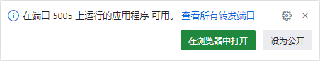
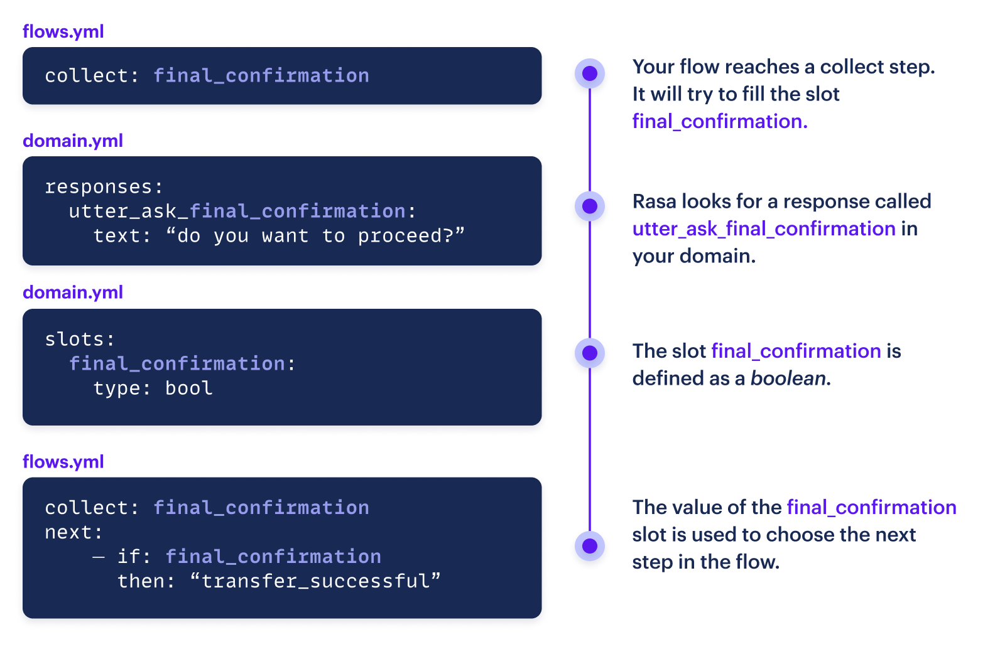
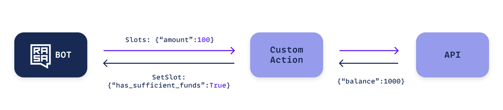

# 教程

你将在本教程中构建一个对话机器人来帮助人们转账。本教程不假设你已经了解 Rasa 或对话机器人。你将在本教程中学习的技术是构建任意 Rasa 对话机器人的基础，理解它将帮助你在掌握 Rasa 方面取得很大进步。

## 你所构建 {#what-are-you-building}

在本教程中，你将构建一个由 LLM 提供支持的对话机器人，它可以完成转账，可靠地执行业务逻辑，同时流畅的对话。

以下是对话机器人可以处理的一些对话：

=== "预期路径"

    <div class="md-chat"><div class="chat-container"><div class="chat-input chat-item stack-xs"><p class="chat-bubble"><span class="sr-only">User: </span><span class="content">I want to send money</span></p></div><div class="chat-output chat-item stack-xs"><p class="chat-bubble"><span class="sr-only">Bot: </span><span class="content">Who would you like to send money to?</span></p></div><div class="chat-input chat-item stack-xs"><p class="chat-bubble"><span class="sr-only">User: </span><span class="content">to Jen</span></p></div><div class="chat-output chat-item stack-xs"><p class="chat-bubble"><span class="sr-only">Bot: </span><span class="content">How much would you like to send?</span></p></div><div class="chat-input chat-item stack-xs"><p class="chat-bubble"><span class="sr-only">User: </span><span class="content">$50</span></p></div><div class="chat-output chat-item stack-xs"><p class="chat-bubble"><span class="sr-only">Bot: </span><span class="content">Please confirm: you want to transfer $50.0 to Jen?</span></p></div><div class="chat-input chat-item stack-xs"><p class="chat-bubble"><span class="sr-only">User: </span><span class="content">yes</span></p></div><div class="chat-output chat-item stack-xs"><p class="chat-bubble"><span class="sr-only">Bot: </span><span class="content">All done. $50.0 has been sent to Jen.</span></p></div><div class="chat-output chat-item stack-xs"><p class="chat-bubble"><span class="sr-only">Bot: </span><span class="content">Is there anything else I can help you with?!</span></p></div></div><figcaption>预期路径</figcaption></div>

=== "直接处理"

    <div class="md-chat"><div class="chat-container"><div class="chat-input chat-item stack-xs"><p class="chat-bubble"><span class="sr-only">User: </span><span class="content">I want to send 100 dollars to Joe</span></p></div><div class="chat-output chat-item stack-xs"><p class="chat-bubble"><span class="sr-only">Bot: </span><span class="content">Please confirm: you want to transfer $100.0 to Joe?</span></p></div><div class="chat-input chat-item stack-xs"><p class="chat-bubble"><span class="sr-only">User: </span><span class="content">yes.</span></p></div><div class="chat-output chat-item stack-xs"><p class="chat-bubble"><span class="sr-only">Bot: </span><span class="content">All done. $100.00 has been sent to Joe.</span></p></div><div class="chat-output chat-item stack-xs"><p class="chat-bubble"><span class="sr-only">Bot: </span><span class="content">Is there anything else I can help you with?</span></p></div></div><figcaption>直接处理</figcaption></div>

=== "改变主意"

    <div class="md-chat"><div class="chat-container"><div class="chat-input chat-item stack-xs"><p class="chat-bubble"><span class="sr-only">User: </span><span class="content">I need to send $50</span></p></div><div class="chat-output chat-item stack-xs"><p class="chat-bubble"><span class="sr-only">Bot: </span><span class="content">Who would you like to send money to?</span></p></div><div class="chat-input chat-item stack-xs"><p class="chat-bubble"><span class="sr-only">User: </span><span class="content">Jen</span></p></div><div class="chat-output chat-item stack-xs"><p class="chat-bubble"><span class="sr-only">Bot: </span><span class="content">Please confirm: you want to transfer $50.0 to Jen?</span></p></div><div class="chat-input chat-item stack-xs"><p class="chat-bubble"><span class="sr-only">User: </span><span class="content">actually no 60</span></p></div><div class="chat-output chat-item stack-xs"><p class="chat-bubble"><span class="sr-only">Bot: </span><span class="content">Ok, I corrected the amount.</span></p></div><div class="chat-output chat-item stack-xs"><p class="chat-bubble"><span class="sr-only">Bot: </span><span class="content">Please confirm: you want to transfer $60.0 to Jen?</span></p></div><div class="chat-input chat-item stack-xs"><p class="chat-bubble"><span class="sr-only">User: </span><span class="content">yes.</span></p></div><div class="chat-output chat-item stack-xs"><p class="chat-bubble"><span class="sr-only">Bot: </span><span class="content">All done. $60.00 has been sent to Jen.</span></p></div><div class="chat-output chat-item stack-xs"><p class="chat-bubble"><span class="sr-only">Bot: </span><span class="content">Is there anything else I can help you with?</span></p></div></div><figcaption>改变主意</figcaption></div>

## 按照本教程操作 {#following-this-tutorial}

每当你要执行某项操作时，你都会看到此标签：

<button data-md-color-primary="amber">Action Required</button>

## 先决条件 {#prerequisites}

要遵循本教程，你需要：

- 免费的 Rasa Pro [开发者版许可证](developer-edition.md)
- OpenAI 或[其他 LLM 提供者](concepts/components/llm-configuration.md#other-providers)的 API 密钥

!!! info "信息"

    本教程适用于 Rasa 版本 `>= 3.8.0`。

## 设置 {#setup}

<button data-md-color-primary="amber">Action Required</button>

对于新用户，最简单的入门方法是使用 [GitHub Codespace](installation/quickstart.md) 在浏览器中进行操作。

你也可以在[本地安装 rasa-pro](installation/python/environment-set-up.md) 并使用自己的机器。

!!! info "信息"

    GitHub Codespace 为你提供了一个工作环境，让你在不到一分钟的时间内探索 Rasa Pro。我们真的建议你从那里开始！

要按照本教程进行编码，请在终端中导航至一个空目录，然后运行：

```shell
rasa init --template tutorial
```

默认情况下，本教程使用 OpenAI API。如果你想使用其他 LLM，请按照[此处](concepts/components/llm-configuration.md)的说明操作。

如果你使用的是 [Codespace](installation/quickstart.md)，则你已经在设置期间设置了环境变量。如果你已在本地安装了 Rasa ，请在环境变量中设置 OpenAI API 密钥和 Rasa Pro 许可证：

=== "Linux/MacOS"

    ```shell
    export OPENAI_API_KEY="your-api-key"
    export RASA_PRO_LICENSE="your-rasa-pro-license-key"
    ```

=== "Windows"

    ```powershell
    setx OPENAI_API_KEY your-api-key
    setx RASA_PRO_LICENSE your-rasa-pro-license-key
    ```

这将适用于未来的 cmd 提示窗口，因此你需要打开一个新的窗口来使用该变量。

用实际密钥替换 `your-api-key` 和 `your-rasa-pro-license-key`。

!!! info "信息"

    为了从 OpenAI 获得 GPT-4 的访问权，你需要成功支付 5 美元或更多（请参阅[此处](https://help.openai.com/en/articles/7102672-how-can-i-access-gpt-4)）。

## 概述 {#overview}

打开 IDE 中的项目文件夹以查看组成新项目的文件。在本教程中，你将主要使用以下文件：

- `data/flows.yml`
- `domain.yml`
- `actions.py`

## 测试汇款流 {#testing-your-money-transfer-flow}

<button data-md-color-primary="amber">Action Required</button>

通过运行以下命令训练对话机器人：

```shell
rasa train
```

并通过运行以下命令在浏览器中开始与其对话：

```shell
rasa inspect
```

!!! info "信息"

    当你在 GitHub Codespace 中运行 `rasa inspect` 命令时，你会看到一条通知，表明你的应用程序在端口 5005 上可用。单击“在浏览器中打开”以访问检查器并开始聊天。

    <figure markdown>
      
    </figure>

现在，尝试告诉对话机器人你想向朋友转一些钱。

!!! info "信息"

    此模板对话机器人使用生成模型来处理基本聊天。如果你想禁用此功能，请删除 `patterns.yml` 文件并重新训练。

## 了解汇款流 {#understanding-your-money-transfer-flow}

文件 `data/flows.yml` 包含名为 `transfer_money` 流的定义。让我们看看这个定义，看看发生了什么：

```yaml title="flows.yml"
flows:
  transfer_money:
    description: This flow lets users send money to friends and family.
    steps:
      - collect: recipient
      - collect: amount
        description: the number of US dollars to send
      - action: utter_transfer_complete
```

`transfer_money` 流的两个关键属性是 `description` 和 `steps`。`description` 用于帮助决定何时激活此流。但它也有助于任何检查代码的人了解正在发生的事情。如果用户说“I need to transfer some money”，描述可以帮助 Rasa 了解这是相关的流。`steps` 描述了执行用户要求所需的业务逻辑。

流中的第一步是 `collect` 步骤，用于填充 `slot`。`collect` 步骤向用户发送请求信息的消息，并等待答复。

## 在槽中收集信息 {#collecting-information-in-slots}

槽是对话机器人在整个对话过程中可以读取和写入的变量。槽在 `domain.yml` 文件中定义。例如，`recipient` 槽的定义如下所示：

```yaml title="domain.yml"
slots:
  recipient:
    type: text
    mappings:
      - type: from_llm
  # ...
```

槽可用于存储用户在对话期间提供的信息，或通过 API 调用获取的信息。首先，你将了解如何将最终用户提供的信息存储在槽中。为此，你需要定义一个 `collect` 步骤，就像上面流中的第一步一样。

```yaml title="flows.yml" hl_lines="5"
flows:
  transfer_money:
    description: This flow lets users send money to friends and family.
    steps:
      - collect: recipient
      - collect: amount
        description: the number of US dollars to send
      - action: utter_transfer_complete
```

Rasa 将在领域文件中查找名为 `utter_ask_recipient` 的响应，并使用它来向用户提出问题。

```yaml title="domain.yml"
responses:
  utter_ask_recipient:
    - text: "Who would you like to send money to?"
```

发送此消息后，Rasa 将等待用户的响应。当用户响应时，Rasa 将尝试使用他们的答案来填充 `recipient` 槽。阅读有关[槽验证](nlu-based-assistants/slot-validation-actions.md)的内容，了解如何对 Rasa 提取的槽值运行额外检查。

下图总结了如何使用槽值来收集和存储信息，以及如何使用它们来创建分支逻辑。

<figure markdown>
  
</figure>

### `collect` 步骤中的描述 {#descriptions-in-collect-steps}

第二个 `collect` 步骤包括对话机器人将向用户请求的信息的描述。描述是可选的，但可以帮助 Rasa 更可靠地提取槽值。

```yaml title="flows.yml" hl_lines="7"
flows:
  transfer_money:
    description: This flow lets users send money to friends and family.
    steps:
      - collect: recipient
      - collect: amount
        description: the number of US dollars to send
      - action: utter_transfer_complete
```

## `action` 步骤 {#action-steps}

`transfer_money` 流中的第三 `step` 不是 `collect` 步骤，而是 `action` 步骤。当你到达流中的 `action` 步骤时，对话机器人将执行相应的动作，然后继续下一步。它不会停下来等待用户的下一条消息。目前，这是流中的最后一步，因此没有下一步要执行，流已完成。

```yaml title="flows.yml" hl_lines="8"
flows:
  transfer_money:
    description: This flow lets users send money to friends and family.
    steps:
      - collect: recipient
      - collect: amount
        description: the number of US dollars to send
      - action: utter_transfer_complete
```

## 分支逻辑 {#branching-logic}

槽也用于在流中构建分支逻辑。

<button data-md-color-primary="amber">Action Required</button>

你将在流中引入一个额外步骤，要求用户在发送转账之前确认金额和收款人。由于你询问的是“是/否”问题，因此你可以将结果存储在布尔槽中，并将其称为 `final_confirmation`。

在领域文件中，添加 `final_confirmation` 槽的定义和相应的响应：`utter_ask_final_confirmation`。还需要添加一个响应以确认转账已取消。

```yaml title="domain.yml" hl_lines="7-10"
slots:
  recipient:
    type: Text
    mappings:
      - type: from_llm
  # ...
  final_confirmation:
    type: bool
    mappings:
      - type: from_llm
```

```yaml title="domain.yml" hl_lines="5-8"
responses:
  utter_ask_recipient:
    - text: "Who would you like to send money to?"
  # ...
  utter_ask_final_confirmation:
    - text: "Please confirm: you want to transfer {amount} to {recipient}?"
  utter_transfer_cancelled:
    - text: "Your transfer has been cancelled."
```

请注意，你的确认问题使用大括号 `{}` 来将槽值包含在响应中。

为槽 `final_confirmation` 向流添加一个 `collect` 步骤。此步骤包含具有分支逻辑的 `next` 属性。`if` 键后的表达式将被评估为 `true` 或 `false`，以确定流中的下一步。`then` 和 `else` 键可以包含步骤列表或要跳转到的步骤的 `id`。在本例中，`then` 键包含一个 `action` 步骤，用于通知用户他们的转账已被取消。`else` 键包含 `transfer_successful` id。请注意，你已将此 `id` 添加到流的最后一步。

```yaml title="flows.yml" hl_lines="8-14 16"
flows:
  transfer_money:
    description: This flow lets users send money to friends and family.
    steps:
      - collect: recipient
      - collect: amount
        description: the number of US dollars to send
      - collect: final_confirmation
        next:
          - if: not slots.final_confirmation
            then:
              - action: utter_transfer_cancelled
                next: END
          - else: transfer_successful
      - action: utter_transfer_complete
        id: transfer_successful
```

要试用对话机器人的更新版本，请运行 `rasa train`，然后运行 `​​rasa inspect` 与对话机器人对话。现在它应该要求你在完成转账之前进行确认。

## 集成 API 调用 {#integrating-an-api-call}

流中的 `action` 步骤可以描述两种类型的动作。如果动作的名称以 `utter_` 开头，则此动作会向用户发送一条消息。动作的名称必须与领域中定义的响应之一的名称相匹配。流中的最后一步包含动作 `utter_transfer_complete`，此响应也在领域中定义。响应可以包含按钮、图像和自定义负载。你可以在[此处](concepts/responses.md)了解有关可以使用响应执行的所有动作的更多信息。

第二种类型的 `action` 是自定义动作。自定义动作的名称以 `action_` 开头。

你将创建一个自定义动作 `action_check_sufficient_funds`，以检查用户是否有足够的钱进行转账，然后向流添加逻辑以处理这两种情况。

你的自定义动作在文件 `action.py` 中定义。要了解有关自定义动作的更多信息，请转到[此处](concepts/custom-actions.md)。

你的 `action.py` 文件应如下所示：

```python title="actions.py"
from typing import Any, Text, Dict, List
from rasa_sdk import Action, Tracker
from rasa_sdk.executor import CollectingDispatcher
from rasa_sdk.events import SlotSet

class ActionCheckSufficientFunds(Action):
    def name(self) -> Text:
        return "action_check_sufficient_funds"

    def run(self, dispatcher: CollectingDispatcher,
            tracker: Tracker,
            domain: Dict[Text, Any]) -> List[Dict[Text, Any]]:
        # hard-coded balance for tutorial purposes. in production this
        # would be retrieved from a database or an API
        balance = 1000
        transfer_amount = tracker.get_slot("amount")
        has_sufficient_funds = transfer_amount <= balance
        return [SlotSet("has_sufficient_funds", has_sufficient_funds)]
```

槽是向自定义动作传递信息和从自定义动作传递信息的主要方式。在上面的 `run()` 方法中，你可以访问对话期间设置的 `amount` 槽的值，并通过返回 `SlotSet` 事件来更新 `has_sufficient_funds` 槽，将信息传回对话。

<figure markdown>
  
</figure>

<button data-md-color-primary="amber">Action Required</button>

现在，要对 `domain.yml` 进行三项添加。你将添加一个顶层部分，列出自定义动作。你将添加新的布尔值槽 `has_sufficient_funds`，并且将添加一个新的响应，以便在用户资金不足时发送给用户。

```yaml title="domain.yml" hl_lines="1-2 6-9 13-14"
actions:
  - action_check_sufficient_funds

slots:
  # ...
  has_sufficient_funds:
    type: bool
    mappings:
      - type: custom

responses:
  # ...
  utter_insufficient_funds:
    - text: "You do not have enough funds to make this transaction."
```

现在，你将更新流逻辑，以处理用户账户中有足够的钱或没有足够的钱进行转账的情况。

请注意，你的 `collect: final_confirmation` 步骤现在也有一个 id，以便分支逻辑可以跳转到它。

```yaml title="flows.yml" hl_lines="8-14 16"
flows:
  transfer_money:
    description: This flow lets users send money to friends and family.
    steps:
      - collect: recipient
      - collect: amount
        description: the number of US dollars to send
      - action: action_check_sufficient_funds
        next:
          - if: not slots.has_sufficient_funds
            then:
              - action: utter_insufficient_funds
                next: END
          - else: final_confirmation
      - collect: final_confirmation
        id: final_confirmation
        next:
          - if: not slots.final_confirmation
            then:
              - action: utter_transfer_cancelled
                next: END
          - else: transfer_successful
      - action: utter_transfer_complete
        id: transfer_successful
```

## 测试自定义动作 {#testing-your-custom-action}

<button data-md-color-primary="amber">Action Required</button>

自定义动作作为独立于主 Rasa 对话机器人的服务器运行。要启动自定义动作服务器，请创建一个新的终端选项卡并运行：

```shell
rasa run actions
```

仔细检查文件 `endpoints.yml` 中自定义动作服务器的部分是否被取消注释：

```yaml title="endpoints.yml"
action_endpoint:
  url: "http://localhost:5055/webhook"
```

在第一个终端中，通过运行 `rasa inspect` 停止并重新启动检查器。当你到达流中的 `check_funds` 步骤时，Rasa 将调用自定义动作 `action_check_sufficient_funds`。我们已将用户余额硬编码为 `1000`，因此如果你尝试发送更多，对话机器人会告诉你帐户中没有足够的资金。

此时，你已经体验了使用 Rasa 构建对话机器人所涉及的一些关键概念。恭喜！
